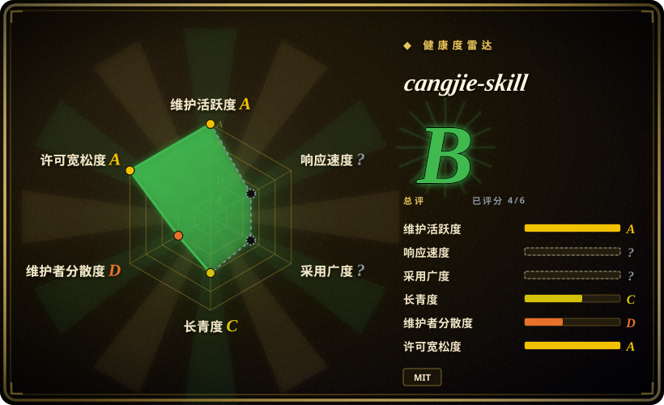

# cangjie-skill

把书、长视频、播客、课程、访谈和转写稿蒸馏成可复用、可测试 agent skill pack 的方法论 skill。

## 何时使用

你要把长材料变成 agent 以后能真正调用的东西：一本书、一份长视频字幕、播客转写、课程、访谈、演讲或密集文档里有框架和判断规则，但普通摘要说不清“什么时候用、怎么用”。此时可选 cangjie-skill：它的目标不是产出一篇压缩笔记，而是生成多个 `SKILL.md` 模块、技能索引、精华长文、术语表和测试 prompts。

关键取舍是严谨度换速度。cangjie-skill 的 RIA-TV++ 流程会做提取、三重验证、RIA++ 结构化、类 Zettelkasten 链接和压力测试；做快速笔记太重，但当输出要变成可复用 skill pack 时更合适。

## 何时不用

- **你只需要围绕来源文档检索问答。** 如果目标是对 notebook 做带来源引用的 Q&A，用 [NotebookLM Claude Code Skill](notebooklm-skill.zh.md)；cangjie-skill 生成静态 skills，不替代可溯源检索。
- **你在蒸馏一个人或公众人物。** 公共人物、主题视角和 persona 蒸馏用 [nuwa-skill](nuwa-skill.zh.md)；cangjie-skill 面向书、转写稿、课程等系统性内容。
- **你只要快速摘要或学习笔记。** 用总结器、笔记流程或本地写作 skill；cangjie-skill 会刻意筛选、结构化、链接和测试候选 skills。
- **你无权转换来源材料。** 未获授权时，不要用 cangjie-skill 重包装受版权保护的书、付费课程或私密转写稿；改用私有、带来源边界的检索方案。
- **你需要可执行工具封装。** 如果任务是封装 Python 库或 API，用 [Scientific Agent Skills](../engineering/scientific-agent-skills.zh.md) 或自定义 tool skill；cangjie-skill 抽取方法论，不做运行时集成。

## 横向对比

| 替代品 | 是否收录 | 我们的评价 | 取舍 |
|---|---|---|---|
| [nuwa-skill](nuwa-skill.zh.md) | ✅ | 公共人物或主题视角 skill 选 nuwa-skill；书、转写稿、课程等系统性内容选 cangjie-skill。 | nuwa 建模视角；cangjie 把显式来源材料拆成可复用方法。 |
| [NotebookLM Claude Code Skill](notebooklm-skill.zh.md) | ✅ | 如果要从自己的 notebook 中拿带引用的答案，选 NotebookLM；如果要把来源材料蒸馏成静态 skill pack，选 cangjie-skill。 | NotebookLM 保持实时检索和来源；cangjie 产物更便携，但除非保留引用，否则来源级可追溯性会下降。 |
| [book-to-skill](../book-to-skill.zh.md) | ✅ | 技术 PDF 转可安装 skills 可评估 book-to-skill；覆盖书和非书转写稿的多阶段方法论，选 cangjie-skill。 | book-to-skill 更工具化；cangjie 是带人工判断门的流程 skill。 |
| 一次性摘要 prompt | 未收录 | 一次性摘要用简单 prompt；需要触发条件、边界、测试和索引时选 cangjie-skill。 | 摘要更快；skill pack 生成成本更高，但 agent 后续更容易调用。 |

## 健康度与可持续性

- **维护快照（2026-07-16）：** GitHub 返回 `archived=false`，`pushed_at=2026-07-16T03:00:58Z`；健康度评分器给 maintenance `A`。
- **采用快照：** GitHub API 在 2026-07 返回约 3,203 个 star；README 列出了多个已生成 skill-pack 示例，但 oss-atlas 未逐一审计质量。
- **许可证快照：** 根目录 `LICENSE` 为 MIT，README 也链接到它。
- **Lindy / 治理：** 仓库约 3 个月，longevity 仍为 `C`；评分器看到贡献者集中度高，因此 governance 为 `D`。
- **风险信号：** 输出可能嵌入来源材料衍生的方法论；版权、来源标注和授权比普通 prompt 包更重要。

## 存疑（未验证）

- [未验证] 下游生成出的 skill pack 质量未被 oss-atlas 逐项审计。
- [未验证] RIA-TV++ 的通过率和压力测试效果来自 README，本页没有独立测量。
- [推断] 它放入 context-engineering，是因为它改变 agent 读取内容和可复用上下文的包装方式，尽管示例覆盖写作、商业和知识工作。
