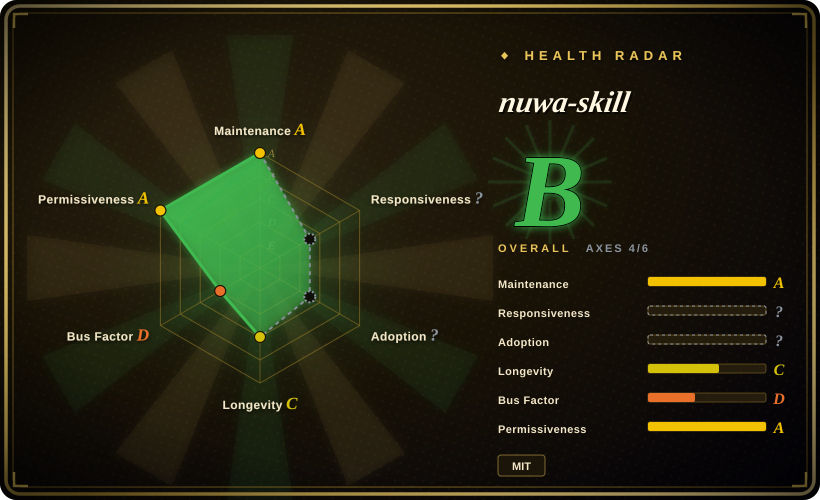

# nuwa-skill

你想蒸馏的下一个员工，何必是同事。蒸馏任何人的思维方式——心智模型、决策启发式、表达DNA。Distill how anyone thinks.

## When to use

You want an agent to distill a public figure, expert, founder, writer, teacher, or domain persona into an installable Agent Skill: mental models, decision heuristics, expression DNA, values, anti-patterns, and explicit honesty boundaries. Use nuwa-skill when the input material is public, sourceable, and broad enough to support a perspective skill rather than a shallow role-play prompt.

It fits workflows where the user asks to “distill Paul Graham”, “build a Zhang Xiaolong perspective skill”, or “make a Feynman-style explanation skill”. Upstream describes a six-track research process, triple validation for mental models, generated `SKILL.md` output, example person/topic skills, fidelity scorecards, and cross-runtime installation via `npx skills add alchaincyf/nuwa-skill`.

## When NOT to use

- **You are distilling a private person without consent.** Do not turn private conversations, employee records, or personal writing into a persona skill without clear rights and authorization.
- **You need a faithful clone of someone's actual beliefs.** Nuwa can only infer from available materials; it cannot verify private thoughts, intuition, or future position changes.
- **You only need the user's own preferences.** Use [tacit-mining](tacit-mining.md) or a memory/voice workflow when the target is the current user's tacit knowledge rather than a public figure.
- **You need a stable knowledge base with citations, not a persona.** [NotebookLM Claude Code Skill](notebooklm-skill.md) is better when source-grounded retrieval matters more than perspective emulation.
- **You need one small local style guide.** A custom `SKILL.md` or voice guide is smaller than running a full multi-agent research/distillation process.

## Comparison

| Alternative | In index | Our verdict | Tradeoff |
|---|---|---|---|
| [soul.md](soul-md.md) | ✅ | Choose soul.md when you already have one person's raw data and want to package a digital identity file hierarchy. | soul.md is a template/runtime for one identity; nuwa-skill is a research-and-distillation pipeline. |
| [tacit-mining](tacit-mining.md) | ✅ | Choose tacit-mining to extract the current user's implicit judgment rules through dialogue. | tacit-mining mines one user's tacit knowledge; nuwa targets public figures or themes. |
| [NotebookLM Claude Code Skill](notebooklm-skill.md) | ✅ | Choose NotebookLM when citation-backed answers from uploaded documents are the deliverable. | NotebookLM is retrieval-grounded; nuwa generates a perspective skill that may extrapolate. |
| Custom persona prompt | 未收录 | Use a hand-written prompt when the persona is narrow and source requirements are low. | Faster and cheaper, but lacks nuwa's research, validation, examples, and honesty-boundary structure. |

## Health & viability

- **Maintenance snapshot (2026-07-16):** GitHub reports `archived=false` and `pushed_at=2026-07-02T03:11:38Z`; health scores maintenance as A.
- **Adoption snapshot:** ~28,015 GitHub stars as of 2026-07, a strong attention signal for a young skill but not proof of persona fidelity.
- **License snapshot:** MIT verified from upstream README and root `LICENSE` in the read-only upstream check.
- **Lindy / governance:** health longevity is C and governance is D due to a young, single-maintainer-centered repo.
- **Risk flags:** persona distillation can overstate fidelity, mishandle private/source material, or create misleading “expert” outputs if honesty boundaries are ignored.

## Caveats (unverified)

- [未验证] Upstream fidelity scorecards and example quality were read from README, not independently reproduced.
- [未验证] The generated perspective skills may extrapolate beyond source material; use the honesty-boundary section and source transparency before relying on them.
- [推断] Best fit is public-figure or theme distillation, not private employee cloning or compliance-grade expert advice.
