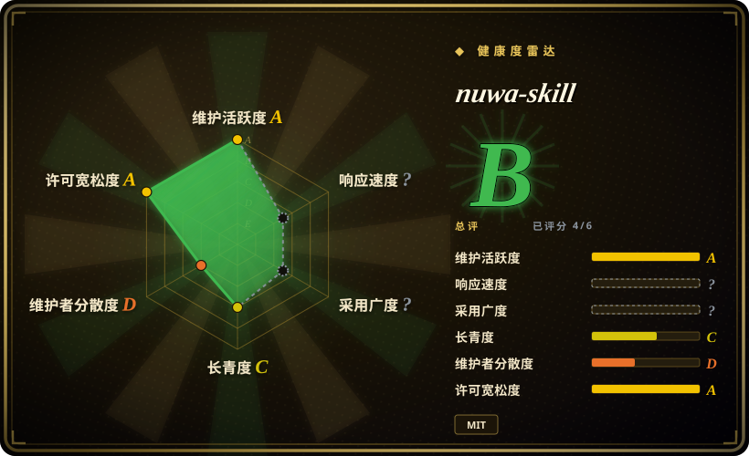

# nuwa-skill

你想蒸馏的下一个员工，何必是同事。蒸馏任何人的思维方式——心智模型、决策启发式、表达DNA。Distill how anyone thinks.

## 何时使用

你想让 agent 把公开人物、专家、创始人、作家、老师或某个领域人格蒸馏成可安装 Agent Skill：心智模型、决策启发式、表达 DNA、价值观、反模式和明确诚实边界。输入材料公开、可溯源，而且足够支撑 perspective skill，而不是浅层角色扮演 prompt 时，选 nuwa-skill。

它适合“蒸馏 Paul Graham”“做一个张小龙视角 skill”“做一个费曼式解释 skill”这类任务。上游描述了六路研究、心智模型三重验证、生成 `SKILL.md`、人物 / 主题 skill 示例、保真度评分卡，以及通过 `npx skills add alchaincyf/nuwa-skill` 跨 runtime 安装。

## 何时不用

- **你要蒸馏未经同意的私人个体。** 不要把私人对话、员工记录或个人写作变成 persona skill，除非有明确权利和授权。
- **你需要忠实复制某人的真实想法。** Nuwa 只能从可得材料推断，不能验证私人想法、直觉或未来立场变化。
- **你只是想提取用户自己的偏好。** 目标是当前用户隐性知识时，用 [tacit-mining](tacit-mining.zh.md) 或 memory / voice 工作流。
- **你需要有引用的稳定知识库，而不是人格。** 来源依据比视角模拟更重要时，用 [NotebookLM Claude Code Skill](notebooklm-skill.zh.md)。
- **你只需要一个小型本地 style guide。** 自写 `SKILL.md` 或 voice guide 比完整多 agent 研究 / 蒸馏流程更小。

## 横向对比

| 替代品 | 是否收录 | 我们的评价 | 取舍 |
|---|---|---|---|
| [soul.md](soul-md.zh.md) | ✅ | 已有某个人的原始资料，想把它打包为 digital identity 文件层级时选 soul.md。 | soul.md 是单个 identity 的模板 / runtime；nuwa-skill 是研究与蒸馏 pipeline。 |
| [tacit-mining](tacit-mining.zh.md) | ✅ | 通过对话提取当前用户自己的隐性判断规则时选 tacit-mining。 | tacit-mining 挖一个用户的 tacit knowledge；nuwa 面向公开人物或主题。 |
| [NotebookLM Claude Code Skill](notebooklm-skill.zh.md) | ✅ | 交付物是从上传文档里取回带引用答案时选 NotebookLM。 | NotebookLM 是 retrieval-grounded；nuwa 生成会外推的 perspective skill。 |
| 自写 persona prompt | 未收录 | persona 很窄、source 要求低时手写 prompt。 | 更快更便宜，但缺少 nuwa 的研究、验证、示例和诚实边界结构。 |

## 健康度与可持续性

- **维护快照（2026-07-16）：** GitHub 返回 `archived=false`，`pushed_at=2026-07-02T03:11:38Z`；health 将维护评为 A。
- **采用快照：** 2026-07 约 28,015 个 GitHub stars；对年轻 skill 是强关注信号，但不是 persona fidelity 证明。
- **许可证快照：** 只读上游核验确认 README 和根目录 `LICENSE` 均为 MIT。
- **Lindy / 治理：** health 中 longevity 为 C；因项目年轻且维护者集中，governance 为 D。
- **风险信号：** persona 蒸馏可能夸大保真度、误处理私人 / 来源材料，或在忽略诚实边界时产出误导性“专家”回答。

## 存疑（未验证）

- [未验证] 上游 fidelity scorecards 和示例质量读自 README，本次没有独立复现。
- [未验证] 生成的 perspective skill 可能外推到来源材料之外；依赖前应检查诚实边界和来源透明度。
- [推断] 最适合公开人物或主题蒸馏，不适合私人雇员克隆或合规级专家建议。
