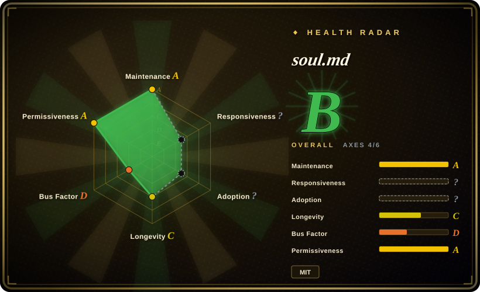

# soul.md

The best way to build a personality for your agent. Let Claude Code / OpenClaw ingest your data & build your AI soul.

## When to use

You already have source material for a digital identity and want a structured Agent Skill folder that tells the model how to embody it: `SOUL.md` for worldview, `STYLE.md` for voice, `MEMORY.md` for continuity, `data/` for raw material, and `examples/` for good/bad output calibration. Choose soul.md when the goal is a persistent persona package rather than a one-off prompt.

This repo has no root README in the current upstream tree; the operational contract comes from `SKILL.md`, `MEMORY.md`, templates, and examples. It is strongest for agent runtimes that can read local files and maintain a folder of identity/context files.

## When NOT to use

- **You need source-grounded answers with citations.** [NotebookLM Claude Code Skill](notebooklm-skill.md) is better for retrieval over uploaded documents.
- **You need to create a persona from scratch through research.** [nuwa-skill](nuwa-skill.md) gives a research/distillation pipeline; soul.md assumes you can fill the identity files.
- **You are modeling a private person without consent.** The folder structure makes cloning easy; that is a privacy and authorization risk, not only a technical task.
- **You do not want role embodiment.** soul.md explicitly instructs the agent to stay in character and avoid “as an AI” framing; avoid it when neutral assistant behavior is required.
- **You cannot manage persistent files.** Its memory and calibration model depends on local files being read and maintained over time.

## Comparison

| Alternative | In index | Our verdict | Tradeoff |
|---|---|---|---|
| [nuwa-skill](nuwa-skill.md) | ✅ | Choose nuwa when you need to research and distill a public figure or theme into a skill. | nuwa is a creation pipeline; soul.md is a file hierarchy and operating contract for an identity. |
| [tacit-mining](tacit-mining.md) | ✅ | Choose tacit-mining when the target is the user's own tacit judgment rules discovered through dialogue. | tacit-mining extracts rules; soul.md packages a broader persona and memory. |
| Custom voice guide | 未收录 | Choose a custom guide for a narrow brand/author voice without full identity embodiment. | Smaller and safer; less persistence and calibration than soul.md. |
| Character role-play prompt | 未收录 | Use only for disposable experimentation. | Cheap, but lacks file hierarchy, source priority, memory, and anti-pattern calibration. |

## Health & viability

- **Maintenance snapshot (2026-07-16):** GitHub reports `archived=false` and `pushed_at=2026-07-16T05:44:05Z`; health scores maintenance as A.
- **Adoption snapshot:** ~616 GitHub stars as of 2026-07; small but relevant for a young identity-template repo.
- **License snapshot:** MIT verified from root `LICENSE`; GitHub contents also show `SKILL.md`, `MEMORY.md`, `SOUL.template.md`, `STYLE.template.md`, `data/`, and `examples/`.
- **Lindy / governance:** health longevity is C and governance is D because commit activity is concentrated.
- **Risk flags:** persona embodiment can create overconfident imitation, privacy issues, or stale memory if users do not curate the identity folder.

## Caveats (unverified)

- [未验证] The repository has no root README at the verified `main` tree; this page is based on `SKILL.md`, templates, root contents, and LICENSE.
- [未验证] Example identity quality was not evaluated by running an agent with the folder.
- [推断] Best fit is packaging an identity you already own or are authorized to model, not open-ended research or retrieval.
