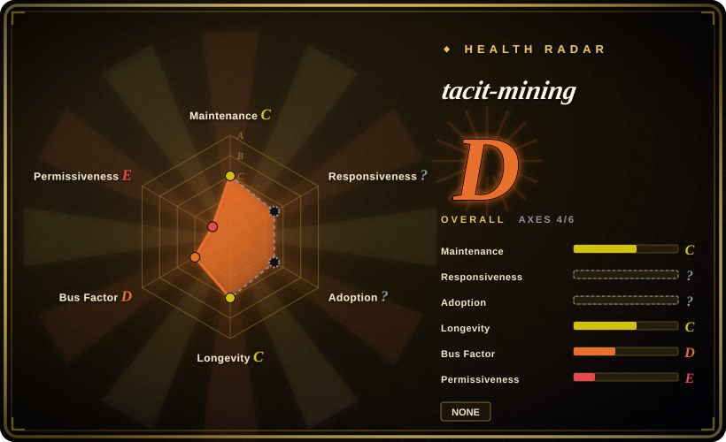

# tacit-mining

Let AI truly understand you. A Claude Code skill that extracts tacit knowledge through structured dialogue. 隐性知识挖掘技能。

## When to use

You want an agent to understand the user's tacit judgment rules through structured dialogue: writing taste, topic instinct, product judgment, aesthetics, and audience sense. Use tacit-mining when the target is **the current user's own implicit decision standards**, not a public persona or generic memory store.

The upstream skill is based on Polanyi's tacit knowledge theory plus CDM, Laddering, and Repertory Grid methods. It asks about concrete events and choices, performs teachback, stores confirmed or fuzzy rules under `memory/tacit/`, and updates a tacit knowledge map.

## When NOT to use

- **License clarity matters.** The README says MIT, but the verified root tree has no `LICENSE` file; keep reuse conservative until the upstream adds one.
- **You need a persona or expert imitation.** Use [nuwa-skill](nuwa-skill.md) or [soul.md](soul-md.md); tacit-mining is about extracting the user's own tacit rules.
- **You cannot store personal memory files.** The workflow writes `memory/tacit/` fragments and updates maps; that is sensitive user preference data.
- **You need quick prompt tuning.** Tacit mining is an interview loop, not a one-shot prompt optimizer.
- **The user does not want introspective questioning.** The method depends on 5-8 rounds of concrete-event probing and correction.

## Comparison

| Alternative | In index | Our verdict | Tradeoff |
|---|---|---|---|
| [nuwa-skill](nuwa-skill.md) | ✅ | Choose nuwa when you want to distill a public figure or theme into a reusable perspective skill. | nuwa targets public-source persona/thinking extraction; tacit-mining targets the current user's hidden criteria. |
| [soul.md](soul-md.md) | ✅ | Choose soul.md when you already have identity/source files and want a persistent persona package. | soul.md packages identity; tacit-mining elicits user rules through dialogue. |
| [NotebookLM Claude Code Skill](notebooklm-skill.md) | ✅ | Choose NotebookLM when the issue is source-grounded retrieval from uploaded documents. | NotebookLM retrieves; tacit-mining interviews and writes memory fragments. |
| Manual interview notes | 未收录 | Use manual notes when data sensitivity blocks automated memory writes. | Safer and easier to review, but loses agent automation and map updates. |

## Health & viability

- **Maintenance snapshot (2026-07-16):** GitHub reports `archived=false` and `pushed_at=2026-04-08T10:52:37Z`; health scores maintenance as C.
- **Adoption snapshot:** ~68 GitHub stars as of 2026-07; low adoption is acceptable for inclusion but should be treated as a risk signal.
- **License snapshot:** `NOASSERTION`; README says MIT, but the verified root tree contains only `README.md`, `SKILL.md`, and `banner.jpg`, with no root `LICENSE`.
- **Lindy / governance:** health longevity is C and governance is D due to a young, single-maintainer repo.
- **Risk flags:** stores sensitive user judgment data and can overfit from a small number of interview rounds.

## Caveats (unverified)

- [未验证] README says MIT, but no root `LICENSE` file was found in the verified tree.
- [未验证] The interview method was read from README/SKILL.md but not run with a user in this pass.
- [推断] Best fit is preference/tacit-rule extraction for a consenting user, not persona cloning or general knowledge retrieval.
