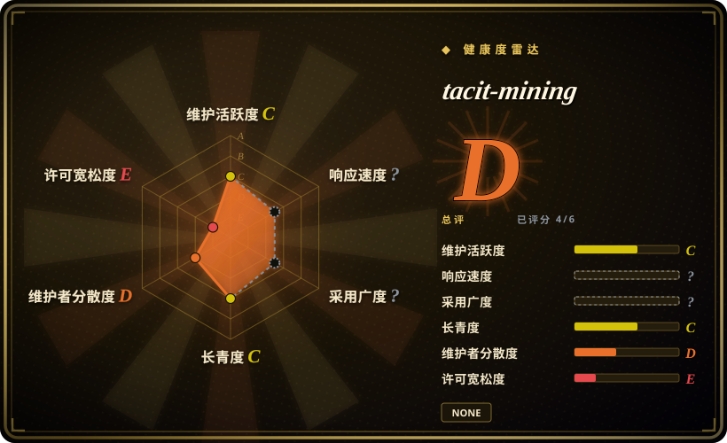

# tacit-mining

Let AI truly understand you. A Claude Code skill that extracts tacit knowledge through structured dialogue. 隐性知识挖掘技能。

## 何时使用

你想让 agent 通过结构化对话理解用户自己的隐性判断规则：写作品味、选题直觉、产品判断、审美和读者感知。目标是**当前用户自己的隐性决策标准**，而不是公开 persona 或通用记忆库时，选 tacit-mining。

上游 skill 基于 Polanyi 隐性知识理论，以及 CDM、Laddering、Repertory Grid 方法。它围绕具体事件和选择提问、teachback 复述确认，把 confirmed / fuzzy 规则存到 `memory/tacit/`，并更新隐性知识地图。

## 何时不用

- **许可证必须清晰。** README 写 MIT，但已核验根目录没有 `LICENSE` 文件；上游补 license 前，复用应保守处理。
- **你需要 persona 或专家模仿。** 用 [nuwa-skill](nuwa-skill.zh.md) 或 [soul.md](soul-md.zh.md)；tacit-mining 是提取用户自己的 tacit rules。
- **你不能存个人 memory 文件。** 工作流会写 `memory/tacit/` fragments 和 map，这是敏感用户偏好数据。
- **你只需要快速 prompt tuning。** 隐性知识挖掘是访谈循环，不是一条 prompt 优化器。
- **用户不想接受内省式追问。** 方法依赖 5-8 轮具体事件 probing 和纠正。

## 横向对比

| 替代品 | 是否收录 | 我们的评价 | 取舍 |
|---|---|---|---|
| [nuwa-skill](nuwa-skill.zh.md) | ✅ | 想把公开人物或主题蒸馏成 reusable perspective skill 时选 nuwa。 | nuwa 面向公开来源 persona / thinking extraction；tacit-mining 面向当前用户隐藏标准。 |
| [soul.md](soul-md.zh.md) | ✅ | 已有 identity / source 文件，想做持久 persona package 时选 soul.md。 | soul.md 包装 identity；tacit-mining 通过对话抽取用户规则。 |
| [NotebookLM Claude Code Skill](notebooklm-skill.zh.md) | ✅ | 问题是从上传文档里取回有来源依据的答案时选 NotebookLM。 | NotebookLM 做 retrieval；tacit-mining 做访谈并写 memory fragments。 |
| 手工访谈笔记 | 未收录 | 数据敏感性不允许自动写 memory 时用手工笔记。 | 更安全、更易审阅，但失去 agent automation 和 map updates。 |

## 健康度与可持续性

- **维护快照（2026-07-16）：** GitHub 返回 `archived=false`，`pushed_at=2026-04-08T10:52:37Z`；health 将维护评为 C。
- **采用快照：** 2026-07 约 68 个 GitHub stars；低采用不影响收录，但应视为风险信号。
- **许可证快照：** `NOASSERTION`；README 写 MIT，但已核验根目录只有 `README.md`、`SKILL.md` 和 `banner.jpg`，没有根目录 `LICENSE`。
- **Lindy / 治理：** 项目年轻，health 中 longevity 为 C；单维护者集中，governance 为 D。
- **风险信号：** 会存储敏感用户判断数据，而且可能从少量访谈轮次过拟合。

## 存疑（未验证）

- [未验证] README 写 MIT，但已核验 tree 中没有根目录 `LICENSE` 文件。
- [未验证] 访谈方法读自 README / `SKILL.md`，本次没有和用户实际跑一轮。
- [推断] 最适合同意参与的用户做 preference / tacit-rule extraction，不适合 persona 克隆或通用知识 retrieval。
