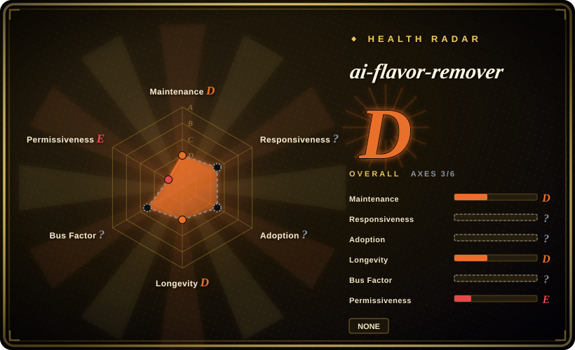

# ai-flavor-remover

Single-file Chinese prompt snippet for removing “AI flavor”, with the upstream README saying it was only tested on Gemini 2.5 Pro.

## When to use

You want the lightest possible Chinese de-AI prompt to paste into a reasoning model, and you explicitly accept the upstream constraint that it was only tested on Gemini 2.5 Pro. Use ai-flavor-remover as a prompt specimen or quick experiment, not as an installable Claude/Codex skill.

It belongs here only as a real repository relevant to de-AI writing; the upstream tree contains only `README.md` in the read-only check, with no `SKILL.md`, no references directory, and no install metadata.

## When NOT to use

- **You need a real SKILL.md package.** Use [shuorenhua](shuorenhua.md), [Humanizer-zh](humanizer-zh.md), [humanizer](humanizer.md), or [stop-slop](stop-slop.md); this repo is a README prompt, not an installable skill pack.
- **License clarity matters.** The read-only upstream check found no `LICENSE` file and GitHub metadata has no parsed license.
- **You are not using Gemini 2.5 Pro or a comparable reasoning model.** The upstream README only claims Gemini 2.5 Pro testing.
- **You need protected spans, examples, benchmark cases, or harness install docs.** This repo does not provide the structure that larger de-AI skills provide.

## Comparison

| Alternative | In index | Our verdict | Tradeoff |
|---|---|---|---|
| [shuorenhua](shuorenhua.md) | ✅ | Choose shuorenhua for an installable Chinese de-AI skill with protected spans and multi-harness docs. | shuorenhua is a real skill pack; ai-flavor-remover is a minimal prompt snippet. |
| [Humanizer-zh](humanizer-zh.md) | ✅ | Choose Humanizer-zh for a Claude Code Chinese humanizer skill. | Humanizer-zh has `SKILL.md` and MIT license; ai-flavor-remover has no license file and no SKILL.md. |
| [humanizer](humanizer.md) | ✅ | Choose humanizer for the English upstream skill. | humanizer is installable and structured; ai-flavor-remover is a Gemini-tested prompt. |
| Paste-your-own prompt | 未收录 | Use your own prompt when this prompt is too opinionated or license is unclear. | Same lightweight workflow without depending on an unlicensed repo. |

## Tech stack

- **README prompt** — the read-only upstream check found only `README.md`, not a package or multi-file skill.
- **No detected language runtime** — GitHub reports no primary language.
- **Model assumption** — upstream says it was tested only on Gemini 2.5 Pro.

## Dependencies

- **Reasoning-model chat session** — you paste the prompt into a model; there is no installer or runtime.
- **No `SKILL.md` harness dependency** — this is not an Agent Skills package.
- **License uncertainty** — no license file was found, so redistribution/vendoring needs caution.

## Ops difficulty

**Low to try, high to standardize.** Pasting the prompt is easy; making it reproducible across teams is harder because there is no package structure, versioned examples, or harness contract.

## Health & viability

- **Maintenance snapshot (2026-07-16):** GitHub reports `archived=false` and `pushed_at=2025-04-02T14:35:03Z`; health scores maintenance as D.
- **Adoption snapshot:** ~1,093 GitHub stars as of 2026-07, but the repository has no package structure and no installable skill artifacts.
- **License snapshot:** `NOASSERTION`; the read-only upstream check found no license file.
- **Lindy / governance:** single-file prompt repo with no recent activity; use as an example, not as infrastructure.
- **Risk flags:** author-reported detector/improvement claims and Gemini-only testing were not independently reproduced.

## Caveats (unverified)

- [未验证] Upstream effect claims, including any AI-detector score changes, were not reproduced.
- [未验证] No license file was found during the read-only upstream check; legal reuse is unclear.
- [推断] Because it is only a prompt snippet, it is better treated as inspiration for a private prompt than as an OSS dependency.
