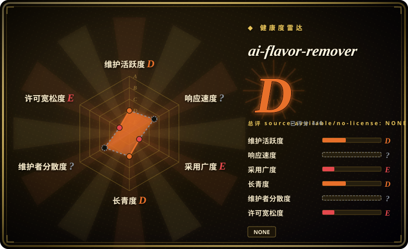

# ai-flavor-remover

一个用于去除“AI 味”的中文单文件 prompt 片段；上游 README 明确说只在 Gemini 2.5 Pro 上测试过。

## 何时使用

你只想要一个最轻量的中文去 AI 味 prompt，直接复制到推理模型里试，并且接受上游“仅在 Gemini 2.5 Pro 上测试过”的限制时，可以参考 ai-flavor-remover。它更像 prompt 标本或快速实验，不是可安装的 Claude / Codex skill。

本页仍收录它，是因为它是真实仓库且与去 AI 写作相关；但只读上游核验只看到 `README.md`，没有 `SKILL.md`、references 目录或安装 metadata。

## 何时不用

- **你需要真正的 SKILL.md 包。** 选 [shuorenhua](shuorenhua.zh.md)、[Humanizer-zh](humanizer-zh.zh.md)、[humanizer](humanizer.zh.md) 或 [stop-slop](stop-slop.zh.md)；这个仓库是 README prompt，不是可安装 skill-pack。
- **许可证必须明确。** 只读上游核验没有发现 `LICENSE` 文件，GitHub metadata 也没有解析出许可证。
- **你不用 Gemini 2.5 Pro 或同类推理模型。** 上游 README 只声称 Gemini 2.5 Pro 测试。
- **你需要 protected spans、示例、benchmark 或 harness 安装文档。** 该仓库没有较完整 de-AI skill 的结构。

## 横向对比

| 替代品 | 是否收录 | 我们的评价 | 取舍 |
|---|---|---|---|
| [shuorenhua](shuorenhua.zh.md) | ✅ | 需要可安装的中文去 AI 味 skill、protected spans 和多 harness 文档时选 shuorenhua。 | shuorenhua 是真正的 skill-pack；ai-flavor-remover 是极简 prompt 片段。 |
| [Humanizer-zh](humanizer-zh.zh.md) | ✅ | 需要 Claude Code 中文 humanizer skill 时选 Humanizer-zh。 | Humanizer-zh 有 `SKILL.md` 和 MIT license；ai-flavor-remover 没有 license 文件，也没有 `SKILL.md`。 |
| [humanizer](humanizer.zh.md) | ✅ | 英文上游 skill 选 humanizer。 | humanizer 可安装、结构完整；ai-flavor-remover 是 Gemini 测过的 prompt。 |
| 自写 prompt | 未收录 | 这个 prompt 过于主观或许可证不清时，自写本地 prompt。 | 同样轻量，但不依赖一个无明确许可证的仓库。 |

## 技术栈

- **README prompt**——只读上游核验只发现 `README.md`，不是 package 或多文件 skill。
- **无检测到的语言运行时**——GitHub 没有返回主要语言。
- **模型假设**——上游说明只在 Gemini 2.5 Pro 上测试过。

## 依赖

- **推理模型聊天会话**——把 prompt 粘进模型；没有 installer 或 runtime。
- **无 `SKILL.md` harness 依赖**——它不是 Agent Skills 包。
- **许可证不确定**——没有找到 license 文件，redistribution / vendoring 需要谨慎。

## 运维难度

**试用低，标准化高。** 复制 prompt 很容易；团队内可复现较难，因为没有 package 结构、版本化示例或 harness contract。

## 健康度与可持续性

- **维护快照（2026-07-16）：** GitHub 返回 `archived=false`，`pushed_at=2025-04-02T14:35:03Z`；health 将维护评为 D。
- **采用快照：** 2026-07 约 1,093 个 GitHub stars，但仓库没有 package 结构，也没有可安装 skill artifact。
- **许可证快照：** `NOASSERTION`；只读上游核验没有发现 license 文件。
- **Lindy / 治理：** 单文件 prompt 仓库且近期无活动；更适合作为示例，而不是基础设施。
- **风险信号：** 作者自述的 detector / 改善效果和 Gemini-only 测试，本次没有独立复现。

## 存疑（未验证）

- [未验证] 上游效果声明，包括 AI 检测器分数变化，本次没有复现。
- [未验证] 只读上游核验没有找到 license 文件；法律复用不清楚。
- [推断] 因为它只是 prompt 片段，更适合作为私有 prompt 灵感，而不是 OSS 依赖。
