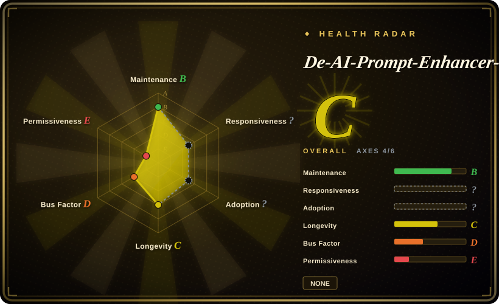

# De-AI-Prompt-Enhancer-Writer-Booster-SKILL

Chinese de-AI writing prompt suite packaged as two SKILL-format folders: `de-AI-writing/SKILL.md` for AI-tone cleanup and `good-writing/SKILL.md` for stronger author-style reconstruction.

## When to use

You want a Chinese de-AI writing workflow that goes beyond generic “humanize this” prompts and deliberately models an author-like writing style. Choose this repo when you want two installable SKILL folders: `de-AI-writing` for cleanup and `good-writing` for a heavier writer-booster / style-reconstruction workflow.

It is a better fit when your team accepts a strong, opinionated Chinese prose voice and wants auxiliary style-audit scripts (`scripts/style_audit.js`, `de-AI-writing/tools/style-lint.ps1`) rather than a neutral, lightweight humanizer.

## When NOT to use

- **License clarity matters.** No root `LICENSE` file was found in the upstream tree during the read-only check, and GitHub metadata reports no parsed license.
- **You need neutral Chinese prose.** Use [shuorenhua](shuorenhua.md) or [Humanizer-zh](humanizer-zh.md); this repo's `good-writing` workflow is more author-style and voice-DNA oriented.
- **You only need quick cleanup.** The `de-AI-writing` folder may be enough; adopting the whole writer-booster workflow is heavier than a single humanizer skill.
- **You are editing someone else's private style samples.** Do not use style-reconstruction workflows unless you have rights and consent for the source material.

## Comparison

| Alternative | In index | Our verdict | Tradeoff |
|---|---|---|---|
| [shuorenhua](shuorenhua.md) | ✅ | Choose shuorenhua for general Chinese fact-preserving rewrite across engineering/product scenarios. | shuorenhua is less tied to one author style; OUBIGFA is heavier and more voice-reconstruction oriented. |
| [Humanizer-zh](humanizer-zh.md) | ✅ | Choose Humanizer-zh for a smaller Chinese localization of the upstream humanizer checklist. | Humanizer-zh is lighter; OUBIGFA adds writer-booster behavior and style-audit scripts. |
| [humanizer](humanizer.md) | ✅ | Choose humanizer for English text and the upstream portable skill. | OUBIGFA is Chinese-first and more subjective. |
| Private voice guide | 未收录 | Choose a private guide when the style source is internal or legally sensitive. | A private guide avoids public repo license/source ambiguity. |

## Health & viability

- **Maintenance snapshot (2026-07-16):** GitHub reports `archived=false` and `pushed_at=2026-06-01T04:26:50Z`; health scores maintenance as B.
- **Adoption snapshot:** ~538 GitHub stars as of 2026-07; still a young, single-maintainer skill pack.
- **License snapshot:** `NOASSERTION`; the read-only upstream check did not find a root license file, so reuse/vendoring is blocked until license is clarified.
- **Lindy / governance:** created in 2026, health scores longevity as C and governance as D due to maintainer concentration.
- **Risk flags:** `good-writing` can impose a strong author-like style; this is a feature for voice reconstruction but a liability for neutral editorial cleanup.

## Caveats (unverified)

- [未验证] Upstream README refers to style material under `.writer/`; the read-only tree check only confirmed related sample/reference files, not that exact directory.
- [未验证] The style-audit scripts were identified from upstream docs/tree but not executed locally.
- [推断] The writer-booster workflow may be too opinionated for neutral documentation, support replies, or regulated communications.
