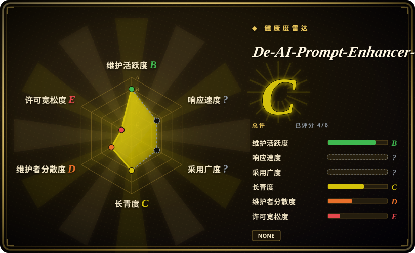

# De-AI-Prompt-Enhancer-Writer-Booster-SKILL

中文去 AI 味提示词套件，打包为两个 SKILL 格式文件夹：`de-AI-writing/SKILL.md` 用于清理 AI 腔，`good-writing/SKILL.md` 用于更强的作者风格复现。

## 何时使用

你需要的不只是通用“去 AI 味”，而是一个中文写作流程：既能做 AI 腔清理，也能强化某种作者式表达。需要两个可安装的 SKILL 文件夹时，选这个仓库：`de-AI-writing` 负责清理，`good-writing` 负责更重的 writer-booster / 风格复现。

当团队接受比较强、比较有主张的中文 prose voice，并且想要附带风格审计脚本（`scripts/style_audit.js`、`de-AI-writing/tools/style-lint.ps1`），而不是中性轻量 humanizer 时，它更合适。

## 何时不用

- **许可证必须明确。** 只读上游核验没有找到根目录 `LICENSE` 文件，GitHub metadata 也没有解析出许可证。
- **你需要中性中文表达。** 优先用 [shuorenhua](shuorenhua.zh.md) 或 [Humanizer-zh](humanizer-zh.zh.md)；本仓库的 `good-writing` 更偏作者风格和 voice DNA。
- **你只需要快速去味。** 只用 `de-AI-writing` 文件夹可能就够了；采用整个 writer-booster 流程比单个 humanizer skill 更重。
- **你在处理他人的私有风格样本。** 没有素材权利和同意时，不应使用风格复现流程。

## 横向对比

| 替代品 | 是否收录 | 我们的评价 | 取舍 |
|---|---|---|---|
| [shuorenhua](shuorenhua.zh.md) | ✅ | 通用中文保真改写、工程 / 产品场景优先选 shuorenhua。 | shuorenhua 不绑定某个作者风格；OUBIGFA 更重，也更偏风格复现。 |
| [Humanizer-zh](humanizer-zh.zh.md) | ✅ | 需要更小的中文 humanizer checklist 时选 Humanizer-zh。 | Humanizer-zh 更轻；OUBIGFA 增加 writer-booster 和风格审计脚本。 |
| [humanizer](humanizer.zh.md) | ✅ | 英文文本和上游 portable skill 选 humanizer。 | OUBIGFA 中文优先，且更主观。 |
| 私有 voice guide | 未收录 | 风格源材料是内部或法律敏感素材时自写。 | 私有 guide 避开公开仓库许可证和素材来源不确定性。 |

## 健康度与可持续性

- **维护快照（2026-07-16）：** GitHub 返回 `archived=false`，`pushed_at=2026-06-01T04:26:50Z`；health 将维护评为 B。
- **采用快照：** 2026-07 约 538 个 GitHub stars；仍是年轻、单维护者集中的 skill pack。
- **许可证快照：** `NOASSERTION`；只读上游核验未发现根目录 license 文件，因此复用 / vendoring 前必须先澄清许可证。
- **Lindy / 治理：** 创建于 2026，health 中 longevity 为 C，governance 因维护者集中为 D。
- **风险信号：** `good-writing` 会施加强作者风格；这对 voice reconstruction 是功能，对中性编辑清理是风险。

## 存疑（未验证）

- [未验证] 上游 README 提到 `.writer/` 下的作者文章；只读 tree 核验只确认相关 sample / reference 文件，未确认该目录当前存在。
- [未验证] 风格审计脚本来自上游文档 / tree 线索，本次没有在本地执行。
- [推断] writer-booster 流程可能过于主观，不适合中性文档、客服回复或合规沟通。
