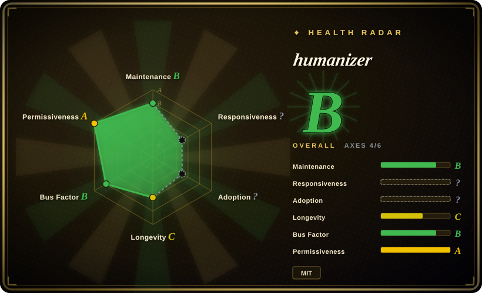

# humanizer

Claude Code skill that removes signs of AI-generated writing from text

## When to use

You are editing English prose that reads like generic AI output and want a portable, installable agent skill rather than another inline prompt. Choose humanizer when the target language is English, you want the upstream rubric behind the Chinese Humanizer-zh page, and your harness can load skill-style Markdown instructions or Claude Code plugins.

It is useful when you want more than a short “remove AI tone” prompt: upstream includes `SKILL.md`, plugin metadata, install commands via `npx skills add blader/humanizer`, Claude Code plugin install docs, false-positive guidance, and a draft→audit→final rewrite loop.

## When NOT to use

- **Your target text is Chinese.** Use [Humanizer-zh](humanizer-zh.md) for the localized checklist or [shuorenhua](shuorenhua.md) for Chinese-first scene rules and protected spans.
- **You want a very strict, minimal rubric.** [stop-slop](stop-slop.md) is shorter and more forceful; humanizer is broader and more cautious.
- **You must preserve a formal, academic, legal, or technical register.** Humanizer includes false-positive guidance, but de-AI skills can still over-edit useful formal structure.
- **You need brand voice cloning.** Use a private voice guide or an author-style workflow; humanizer is a general English AI-writing cleanup rubric.

## Comparison

| Alternative | In index | Our verdict | Tradeoff |
|---|---|---|---|
| [Humanizer-zh](humanizer-zh.md) | ✅ | Choose Humanizer-zh for Simplified Chinese text and Claude Code usage. | Humanizer-zh localizes this upstream skill but may lag upstream pattern changes. |
| [shuorenhua](shuorenhua.md) | ✅ | Choose shuorenhua for Chinese engineering/product prose with protected spans. | shuorenhua is Chinese-native and scenario-oriented; humanizer is the English upstream baseline. |
| [stop-slop](stop-slop.md) | ✅ | Choose stop-slop for a compact, hard-edged prose de-slop rubric. | stop-slop is stricter and easier to paste; humanizer has more patterns, false-positive handling, and plugin install paths. |
| Custom voice guide | 未收录 | Choose a custom guide when one author or brand voice matters more than generic AI-tone cleanup. | Custom guides fit one voice; humanizer is reusable and broadly applicable. |

## Health & viability

- **Maintenance snapshot (2026-07-16):** GitHub reports `archived=false` and `pushed_at=2026-06-29T20:43:06Z`; health scores maintenance as B.
- **Adoption snapshot:** ~29,415 GitHub stars as of 2026-07, but this is a social attention signal, not evidence that every rewrite is good.
- **License snapshot:** MIT verified from GitHub metadata, root `LICENSE`, README, and `SKILL.md` metadata in the read-only upstream check.
- **Lindy / governance:** young project with strong attention; health reports a broader contributor distribution than many single-skill repos, but it is still under one year old.
- **Risk flags:** upstream patterns cite Wikipedia-style AI-writing signals; exact alignment with current writing norms should be rechecked over time.

## Caveats (unverified)

- [未验证] The project cites Wikipedia-style “signs of AI writing”; this pass did not verify that every upstream pattern matches the current Wikipedia page.
- [未验证] Install commands were read from upstream docs but not executed locally.
- [推断] Because Humanizer-zh appears to lag upstream pattern counts, this upstream page is the safer baseline for English text and current upstream rules.
