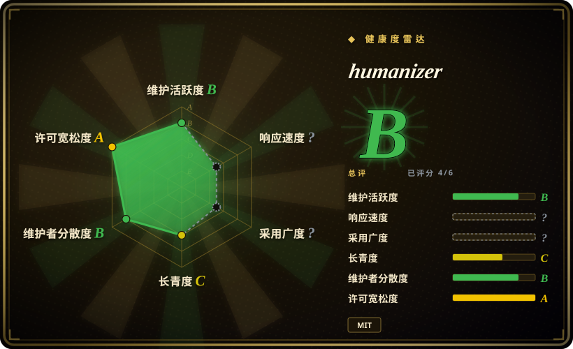

# humanizer

Claude Code skill that removes signs of AI-generated writing from text

## 何时使用

你正在编辑英文文本，输出看起来像通用 AI 写作，并且想用一个可安装、可复用的 agent skill，而不是再写一条临时 prompt。目标语言是英文、你想使用 Humanizer-zh 背后的上游规则，并且 harness 能加载 skill-style Markdown 指令或 Claude Code plugin 时，选 humanizer。

当你需要的不只是“去 AI 味”一句话，而是 `SKILL.md`、plugin metadata、`npx skills add blader/humanizer`、Claude Code plugin 安装文档、false-positive 指南和 draft→audit→final 改写循环时，它更合适。

## 何时不用

- **目标文本是中文。** 简体中文 checklist 用 [Humanizer-zh](humanizer-zh.zh.md)，中文工程 / 产品表达和 protected spans 用 [shuorenhua](shuorenhua.zh.md)。
- **你想要非常短、非常硬的规则。** [stop-slop](stop-slop.zh.md) 更短也更强硬；humanizer 更宽、更谨慎。
- **必须保留正式、学术、法律或技术语体。** humanizer 有 false-positive 指南，但去 AI 味 skill 仍可能过度编辑有用的正式结构。
- **你要复刻品牌 voice。** 自写 voice guide 或作者风格工作流更合适；humanizer 是通用英文 AI 写作清理规则。

## 横向对比

| 替代品 | 是否收录 | 我们的评价 | 取舍 |
|---|---|---|---|
| [Humanizer-zh](humanizer-zh.zh.md) | ✅ | 简体中文文本和 Claude Code 中文场景选 Humanizer-zh。 | Humanizer-zh 是本上游 skill 的中文本地化，但可能落后于上游规则变化。 |
| [shuorenhua](shuorenhua.zh.md) | ✅ | 中文工程 / 产品表达，并需要 protected spans 时选 shuorenhua。 | shuorenhua 更中文原生、场景化；humanizer 是英文上游基线。 |
| [stop-slop](stop-slop.zh.md) | ✅ | 需要短小、强硬的 prose 去机器腔规则时选 stop-slop。 | stop-slop 更严格、更容易复制；humanizer 模式更多，有 false-positive 处理和 plugin 安装路径。 |
| 自写 voice guide | 未收录 | 单个作者或品牌 voice 比通用去 AI 味更重要时自写。 | 自写更贴一个 voice；humanizer 更通用。 |

## 健康度与可持续性

- **维护快照（2026-07-16）：** GitHub 返回 `archived=false`，`pushed_at=2026-06-29T20:43:06Z`；health 将维护评为 B。
- **采用快照：** 2026-07 约 29,415 个 GitHub stars，但这是社交关注度，不等于每次改写质量。
- **许可证快照：** 只读上游核验确认 GitHub metadata、根目录 `LICENSE`、README 和 `SKILL.md` metadata 均为 MIT。
- **Lindy / 治理：** 项目很年轻但关注度高；health 显示贡献者分布比许多单 skill 仓库更分散，不过仍不足一年。
- **风险信号：** 上游规则引用 Wikipedia 风格 AI 写作迹象；这些模式是否仍符合当前写作规范，需要周期性复核。

## 存疑（未验证）

- [未验证] 项目引用 Wikipedia 风格“AI 写作迹象”；本次没有核验每条上游规则是否仍与当前 Wikipedia 页面一致。
- [未验证] 安装命令读自上游文档，但没有在本机逐个执行。
- [推断] 因为 Humanizer-zh 的模式数量看起来可能落后，上游 humanizer 对英文和最新上游规则更适合作为基线。
