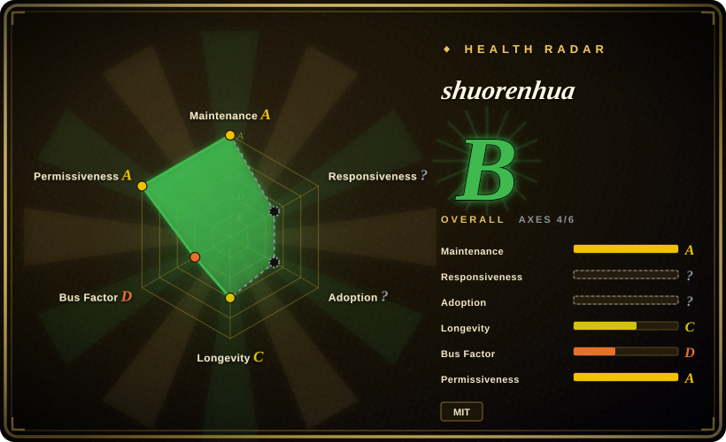

# shuorenhua

说人话｜中文优先的去 AI 味改写 skill：保事实、分场景、改完可直接发。Chinese-first rewrite skill for Codex / Claude Code / Cursor / ChatGPT — removes AI tone, preserves facts.

## When to use

You write Chinese product copy, README/release-note prose, issue replies, status updates, or social posts with an LLM, and the output keeps sounding like generic AI: over-polished, responsibility-blurring, template-heavy, or full of phrases that erase the original point. Use shuorenhua when you want a **Chinese-first** rewrite skill that says it preserves facts first, then removes AI tone by scenario, and protects commands, code, terms, names, and responsibility-bearing text from accidental rewriting.

Reach for it over a one-line prompt when the task crosses harnesses. The upstream README documents use with Codex, Claude Code, Cursor, ChatGPT, and custom agents; the repo contains `SKILL.md`, `references/`, `install/`, and `evals/`, plus Claude Code plugin and Codex usage docs.

## When NOT to use

- **You need English-first prose cleanup.** Use [humanizer](humanizer.md) or [stop-slop](stop-slop.md) instead; shuorenhua is strongest when the target language and failure modes are Chinese.
- **You need brand-voice cloning or a named author's style.** Use a private voice guide or [De-AI-Prompt-Enhancer-Writer-Booster-SKILL](de-ai-prompt-enhancer-writer-booster-skill.md); shuorenhua is more about scene-aware, fact-preserving Chinese prose than imitating one person.
- **Your text is mostly code, logs, shell commands, API names, config, or legal wording.** The upstream emphasizes protected spans, but you still should not ask a style skill to rewrite machine-checked or legally sensitive text wholesale.
- **Your real need is fact-checking.** This is a style/rewrite skill, not a source-verification system.
- **You need proof that it defeats AI detectors.** The upstream explicitly frames the goal as better prose, not detector evasion; evaluation claims still require independent review.

## Comparison

| Alternative | In index | Our verdict | Tradeoff |
|---|---|---|---|
| [Humanizer-zh](humanizer-zh.md) | ✅ | Choose Humanizer-zh for a simpler Chinese localization of the upstream humanizer checklist. | Humanizer-zh is lighter and closer to a translated rubric; shuorenhua is more scenario-aware and adds protected spans / multi-harness install docs. |
| [humanizer](humanizer.md) | ✅ | Choose humanizer for English-first AI-writing cleanup. | humanizer is the upstream English-style skill; shuorenhua is Chinese-first and more explicit about engineering prose protection. |
| [De-AI-Prompt-Enhancer-Writer-Booster-SKILL](de-ai-prompt-enhancer-writer-booster-skill.md) | ✅ | Choose it when author-style reconstruction is the point. | OUBIGFA is more opinionated and personal-style oriented; shuorenhua is more general-purpose Chinese cleanup. |
| Custom voice guide | 未收录 | Choose a private guide when one brand/author voice must be reproduced exactly. | Private guides fit one voice better; shuorenhua is reusable and public but less brand-specific. |

## Health & viability

- **Maintenance snapshot (2026-07-16):** GitHub reports `archived=false` and `pushed_at=2026-07-16T01:30:25Z`; health scores maintenance as A.
- **Adoption snapshot:** ~736 GitHub stars as of 2026-07; this is still a young, single-author skill, so do not treat star count as proof of rewrite quality.
- **License snapshot:** MIT verified from GitHub metadata and a root `LICENSE` file in the read-only upstream check.
- **Lindy / governance:** created in 2026 and health reports one dominant maintainer, so the project is active but not Lindy-proven.
- **Risk flags:** benchmark/eval claims are described upstream, but this pass only verified that `evals/` exists, not the quality of every case.

## Caveats (unverified)

- [未验证] Upstream README mentions an 80-case benchmark and scenario samples; this pass verified the presence of docs/evals directories, not benchmark quality.
- [未验证] Installation instructions for every harness were not executed locally; verify Codex / Claude Code / Cursor behavior before relying on auto-loading.
- [推断] Because it is Chinese-first, it may overfit Chinese social/product prose and be less useful for English technical documentation.
