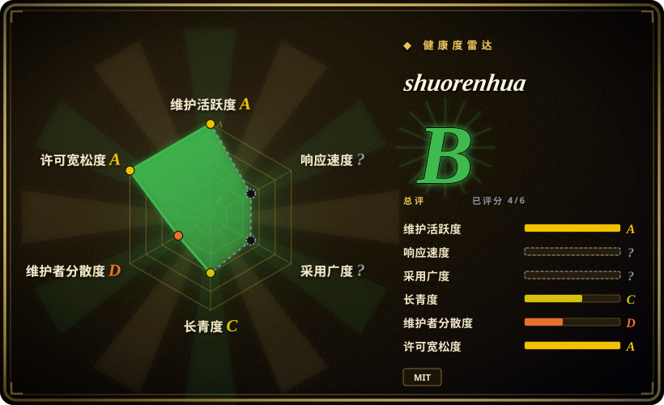

# shuorenhua

说人话｜中文优先的去 AI 味改写 skill：保事实、分场景、改完可直接发。Chinese-first rewrite skill for Codex / Claude Code / Cursor / ChatGPT — removes AI tone, preserves facts.

## 何时使用

你用 LLM 写中文产品文案、README、release note、issue 回复、状态更新或社媒内容，但输出总是像通用 AI：过度圆滑、责任主体被抹掉、模板腔重，或把原来的观点磨平。需要一个**中文优先**的改写 skill，先保事实，再按场景去 AI 味，并尽量保护命令、代码、术语、人名和责任表达时，选 shuorenhua。

当你不想只靠一条临时 prompt，而是要跨 Codex、Claude Code、Cursor、ChatGPT 或自建 agent 复用时，也适合选它。上游 README 给出多 harness 用法，仓库包含 `SKILL.md`、`references/`、`install/`、`evals/`，并有 Claude Code plugin 与 Codex 使用说明。

## 何时不用

- **你要清理英文文本。** 优先用 [humanizer](humanizer.zh.md) 或 [stop-slop](stop-slop.zh.md)；shuorenhua 的主场是中文语境和中文 AI 痕迹。
- **你要复刻品牌 voice 或某个作者文风。** 选私有 voice guide 或 [De-AI-Prompt-Enhancer-Writer-Booster-SKILL](de-ai-prompt-enhancer-writer-booster-skill.zh.md)；shuorenhua 更偏通用中文保真改写，不是作者风格克隆器。
- **文本主体是代码、日志、shell 命令、API 名、配置或法律措辞。** 上游强调 protected spans，但风格 skill 仍不适合整段重写机器校验或法律敏感内容。
- **真实需求是事实核查。** 这是风格 / 改写 skill，不是查证系统。
- **你要证明它能骗过 AI 检测器。** 上游目标是改善表达，不是规避检测；评测声明仍需独立复核。

## 横向对比

| 替代品 | 是否收录 | 我们的评价 | 取舍 |
|---|---|---|---|
| [Humanizer-zh](humanizer-zh.zh.md) | ✅ | 需要更轻量的中文 humanizer checklist 时选 Humanizer-zh。 | Humanizer-zh 更接近上游 humanizer 的中文翻译；shuorenhua 更强调场景分流、保护片段和多 harness 文档。 |
| [humanizer](humanizer.zh.md) | ✅ | 英文去 AI 味时选 humanizer。 | humanizer 是英文上游风格 skill；shuorenhua 是中文优先，并更明确保护工程文本。 |
| [De-AI-Prompt-Enhancer-Writer-Booster-SKILL](de-ai-prompt-enhancer-writer-booster-skill.zh.md) | ✅ | 需要作者风格复现时选它。 | OUBIGFA 更个人风格化；shuorenhua 更通用，适合中文保真改写。 |
| 自写 voice guide | 未收录 | 单个品牌或作者 voice 必须精确复现时自写。 | 私有 guide 更贴一个 voice；shuorenhua 更通用、可复用。 |

## 健康度与可持续性

- **维护快照（2026-07-16）：** GitHub 返回 `archived=false`，`pushed_at=2026-07-16T01:30:25Z`；health 将维护评为 A。
- **采用快照：** 2026-07 约 736 个 GitHub stars；项目仍很年轻且单作者集中，不要把 star 当作改写质量证明。
- **许可证快照：** 只读上游核验确认 GitHub metadata 和根目录 `LICENSE` 均为 MIT。
- **Lindy / 治理：** 创建于 2026，health 显示维护者集中，因此活跃但没有 Lindy 履历。
- **风险信号：** 上游有 benchmark / eval 声明；本次只核验到相关目录存在，未审计每个 case 的质量。

## 存疑（未验证）

- [未验证] 上游 README 提到 80 case benchmark 和场景样例；本次只核验到 docs / evals 目录存在，没有审计评测质量。
- [未验证] 没有本地执行所有 harness 的安装流程；依赖 Codex / Claude Code / Cursor 自动加载前仍需试装。
- [推断] 因为它中文优先，可能更适合中文社媒 / 产品表达，不一定适合英文技术文档。
