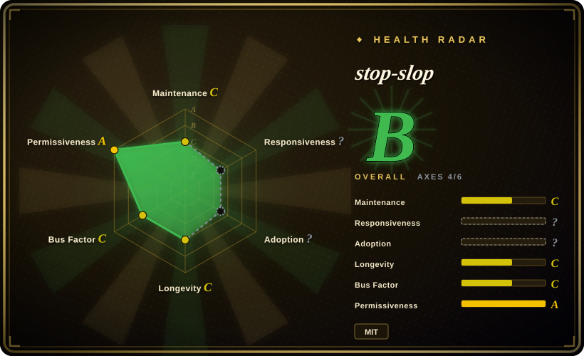

# stop-slop

A skill file for removing AI tells from prose

## When to use

You want a short, hard-edged English prose rubric that an agent can load from `SKILL.md` plus references, and you care more about quickly removing common AI tells than about preserving every formal convention. Use stop-slop when you want concrete references for phrases, structures, and examples, but do not need a Claude plugin marketplace package.

It fits lightweight review workflows: upstream documents Claude Code skill-folder use, Claude Projects upload, custom-instruction copying, and API/system-prompt use with `SKILL.md` and `references/` files.

## When NOT to use

- **You need Chinese prose cleanup.** Use [Humanizer-zh](humanizer-zh.md) or [shuorenhua](shuorenhua.md); stop-slop is English-prose oriented.
- **You need nuance-preserving formal prose.** Rules like “kill all adverbs”, “active voice required”, and “no em dashes” can over-edit academic, legal, technical, or literary writing.
- **You need plugin-style installation.** Upstream documents manual skill/API/custom-instruction use, but this pass did not find Claude plugin marketplace commands.
- **You want voice calibration rather than strict de-slop.** [humanizer](humanizer.md) has a broader and gentler loop; stop-slop is intentionally compact and forceful.

## Comparison

| Alternative | In index | Our verdict | Tradeoff |
|---|---|---|---|
| [humanizer](humanizer.md) | ✅ | Choose humanizer when you want a fuller English upstream skill with false-positive guidance and install paths. | humanizer is broader and gentler; stop-slop is shorter, stricter, and easier to paste into local instructions. |
| [Humanizer-zh](humanizer-zh.md) | ✅ | Choose Humanizer-zh for Simplified Chinese de-AI rewriting. | Humanizer-zh is Chinese-first and borrows some stop-slop ideas; stop-slop is the English hard-rules baseline. |
| [shuorenhua](shuorenhua.md) | ✅ | Choose shuorenhua for Chinese scenario-aware cleanup with protected spans. | shuorenhua handles Chinese engineering/product contexts; stop-slop does not. |
| Custom editorial checklist | 未收录 | Choose a custom checklist when your organization has explicit style rules. | A custom checklist avoids stop-slop's hard universal rules but costs maintenance. |

## Health & viability

- **Maintenance snapshot (2026-07-16):** GitHub reports `archived=false` and `pushed_at=2026-03-17T18:50:39Z`; health scores maintenance as C.
- **Adoption snapshot:** ~13,905 GitHub stars as of 2026-07; this is attention, not proof that the hard rules fit every prose genre.
- **License snapshot:** MIT verified from GitHub metadata, root `LICENSE`, README, and `SKILL.md` in the read-only upstream check.
- **Lindy / governance:** young project with a small maintainer set; useful as a compact rubric but not a long-lived standard yet.
- **Risk flags:** hard rules can be overbroad, especially for formal registers where passive voice, adverbs, or em dashes may be legitimate.

## Caveats (unverified)

- [未验证] Plugin marketplace installation was not found in the upstream docs during this pass; only manual skill/API/custom-instruction usage was verified.
- [推断] The strongest rules are stylistic preferences, not universal quality laws; expect false positives outside casual English prose.
