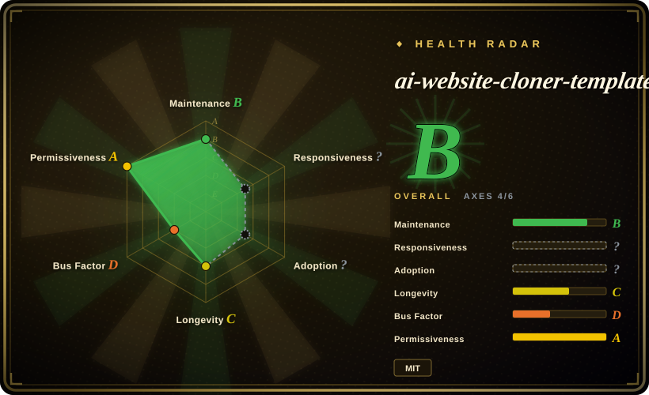

# ai-website-cloner-template

Clone any website with one command using AI coding agents

## When to use

You own or are authorized to rebuild a live website and want an AI coding agent to reverse-engineer it into a modern Next.js codebase. Choose ai-website-cloner-template when the desired workflow is screenshot/design-token reconnaissance, asset extraction, component specs, parallel builders, assembly, and visual QA against the original.

The template targets Next.js 16, React 19, TypeScript strict, shadcn/ui, Tailwind CSS v4, and multi-agent coding workflows. It exposes `/clone-website <target-url...>` and keeps `AGENTS.md` as the source of truth for supported agents including Claude Code, Codex CLI, OpenCode, Copilot, Cursor, Windsurf, Gemini CLI, Cline, Roo Code, Continue, Amazon Q, Augment Code, and Aider.

## When NOT to use

- **You do not own or have permission to reproduce the target site.** The upstream README explicitly excludes phishing, impersonation, passing off someone else's design, and terms-of-service violations.
- **You only need design inspiration.** Use [Hallmark](hallmark.md), [Taste-Skill](taste-skill.md), or a study workflow rather than cloning brand assets, copy, and layout.
- **You need framework-neutral output.** This template is opinionated around Next.js, React, shadcn/ui, and Tailwind CSS.
- **You cannot run a browser-backed agent workflow.** The reconstruction depends on screenshots, computed styles, interactions, assets, and visual comparison.
- **You need pixel-perfect legal/compliance signoff.** Treat generated code as a starting point and review brand/IP rights, accessibility, security, and responsive behavior before launch.

## Comparison

| Alternative | In index | Our verdict | Tradeoff |
|---|---|---|---|
| [Hallmark](hallmark.md) | ✅ | Choose Hallmark when you need anti-slop design direction, audit, redesign, or study without copying a live site. | Hallmark is safer for ideation; ai-website-cloner-template reconstructs concrete sites. |
| [Stitch Skills](stitch-skills.md) | ✅ | Choose Stitch when you want UI screens or code/design handoff through Stitch MCP. | Stitch generates screens; this template migrates/rebuilds target websites into a Next.js project. |
| [huashu-design](huashu-design.md) | ✅ | Choose huashu-design for HTML-native prototypes, slides, motion, and infographics. | huashu-design creates new artifacts; this template clones/migrates existing web pages. |
| Manual rebuild | not indexed | Choose manual rebuild when IP, accessibility, or business logic needs exact human judgment. | Slower, but reduces legal and quality risk versus automated cloning. |

## Health & viability

- **Maintenance snapshot (2026-07-16):** GitHub reports `archived=false` and `pushed_at=2026-07-04T06:49:18Z`; health scores maintenance as B.
- **Adoption snapshot:** ~28,523 GitHub stars as of 2026-07; strong attention signal for a young template, not proof that every target site can be reconstructed safely.
- **License snapshot:** MIT verified from upstream README badge, README license section, and root `LICENSE`.
- **Lindy / governance:** health longevity is C and governance is D because the project is young and contribution is concentrated.
- **Risk flags:** legal authorization, target-site terms, browser access, asset rights, and post-generation QA matter more than the template itself.

## Caveats (unverified)

- [未验证] Demo quality was read from upstream README/demo assets, not reproduced locally.
- [未验证] Different agents may vary in browser access, screenshot quality, and parallel worktree handling.
- [推断] Best fit is authorized site migration/rebuild, not design plagiarism or phishing.
