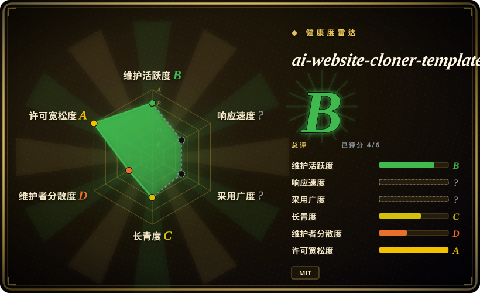

# ai-website-cloner-template

Clone any website with one command using AI coding agents

## 何时使用

你拥有或获授权重建一个线上网站，并想让 AI coding agent 把它逆向成现代 Next.js codebase。目标 workflow 是截图 / design-token 侦察、资产提取、component specs、parallel builders、组装，以及和原站做 visual QA 时，选 ai-website-cloner-template。

这个 template 面向 Next.js 16、React 19、TypeScript strict、shadcn/ui、Tailwind CSS v4 和多 agent 编码工作流。它暴露 `/clone-website <target-url...>`，并以 `AGENTS.md` 作为 Claude Code、Codex CLI、OpenCode、Copilot、Cursor、Windsurf、Gemini CLI、Cline、Roo Code、Continue、Amazon Q、Augment Code、Aider 等 agent 的说明 SSOT。

## 何时不用

- **你不拥有或未获授权复刻目标站点。** 上游 README 明确排除 phishing、impersonation、冒充他人设计，以及违反服务条款的用途。
- **你只是找设计灵感。** 用 [Hallmark](hallmark.zh.md)、[Taste-Skill](taste-skill.zh.md) 或 study workflow，而不是复制品牌资产、文案和布局。
- **你需要 framework-neutral 输出。** 这个 template 强绑定 Next.js、React、shadcn/ui 和 Tailwind CSS。
- **你不能运行 browser-backed agent workflow。** 重建依赖截图、computed styles、交互、资产和视觉对比。
- **你需要 pixel-perfect 法务 / 合规签核。** 生成代码只能当起点；上线前仍要审品牌 / IP 权利、可访问性、安全和响应式行为。

## 横向对比

| 替代品 | 是否收录 | 我们的评价 | 取舍 |
|---|---|---|---|
| [Hallmark](hallmark.zh.md) | ✅ | 需要 anti-slop design direction、audit、redesign 或 study，但不复制线上站点时选 Hallmark。 | Hallmark 更适合灵感和重设计；ai-website-cloner-template 重建具体网站。 |
| [Stitch Skills](stitch-skills.zh.md) | ✅ | 想通过 Stitch MCP 生成 UI screens 或 code/design handoff 时选 Stitch。 | Stitch 生成 screen；这个 template 把目标站点迁移 / 重建成 Next.js 项目。 |
| [huashu-design](huashu-design.zh.md) | ✅ | 需要 HTML-native prototypes、slides、motion 和信息图时选 huashu-design。 | huashu-design 创造新 artifact；这个 template 克隆 / 迁移现有网页。 |
| 手工重建 | 未收录 | IP、可访问性或业务逻辑需要精确人工判断时手工重建。 | 更慢，但比自动 cloning 更能降低法律和质量风险。 |

## 健康度与可持续性

- **维护快照（2026-07-16）：** GitHub 返回 `archived=false`，`pushed_at=2026-07-04T06:49:18Z`；health 将维护评为 B。
- **采用快照：** 2026-07 约 28,523 个 GitHub stars；对年轻 template 是强关注信号，但不证明每个目标站都能安全重建。
- **许可证快照：** 已从 upstream README badge、README license section 和根目录 `LICENSE` 核验 MIT。
- **Lindy / 治理：** health 中 longevity 为 C；项目年轻且贡献集中，governance 为 D。
- **风险信号：** 法律授权、目标站条款、浏览器访问、资产权利和生成后的 QA，比 template 本身更关键。

## 存疑（未验证）

- [未验证] Demo 质量读自上游 README / demo assets，本次没有本地复现。
- [未验证] 不同 agent 的浏览器访问、截图质量和 parallel worktree 处理能力会不同。
- [推断] 最适合获授权的网站迁移 / 重建，不适合设计抄袭或 phishing。
