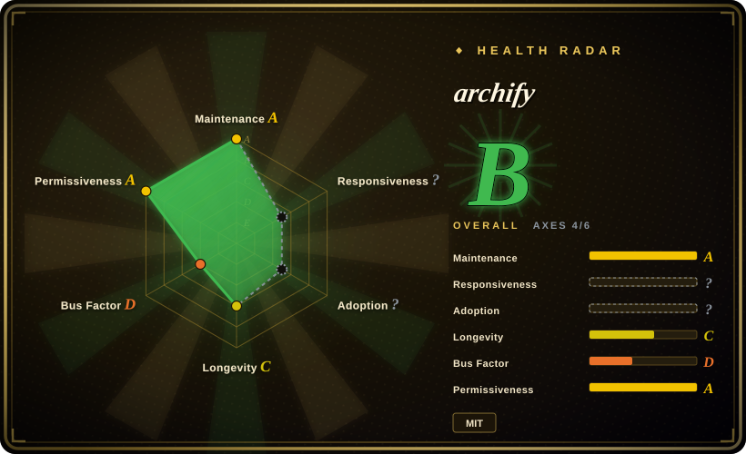

# archify

Any agent Skill: generate beautiful architecture diagrams with dark/light theme toggle and PNG/JPEG/WebP/SVG export

## When to use

You need an agent to turn a plain-English system, workflow, sequence, data-flow, or lifecycle description into a polished technical diagram artifact. Choose archify when the deliverable is a self-contained HTML diagram with dark/light theme toggle, PNG/JPEG/WebP/SVG export, clipboard PNG copy, typed JSON IR, and renderer-backed validation.

It is strongest for architecture overviews, CI/CD workflows, request sequences, PII/data-lineage diagrams, runbooks, lifecycle/state-machine views, and README/slides-ready technical communication. It can be installed through `npx skills add tt-a1i/archify -g` or used through supported agent skill directories for Claude Code, Codex CLI, opencode, and related skill-capable harnesses.

## When NOT to use

- **You need a general-purpose diagram editor.** Use Excalidraw, diagrams.net, or Figma when humans need WYSIWYG editing rather than agent-generated HTML artifacts.
- **You need Mermaid as the interchange format.** Archify explicitly is not a Mermaid theme/parser; use Mermaid or PlantUML when text diagram portability matters more than polished export.
- **You need deterministic architecture discovery.** The agent still has to understand the repository or system; pair it with code reading, logs, or docs before trusting the diagram.
- **You need brand-governed visual design.** Archify ships its own renderer and themes; strict corporate visual systems may need a custom renderer or manual design pass.
- **Your environment cannot run local Node/browser checks.** The full workflow uses bundled validators, renderers, and artifact checks; a pure project-knowledge upload is reduced to prompt-driven guidance.

## Comparison

| Alternative | In index | Our verdict | Tradeoff |
|---|---|---|---|
| [huashu-design](huashu-design.md) | ✅ | Choose huashu-design for broad HTML-native visual artifacts, slides, motion, and infographics. | huashu-design is wider; archify is specialized for technical diagrams with typed renderers. |
| [Stitch Skills](stitch-skills.md) | ✅ | Choose Stitch when the target is UI screen generation or code/design handoff through Google's Stitch MCP. | Stitch targets product UI; archify targets architecture and workflow communication. |
| [Mermaid](../../diagramming/mermaid.md) | ✅ | Choose Mermaid when diagrams must remain plain-text, diffable, and Markdown-native. | Mermaid is portable and compact; archify gives richer artifacts and export controls. |
| [Excalidraw](../../diagramming/excalidraw.md) | ✅ | Choose Excalidraw when humans need hand-drawn collaborative whiteboarding. | Excalidraw is better for manual sketching; archify is faster for agent-produced technical diagrams. |
| draw.io / diagrams.net | not indexed | Choose draw.io when a full WYSIWYG diagramming canvas is required. | Manual editors have better hand-tuning; archify keeps diagrams agent-generated and export-ready. |

## Health & viability

- **Maintenance snapshot (2026-07-16):** GitHub reports `archived=false` and `pushed_at=2026-07-15T16:29:36Z`; health scores maintenance as A.
- **Adoption snapshot:** ~5,339 GitHub stars as of 2026-07; useful attention signal, but the project is still young.
- **License snapshot:** MIT verified from upstream README and root `LICENSE` in the read-only upstream check.
- **Lindy / governance:** health longevity is C and governance is D because the repo is young and contribution is concentrated.
- **Risk flags:** output accuracy depends on the agent's system understanding and local validation loop, not only on the renderer.

## Caveats (unverified)

- [未验证] Diagram quality was read from README/examples and not reproduced locally in this pass.
- [未验证] Supported-agent behavior can differ by harness, sandbox, and Node/browser availability.
- [推断] Best fit is technical communication artifacts, not generic UI design or hand-authored diagramming.
