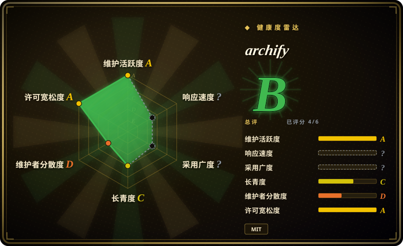

# archify

Any agent Skill: generate beautiful architecture diagrams with dark/light theme toggle and PNG/JPEG/WebP/SVG export

## 何时使用

你需要让 agent 把一段自然语言系统、工作流、时序、数据流或生命周期描述，转成漂亮的技术图表 artifact。交付物需要是自包含 HTML 图表，并带暗 / 亮主题切换、PNG / JPEG / WebP / SVG 导出、PNG 复制到剪贴板、typed JSON IR 和 renderer-backed validation 时，选 archify。

它最适合架构概览、CI/CD 工作流、请求时序、PII / 数据血缘图、runbook、生命周期 / 状态机视图，以及可放进 README 或 slides 的技术沟通材料。可通过 `npx skills add tt-a1i/archify -g` 安装，也支持 Claude Code、Codex CLI、opencode 等 skill-capable harness 的技能目录。

## 何时不用

- **你需要通用图表编辑器。** 人类需要 WYSIWYG 编辑时，用 Excalidraw、diagrams.net 或 Figma，而不是 agent 生成 HTML artifact。
- **你需要 Mermaid 作为交换格式。** Archify 明确不是 Mermaid theme / parser；文本图表可移植性比精致导出更重要时，用 Mermaid 或 PlantUML。
- **你需要确定性的架构发现。** Agent 仍然要先读懂仓库或系统；信任图表前应配合代码阅读、日志或文档。
- **你需要严格品牌视觉系统。** Archify 使用自己的 renderer 和 themes；公司视觉规范很严时，可能需要自定义 renderer 或人工设计复核。
- **你的环境不能运行本地 Node / 浏览器检查。** 完整流程用 bundled validators、renderers 和 artifact checks；纯 Project Knowledge 上传会退化成 prompt-driven guidance。

## 横向对比

| 替代品 | 是否收录 | 我们的评价 | 取舍 |
|---|---|---|---|
| [huashu-design](huashu-design.zh.md) | ✅ | 需要更宽的 HTML-native 视觉 artifact、slides、motion 和信息图时选 huashu-design。 | huashu-design 更宽；archify 专注 typed renderer 技术图表。 |
| [Stitch Skills](stitch-skills.zh.md) | ✅ | 目标是通过 Stitch MCP 生成 UI screen 或 code/design handoff 时选 Stitch。 | Stitch 面向产品 UI；archify 面向架构和工作流沟通。 |
| [Mermaid](../../diagramming/mermaid.zh.md) | ✅ | 图表必须保持纯文本、可 diff、Markdown 原生时选 Mermaid。 | Mermaid 更便携更紧凑；archify artifact 更精致，导出控制更强。 |
| [Excalidraw](../../diagramming/excalidraw.zh.md) | ✅ | 人类需要手绘风协作白板时选 Excalidraw。 | Excalidraw 更适合手工草图；archify 更适合 agent 快速产出技术图。 |
| draw.io / diagrams.net | 未收录 | 需要完整 WYSIWYG 图表画布时选 draw.io。 | 手工编辑器更适合细调；archify 保持 agent-generated 和 export-ready。 |

## 健康度与可持续性

- **维护快照（2026-07-16）：** GitHub 返回 `archived=false`，`pushed_at=2026-07-15T16:29:36Z`；health 将维护评为 A。
- **采用快照：** 2026-07 约 5,339 个 GitHub stars；这是有用关注信号，但项目仍很年轻。
- **许可证快照：** 只读上游核验确认 README 和根目录 `LICENSE` 均为 MIT。
- **Lindy / 治理：** health 中 longevity 为 C；项目年轻且贡献集中，governance 为 D。
- **风险信号：** 输出准确性依赖 agent 对系统的理解和本地验证 loop，不只依赖 renderer。

## 存疑（未验证）

- [未验证] 图表质量读自 README / examples，本次没有本地复现。
- [未验证] 不同 harness 的行为会受 sandbox、Node 和浏览器可用性影响。
- [推断] 最适合技术沟通 artifact，不是通用 UI 设计或手工图表编辑。
