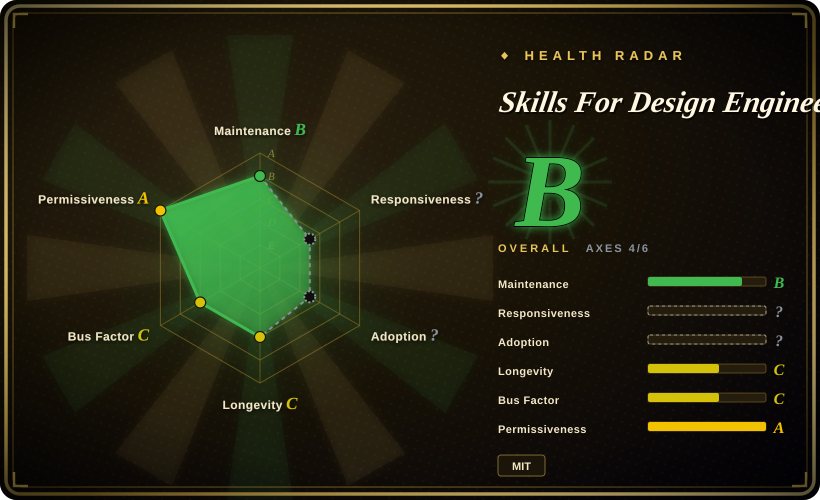

# Skills For Design Engineers

A six-skill design-engineering pack for coding agents that focuses on UI motion, animation vocabulary, Apple-style interface principles, and strict animation review rather than broad product-design process.

## When to use

You're a frontend engineer or design engineer using Claude Code, Codex, Cursor, or another skill-capable coding agent to build a polished web UI, and the agent can write React/CSS but keeps making motion mistakes: wrong easing, heavy transitions, missing interruptibility, over-animated surfaces, or vague animation language. You reach for Skills For Design Engineers when you want Emil Kowalski's animation/design taste encoded as reusable `SKILL.md` files rather than a one-off prompt.

The deciding tradeoff is focus: this pack is narrower than broad design lifecycle bundles and stronger for motion craft. Its README lists six skills: `emil-design-eng`, `review-animations`, `improve-animations`, `find-animation-opportunities`, `animation-vocabulary`, and `apple-design`. Pick it when animation critique, animation opportunity discovery, and design-engineering taste are the actual bottleneck.

## When NOT to use

- **You need a full design lifecycle or UX research bundle.** Use [Designer Skills](designer-skills.md) when research, UX strategy, design systems, prototyping, design ops, and visual critique all need coverage; Emil's pack is intentionally centered on UI/motion craft.
- **You need deterministic UI quality enforcement.** Use a visual regression test, Storybook checks, Lighthouse, or a custom artifact linter when you need hard gates; this pack is prompt/skill guidance that the agent may misapply.
- **You mainly need generic anti-slop frontend direction.** Use [Taste-Skill](taste-skill.md) when the issue is bland layout, type, color, and full-screen design direction; Emil's pack is more specifically about animation/design-engineering decisions.
- **You only need micro-polish details.** Use [make-interfaces-feel-better](make-interfaces-feel-better.md) when the target is small mechanical polish such as concentric radii, tabular numbers, and surface details; Emil's pack is broader on motion and design judgment.
- **You need editable design artifacts or Stitch/MCP conversion.** Use [Stitch Skills](stitch-skills.md) or a design-to-code workflow when your need is generating, importing, or converting designs rather than coaching a coding agent's UI taste.
- **You cannot tolerate single-author taste as a dependency.** The repo is authored by an individual and is based on his experience at companies such as Vercel and Linear; pin a commit if you need stable guidance.

## Comparison

| Alternative | In index | Our verdict | Tradeoff |
|---|---|---|---|
| [Designer Skills](designer-skills.md) | ✅ | Choose Designer Skills when you need a full design practice bundle; choose Skills For Design Engineers when animation and design-engineering craft are the bottleneck. | Designer Skills has much broader process coverage; Emil's pack is smaller, more opinionated, and easier to apply to motion-heavy frontend work. |
| [Taste-Skill](taste-skill.md) | ✅ | Choose Taste-Skill when the agent needs broad anti-slop direction across layout, color, typography, and motion; choose Emil's pack for animation-specific taste. | Taste-Skill is a general visual-taste overlay; Emil's pack gives more concrete animation review and vocabulary. |
| [make-interfaces-feel-better](make-interfaces-feel-better.md) | ✅ | Choose make-interfaces-feel-better when the UI is directionally right but needs small mechanical polish; choose Emil's pack when motion decisions themselves need critique. | The former is a compact polish checklist; Emil's pack has multiple animation-review and opportunity-finding skills. |
| [UI UX Pro Max Skill](ui-ux-pro-max.md) | ✅ | Choose UI UX Pro Max when you want a larger UI/UX guidance system with local reference data; choose Emil's pack when you want a lightweight motion/design-engineering taste pack. | UI UX Pro Max is broader and heavier; Emil's pack is smaller and easier to inspect. |
| [Stitch Skills](stitch-skills.md) | ✅ | Choose Stitch Skills when UI generation/conversion through Stitch MCP is the workflow; choose Emil's pack when the agent is already coding and needs motion critique. | Stitch is a tool-backed design workflow; Emil's pack is advisory skill text. |

## Health & viability

- **Maintenance snapshot (2026-07-16):** GitHub reports `archived=false`, default branch `main`, and last push on 2026-07-15.
- **Adoption snapshot:** GitHub reports ~14.0k stars and 770 forks as of 2026-07-16; that is strong early attention, but the project is young and has no tagged releases.
- **License snapshot:** MIT verified from GitHub metadata and the root `LICENSE` file.
- **Governance / bus factor:** single-user repo owned by `emilkowalski`; the pack is explicitly based on one author's taste and professional experience.
- **Risk flags:** prompt-level skill guidance is advisory, not a deterministic UI lint or visual regression system.

## Caveats (unverified)

- [未验证] This pass read the README, LICENSE, GitHub metadata, and repository tree; it did not independently execute the install command or test activation in Claude Code, Codex, Cursor, or other harnesses.
- [未验证] The six-skill inventory is from the README and repo tree observed on 2026-07-16; skill names and contents can change between untagged commits.
- [推断] Because the rules live in markdown skills, an agent can still ignore, dilute, or misapply them; use visual tests or human review for high-stakes UI work.
