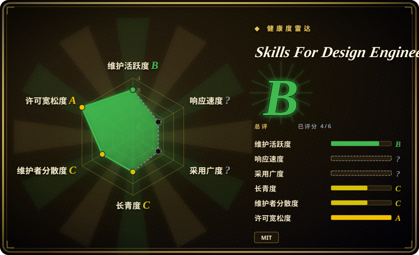

# Skills For Design Engineers

一套面向 coding agent 的六技能设计工程包，重点是 UI motion、动画词汇、Apple 风格界面原则和严格动画评审，而不是完整产品设计流程。

## 何时使用

你是前端工程师或 design engineer，正在用 Claude Code、Codex、Cursor 或其他支持 skill 的 coding agent 做精致 Web UI。agent 会写 React/CSS，但总在动效上出错：easing 选错、transition 太重、交互不可中断、过度动画，或描述动画时词汇太含糊。当你想把 Emil Kowalski 的动画与设计审美编码成可复用的 `SKILL.md`，而不是每次手写提示词时，就用 Skills For Design Engineers。

关键取舍是聚焦度：它比完整设计生命周期包更窄，但在 motion craft 上更强。README 列出六个 skill：`emil-design-eng`、`review-animations`、`improve-animations`、`find-animation-opportunities`、`animation-vocabulary` 和 `apple-design`。当真正瓶颈是动画评审、动画机会发现和设计工程 taste 时，选它。

## 何时不用

- **你需要完整设计生命周期或 UX research 包。** 需要研究、UX 策略、设计系统、原型、design ops 和视觉批评全覆盖时，用 [Designer Skills](designer-skills.zh.md)；Emil 的包刻意聚焦 UI/motion craft。
- **你需要确定性的 UI 质量闸门。** 需要硬性 gate 时，用视觉回归测试、Storybook 检查、Lighthouse 或自定义 artifact linter；这个包是 prompt/skill 指导，agent 仍可能误用。
- **你主要需要通用 anti-slop 前端方向。** 问题是布局、字体、颜色和整屏设计方向太 bland 时，用 [Taste-Skill](taste-skill.zh.md)；Emil 的包更偏动画和设计工程决策。
- **你只需要微观 polish 细节。** 目标是同心圆角、等宽数字、surface 细节这类小机械打磨时，用 [make-interfaces-feel-better](make-interfaces-feel-better.zh.md)；Emil 的包在 motion 和设计判断上更宽。
- **你需要可编辑设计 artifact 或 Stitch/MCP 转换。** 需求是生成、导入或转换设计时，用 [Stitch Skills](stitch-skills.zh.md) 或 design-to-code 工作流；Emil 的包是指导 coding agent 的 UI taste。
- **你不能接受单作者 taste 作为依赖。** 该 repo 由个人维护，且 README 明确说它基于作者在 Vercel、Linear 等公司的经验；需要稳定指导时应 pin commit。

## 横向对比

| 替代品 | 是否收录 | 我们的评价 | 取舍 |
|---|---|---|---|
| [Designer Skills](designer-skills.zh.md) | ✅ | 需要完整设计实践包时选 Designer Skills；瓶颈是动画和设计工程 craft 时选 Skills For Design Engineers。 | Designer Skills 覆盖流程更广；Emil 的包更小、更有主见，更容易用于动效密集的前端工作。 |
| [Taste-Skill](taste-skill.zh.md) | ✅ | agent 需要布局、颜色、字体和 motion 的宽泛 anti-slop 方向时选 Taste-Skill；要动画专项 taste 时选 Emil 的包。 | Taste-Skill 是通用视觉 taste 覆盖层；Emil 的包给出更具体的动画评审和动画词汇。 |
| [make-interfaces-feel-better](make-interfaces-feel-better.zh.md) | ✅ | UI 方向已对、只缺小机械 polish 时选 make-interfaces-feel-better；motion 决策本身需要批评时选 Emil 的包。 | 前者是紧凑 polish 清单；Emil 的包有多个动画评审和机会发现 skill。 |
| [UI UX Pro Max Skill](ui-ux-pro-max.zh.md) | ✅ | 需要带本地参考数据的更大 UI/UX 指导系统时选 UI UX Pro Max；要轻量 motion/design-engineering taste 包时选 Emil 的包。 | UI UX Pro Max 更宽也更重；Emil 的包更小、更容易审阅。 |
| [Stitch Skills](stitch-skills.zh.md) | ✅ | 工作流是通过 Stitch MCP 做 UI 生成／转换时选 Stitch Skills；agent 已在编码、需要 motion critique 时选 Emil 的包。 | Stitch 是工具支撑的设计工作流；Emil 的包是 advisory skill text。 |

## 健康度与可持续性

- **维护快照（2026-07-16）：** GitHub 显示 `archived=false`，默认分支为 `main`，最近 push 是 2026-07-15。
- **采用快照：** GitHub 在 2026-07-16 显示约 14.0k stars 和 770 forks；早期关注度强，但项目很年轻且没有 tagged release。
- **许可证快照：** MIT 已由 GitHub metadata 和根目录 `LICENSE` 核验。
- **治理 / bus factor：** 单用户 repo，owner 是 `emilkowalski`；该 pack 明确基于一位作者的 taste 和职业经验。
- **风险信号：** prompt 级 skill 指导是 advisory，不是确定性的 UI lint 或视觉回归系统。

## 存疑（未验证）

- [未验证] 本轮读取了 README、LICENSE、GitHub metadata 和 repo tree；没有实际执行安装命令，也没有测试它在 Claude Code、Codex、Cursor 或其他 harness 中的激活效果。
- [未验证] 六个 skill 的清单来自 2026-07-16 观察到的 README 和 repo tree；未打 tag 的提交之间可能改变 skill 名称和内容。
- [推断] 因规则存在于 markdown skill 中，agent 仍可能忽略、稀释或误用；高风险 UI 工作应配合视觉测试或人工评审。
