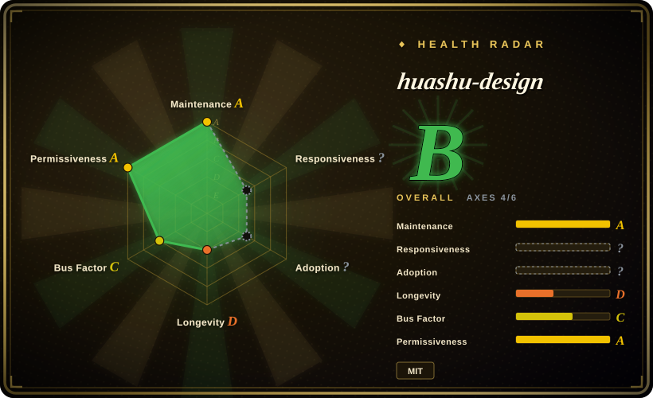

# huashu-design

Huashu Design · HTML-native design skill for Claude Code · Claude Code 里 HTML 原生的设计 skill · 高保真原型 / 幻灯片 / 动画 + 20 设计哲学 + 5 维评审 + MP4 导出 · Agent-agnostic

## When to use

You want an agent to produce actual visual deliverables in HTML rather than only critique a design: clickable app/web prototypes, browser-native slide decks, editable PPTX exports, motion/MP4/GIF output, infographics, or a design-direction gallery. Use huashu-design when the workflow can create files, run scripts, and render/check HTML, and when the desired output is an artifact the user can inspect rather than a prose design brief.

It is especially useful for Chinese/English agent workflows that install via `npx skills add alchaincyf/huashu-design`, then ask Claude Code, Codex, Cursor, or another skill-compatible agent to generate HTML-native design assets. Upstream emphasizes brand-asset extraction, 40 HTML-native style libraries, Playwright visual checking, export scripts, and MP4/PPTX/PDF/PNG/SVG outputs.

## When NOT to use

- **You only need UI taste guidance while coding an existing app.** [Taste-Skill](taste-skill.md), [make-interfaces-feel-better](make-interfaces-feel-better.md), or [UI UX Pro Max Skill](ui-ux-pro-max.md) may be lighter.
- **You need code-to-design handoff into React/React Native/shadcn.** [Stitch Skills](stitch-skills.md) is closer to UI generation and implementation handoff.
- **You need a component library, not a generative skill.** huashu-design creates artifacts via an agent workflow; it is not a reusable design-system package.
- **Your environment cannot run scripts, browser checks, video export, or file creation.** Its strongest claims depend on HTML files, scripts, Playwright-style checking, and media export tooling.
- **You require editable Figma/Keynote layer-level output.** Upstream explicitly frames output as HTML / MP4 / GIF / PPTX / PDF / images rather than Figma-native editing.

## Comparison

| Alternative | In index | Our verdict | Tradeoff |
|---|---|---|---|
| [Stitch Skills](stitch-skills.md) | ✅ | Choose Stitch when the main job is UI screen generation, code/design conversion, or React/React Native/shadcn export. | Stitch is more implementation-handoff oriented; huashu-design is broader visual artifact production. |
| [Taste-Skill](taste-skill.md) | ✅ | Choose Taste-Skill when you want a coding agent to avoid AI-slop frontend aesthetics while implementing an app. | Taste-Skill is advisory and lightweight; huashu-design is an artifact-generation workflow. |
| [Designer Skills](designer-skills.md) | ✅ | Choose Designer Skills when you want a broad design-practice toolkit across research, systems, UX, UI, and critique. | Designer Skills is broader process coverage; huashu-design is more opinionated around HTML-native deliverables. |
| Figma / visual design tool | 未收录 | Choose a GUI tool when designers need layer-level editing, collaboration, or design-system integration. | GUI tools are better for manual design iteration; huashu-design is better for agent-driven file generation. |

## Health & viability

- **Maintenance snapshot (2026-07-16):** GitHub reports `archived=false` and `pushed_at=2026-07-02T03:49:28Z`; health scores maintenance as A.
- **Adoption snapshot:** ~21,518 GitHub stars as of 2026-07, but the project is young and star velocity can reflect social attention more than production reliability.
- **License snapshot:** MIT verified from the upstream README and root `LICENSE`; README states the project changed to MIT on 2026-05-14.
- **Lindy / governance:** health scores longevity as D because the repo is very young; governance is C with a concentrated maintainer profile.
- **Risk flags:** output quality depends on the agent, available brand assets, local browser/media tooling, and the user's willingness to review visual artifacts.

## Caveats (unverified)

- [未验证] The README showcases demos and timing claims; this pass did not reproduce the demo runs locally.
- [未验证] Export scripts and Playwright/browser checks were identified from README/tree descriptions, but not executed in this pass.
- [推断] Teams with an established Figma/design-system workflow may prefer huashu-design only for early exploration or disposable artifacts.
