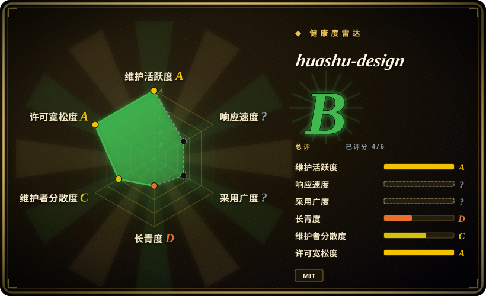

# huashu-design

Huashu Design · HTML-native design skill for Claude Code · Claude Code 里 HTML 原生的设计 skill · 高保真原型 / 幻灯片 / 动画 + 20 设计哲学 + 5 维评审 + MP4 导出 · Agent-agnostic

## 何时使用

你希望 agent 产出真实可看的视觉交付物，而不只是给设计建议：可点击 app / web 原型、浏览器原生 slide deck、可编辑 PPTX、motion / MP4 / GIF、信息图或设计方向 gallery。工作流允许创建文件、运行脚本、渲染 / 检查 HTML，并且目标是让用户直接看 artifact 时，选 huashu-design。

它尤其适合通过 `npx skills add alchaincyf/huashu-design` 装进 Claude Code、Codex、Cursor 或其他 skill-compatible agent，然后让 agent 生成 HTML-native 设计资产。上游强调品牌资产提取、40 种 HTML 原生风格库、Playwright 视觉检查、导出脚本，以及 MP4 / PPTX / PDF / PNG / SVG 输出。

## 何时不用

- **你只需要在写现有 app 时补 UI 审美。** [Taste-Skill](taste-skill.zh.md)、[make-interfaces-feel-better](make-interfaces-feel-better.zh.md) 或 [UI UX Pro Max Skill](ui-ux-pro-max.zh.md) 更轻。
- **你需要 code-to-design handoff 到 React / React Native / shadcn。** [Stitch Skills](stitch-skills.zh.md) 更贴近 UI 生成和实现交接。
- **你要的是组件库，不是生成式 skill。** huashu-design 通过 agent workflow 生成 artifact，不是可复用设计系统 package。
- **运行环境不能执行脚本、浏览器检查、视频导出或文件创建。** 它最强的能力依赖 HTML 文件、scripts、Playwright 式检查和媒体导出工具。
- **你必须要 Figma / Keynote 图层级可编辑输出。** 上游明确把输出定位为 HTML / MP4 / GIF / PPTX / PDF / 图片，而不是 Figma-native 编辑。

## 横向对比

| 替代品 | 是否收录 | 我们的评价 | 取舍 |
|---|---|---|---|
| [Stitch Skills](stitch-skills.zh.md) | ✅ | 主要任务是 UI screen generation、code / design 转换或 React / React Native / shadcn 导出时选 Stitch。 | Stitch 更偏实现交接；huashu-design 更偏宽视觉 artifact 生产。 |
| [Taste-Skill](taste-skill.zh.md) | ✅ | coding agent 正在实现 app，只需要避免 AI-slop 前端审美时选 Taste-Skill。 | Taste-Skill 更轻、更建议式；huashu-design 是 artifact-generation workflow。 |
| [Designer Skills](designer-skills.zh.md) | ✅ | 需要覆盖研究、设计系统、UX、UI、critique 的宽设计实践工具箱时选 Designer Skills。 | Designer Skills 流程覆盖更广；huashu-design 更有主张，聚焦 HTML-native 交付。 |
| Figma / 可视化设计工具 | 未收录 | 设计师需要图层级编辑、协作或接入设计系统时选 GUI 工具。 | GUI 更适合人工细调；huashu-design 更适合 agent-driven 文件生成。 |

## 健康度与可持续性

- **维护快照（2026-07-16）：** GitHub 返回 `archived=false`，`pushed_at=2026-07-02T03:49:28Z`；health 将维护评为 A。
- **采用快照：** 2026-07 约 21,518 个 GitHub stars，但项目很年轻，star 速度可能更多反映社交关注，而不是生产可靠性。
- **许可证快照：** 只读上游核验确认 README 和根目录 `LICENSE` 均为 MIT；README 说明项目自 2026-05-14 起改为 MIT。
- **Lindy / 治理：** repo 很年轻，所以 health 中 longevity 为 D；治理为 C，维护者集中度较高。
- **风险信号：** 输出质量取决于 agent、可用品牌资产、本地浏览器 / 媒体工具，以及用户是否愿意视觉验收 artifact。

## 存疑（未验证）

- [未验证] README 展示了 demo 和耗时声明；本次没有在本地复现 demo run。
- [未验证] 导出脚本和 Playwright / browser 检查来自 README / tree 描述，本次没有执行。
- [推断] 已有成熟 Figma / design-system 流程的团队，可能只适合把 huashu-design 用在早期探索或一次性 artifact。
