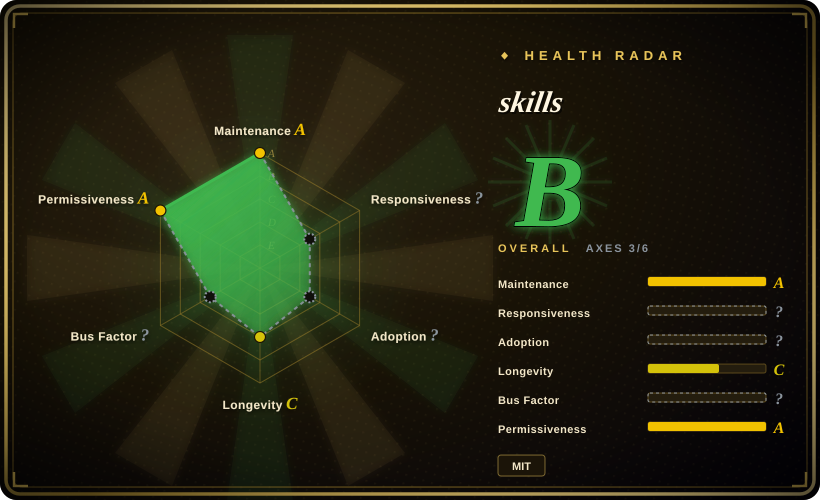

# BrowserAct Skills

Agent-facing browser automation skill pack for BrowserAct: indexed browser control, stealth/private sessions, remote human handoff, and Skill Forge scraping workflows.

## When to use

You're building or operating an agent that must use a real browser rather than a DOM-only library: logged-in pages, anti-bot friction, multi-session browsing, remote human takeover, or repeatable extraction workflows. Pick BrowserAct Skills when you want an LLM-oriented CLI and skill instructions: `state` returns indexed elements, actions target those indexes, and the skill exposes browser modes, remote assist, stealth extraction, and Skill Forge.

The deciding tradeoff versus plain Playwright is that BrowserAct optimizes for agent operation and handoff, not for a stable developer-authored test suite. Use it when the browser is part of an agent workflow; use Playwright when you are writing deterministic tests or automation code.

## When NOT to use

- **You need deterministic browser tests.** Use [Playwright](../../web-automation/playwright.md) for CI tests, trace viewer, fixtures, and code-first browser automation; BrowserAct is shaped for agent-driven sessions.
- **You cannot accept managed-service or paid-feature coupling.** The README says core automation is free, but stealth browsers beyond the first five and managed proxies are paid; choose Playwright or a self-hosted browser stack if that boundary is unacceptable.
- **Your target site forbids scraping or automation.** Use the site's official API or seek explicit permission instead of BrowserAct; anti-blocking features do not remove legal, contractual, or ethical constraints.
- **You do not want user browser state touched.** Use privacy-mode Playwright profiles or a disposable browser environment; BrowserAct supports Chrome login reuse and profile import, which must be governed carefully.
- **You only need static page-to-Markdown fetching.** Use a narrower URL-to-Markdown skill or document parser; BrowserAct's stealth/session stack is overkill for public static pages.

## Comparison

| Alternative | In index | Our verdict | Tradeoff |
|---|---|---|---|
| [Playwright](../../web-automation/playwright.md) | ✅ | For test suites and developer-authored automation, pick Playwright; for agent sessions that need indexed actions, handoff, and stealth modes, pick BrowserAct Skills. | BrowserAct adds agent UX and service features; Playwright is more standard and easier to reason about in CI. |
| [Puppeteer](../../web-automation/puppeteer.md) | ✅ | For simple Node.js browser scripts, Puppeteer may be enough; pick BrowserAct when agent-readable state, session naming, or human handoff matter. | Puppeteer is lighter and familiar; BrowserAct has more workflow surface and external feature boundaries. |
| Browserbase / hosted browser services | 未收录 | For hosted browser infrastructure, evaluate Browserbase-style services; pick BrowserAct when its skill/CLI workflow and free local modes fit better. | Hosted browsers reduce local setup but introduce stronger vendor dependency. |
| Custom site scraper skill | 未收录 | For one stable target with known APIs, write a custom skill; pick BrowserAct Skill Forge when you want an agent to discover and package the scraping flow. | Custom scrapers are narrower and easier to audit; Skill Forge is faster for exploratory extraction. |

## Health & viability

- **Maintenance snapshot (2026-07-16):** GitHub reports `archived=false` and `pushed_at=2026-07-14T09:53:38Z`; the health scorer grades maintenance `A`.
- **Adoption snapshot:** GitHub API reports ~4,449 stars as of 2026-07, plus a public docs/community surface in the README; adoption axis remains `?` because this is not a package-download style project.
- **License snapshot:** root `LICENSE` is MIT and GitHub metadata reports MIT.
- **Lindy / governance:** the repo is young, so longevity is `C`; governance is `D` in the health block because the scorer sees concentrated contributions.
- **Risk flags:** anti-blocking, remote assist, profile import, proxies, cookies, and third-party sites create operational and policy risk; require explicit authorization and secret handling in real use.

## Caveats (unverified)

- [未验证] The stealth and anti-bot claims were read from the README but not independently tested against target websites.
- [未验证] Pricing and free-tier boundaries may change; verify BrowserAct's current service terms before relying on managed proxies or stealth-browser quotas.
- [推断] BrowserAct is best treated as an agent browser workflow layer rather than a replacement for deterministic browser test frameworks.
