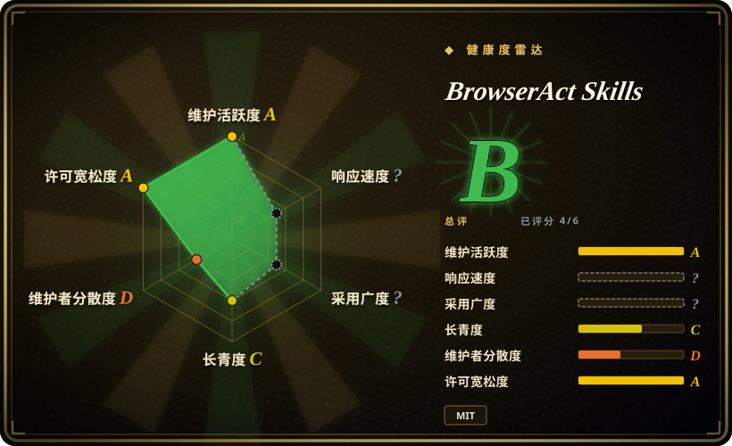

# BrowserAct Skills

面向 BrowserAct 的 agent 浏览器自动化技能包：索引式浏览器控制、stealth/private session、远程人工接管，以及 Skill Forge 抓取工作流。

## 何时使用

你在构建或运行一个必须使用真实浏览器的 agent：要访问登录态页面、处理反自动化摩擦、多 session 浏览、远程人工接管，或把重复抓取流程打包成 skill。此时可选 BrowserAct Skills：它提供面向 LLM 的 CLI 和技能说明，`state` 返回索引化元素，动作按索引执行，并暴露浏览器模式、remote assist、stealth extract 和 Skill Forge。

相对普通 Playwright 的关键取舍是：BrowserAct 优先服务 agent 操作和接管，而不是稳定的开发者手写测试套件。如果浏览器是 agent 工作流的一部分，选它；如果你是在写确定性测试或自动化代码，选 Playwright。

## 何时不用

- **你需要确定性的浏览器测试。** 用 [Playwright](../../web-automation/playwright.zh.md) 做 CI 测试、trace viewer、fixture 和 code-first 浏览器自动化；BrowserAct 更偏 agent session。
- **你不能接受托管服务或付费功能耦合。** README 说核心自动化免费，但超过前 5 个 stealth browser 和 managed proxy 属于付费；如果这个边界不可接受，选 Playwright 或自托管浏览器栈。
- **目标网站禁止抓取或自动化。** 使用官方 API 或先拿明确授权，而不是用 BrowserAct；反阻断能力不消除法律、合同或伦理约束。
- **你不希望触碰用户浏览器状态。** 用 Playwright 隔离 profile 或一次性浏览器环境；BrowserAct 支持复用 Chrome 登录态和导入 profile，必须认真治理。
- **你只要静态网页转 Markdown。** 用更窄的 URL-to-Markdown skill 或文档解析器；BrowserAct 的 stealth/session 栈对公开静态页面过重。

## 横向对比

| 替代品 | 是否收录 | 我们的评价 | 取舍 |
|---|---|---|---|
| [Playwright](../../web-automation/playwright.zh.md) | ✅ | 做测试套件和开发者手写自动化时选 Playwright；需要索引动作、handoff 和 stealth 模式的 agent session 时选 BrowserAct Skills。 | BrowserAct 增加 agent UX 和服务功能；Playwright 更标准，在 CI 中更容易推理。 |
| [Puppeteer](../../web-automation/puppeteer.zh.md) | ✅ | 简单 Node.js 浏览器脚本用 Puppeteer 可能足够；需要 agent-readable state、session 命名或人工接管时选 BrowserAct。 | Puppeteer 更轻、更熟悉；BrowserAct 的工作流和外部功能边界更多。 |
| Browserbase / hosted browser services | 未收录 | 如果要托管浏览器基础设施，评估 Browserbase 类服务；如果 BrowserAct 的 skill/CLI 工作流和免费本地模式更合适，选本页项目。 | 托管浏览器减少本地设置，但带来更强 vendor dependency。 |
| 自定义站点抓取 skill | 未收录 | 目标站稳定且 API 已知时，自写定制 skill；想让 agent 探索并打包抓取流程时，选 BrowserAct Skill Forge。 | 定制抓取器更窄、更易审计；Skill Forge 更适合探索式抽取。 |

## 健康度与可持续性

- **维护快照（2026-07-16）：** GitHub 返回 `archived=false`，`pushed_at=2026-07-14T09:53:38Z`；健康度评分器给 maintenance `A`。
- **采用快照：** GitHub API 在 2026-07 返回约 4,449 个 star，README 也展示公开文档和社区入口；adoption 轴仍为 `?`，因为这不是典型包下载项目。
- **许可证快照：** 根目录 `LICENSE` 为 MIT，GitHub 元数据也返回 MIT。
- **Lindy / 治理：** 仓库仍年轻，longevity 为 `C`；health block 中 governance 为 `D`，因为评分器看到贡献集中。
- **风险信号：** anti-blocking、remote assist、profile import、proxy、cookie 和第三方站点都会带来运营与政策风险；实际使用必须先明确授权范围并按 secret 处理。

## 存疑（未验证）

- [未验证] stealth 和 anti-bot 能力来自 README，oss-atlas 未针对具体目标网站独立测试。
- [未验证] 价格和免费额度边界可能变化；依赖 managed proxy 或 stealth browser quota 前请核验 BrowserAct 当前服务条款。
- [推断] BrowserAct 更适合被当作 agent browser workflow 层，而不是确定性浏览器测试框架的替代品。
