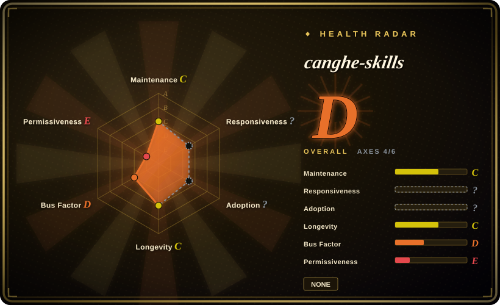

# canghe-skills

苍何的技能skills仓库，搜集好用的 skills，辅助提效

## When to use

You're evaluating a task in the `engineering` area and want a real repository in the oss-atlas shortlist rather than an untracked name from a backlog. Reach for canghe-skills when the upstream description matches the job, when its license and maintenance profile are acceptable after verification, and when adopting a public project is preferable to writing a local one-off.

This is a first-pass intake page for a user-requested backlog item. Use it to route selection and compare nearby options, then reread the upstream README, license, examples, and release history before relying on it for high-stakes work.

## When NOT to use

- **You need a deeply reviewed atlas page today.** Prefer an older in-index page from the comparison table until this entry has had a full semantic review.
- **License is a hard constraint.** GitHub reported `NOASSERTION`; inspect the repository license files before commercial use, redistribution, or vendoring.
- **Maintenance risk is unacceptable.** If the project is young, single-maintainer, low-star, unversioned, or quiet, choose a more established substitute in the same category.
- **Your task needs a narrower substitute.** If another page's `When NOT to use` section names your exact constraint, prefer that page over this first-pass entry.
- **You cannot verify the upstream workflow.** Do not install, run, or vendor this repo before checking its README, scripts, dependencies, and any external API requirements.

## Comparison

| Alternative | In index | Our verdict | Tradeoff |
|---|---|---|---|
| Existing skills in this leaf | ✅ | Prefer a more deeply reviewed in-index page when it already names your exact task and constraints. | This page is first-pass intake; existing pages may have sharper when-not guidance. |
| Custom SKILL.md | 未收录 | Write a custom skill when the task is narrow, private, or tightly bound to one repository's conventions. | Custom skills fit local context better but lose upstream maintenance and community examples. |

## Health & viability

- **Maintenance snapshot (2026-07-16):** GitHub reports `archived=false` and `pushed_at=2026-06-08T09:57:52Z`.
- **Adoption snapshot:** ~407 GitHub stars as of 2026-07; this is a noisy signal and low-star projects are still included when the repository is real and relevant.
- **License snapshot:** `NOASSERTION` from GitHub metadata; manual license-file review remains required when license matters.
- **Lindy / governance:** not fully reviewed in this intake pass. Check age, owner type, contributor concentration, releases, and issue response before long-term adoption.
- **Risk flags:** first-pass page generated from the 2026-07-16 backlog; semantic comparison and dependency review are intentionally conservative.

## Caveats (unverified)

- [未验证] This page is generated from public GitHub metadata plus the user-provided intake list; upstream README, docs, examples, releases, and dependency manifests still need deeper review.
- [未验证] License, install commands, supported harnesses, and runtime requirements may differ from GitHub metadata; verify them in the repository before use.
- [推断] The comparison table starts from nearby atlas categories rather than a complete substitute survey; refine it after reading the full upstream project and adjacent alternatives.
