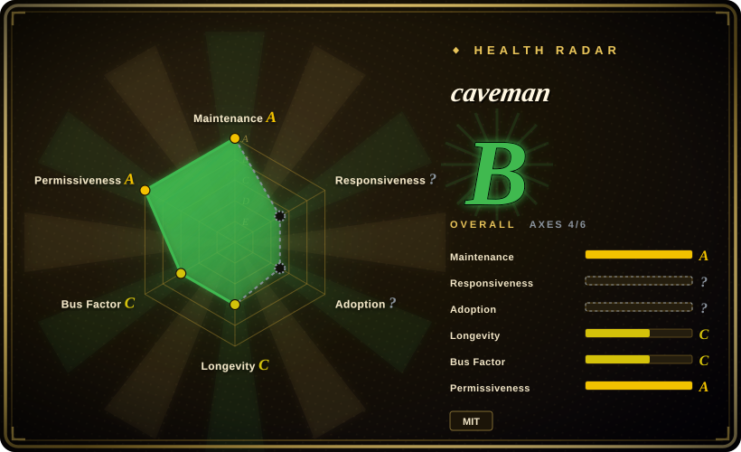

# caveman

Prompt and installer pack that makes many coding agents answer in deliberately terse "caveman" style while preserving code, commands, and errors.

## When to use

You're running a coding agent that spends too many visible tokens on filler, caveats, and long preambles, but you still want exact code blocks, shell commands, errors, and technical claims left intact. Pick caveman when the main problem is answer style and operator reading speed: it installs a compact behavioral skill across Claude Code, Codex, Gemini, Cursor, Windsurf, Cline, Copilot, and other supported agents, with explicit modes for terse output.

The decisive tradeoff is scope. caveman changes the agent's mouth, not the agent's reasoning loop, planner, tools, or memory system; choose it when you want a low-friction brevity overlay rather than a full agent harness.

## When NOT to use

- **You need stronger engineering process, not shorter speech.** Use [mattpocock/skills](mattpocock-skills.md) for TDD, bug diagnosis, spec, review, and architecture discipline; caveman mostly constrains response style.
- **You need context compaction before the agent reads it.** Use a context-engineering skill such as [Agent Skills for Context Engineering](../context-engineering/context-engineering-skills.md) when the problem is memory, retrieval, degradation, or prompt surface design; caveman's main claim is output brevity.
- **You need measured cost reduction as a contractual claim.** The README itself warns that caveman shrinks output tokens but adds input-token overhead and can be net-negative on already-terse work; benchmark it on your own harness before treating savings as a requirement.
- **Your team dislikes novelty personas in operational logs.** Write a local terse-response rule or use a conventional reviewer skill instead, because caveman's intentionally goofy dialect can be distracting in regulated reviews or customer-visible transcripts.
- **You need a full replacement coding agent.** Evaluate Caveman Code (not indexed) or another coding-agent harness instead; this repository is a skill/plugin overlay.

## Comparison

| Alternative | In index | Our verdict | Tradeoff |
|---|---|---|---|
| [mattpocock/skills](mattpocock-skills.md) | ✅ | When the failure mode is weak engineering discipline, choose mattpocock/skills; choose caveman only when the main win is shorter agent output. | mattpocock/skills changes workflow quality gates; caveman is lighter but does not add TDD or review process. |
| [Agent Skills for Context Engineering](../context-engineering/context-engineering-skills.md) | ✅ | When context design, memory, or evaluation is the bottleneck, choose the context-engineering pack; choose caveman for a narrow response-style overlay. | Context engineering is broader and heavier; caveman is quick to install but only tackles verbosity. |
| Custom terse-response rule | 未收录 | When your team needs a neutral tone or exact house style, write a local rule; choose caveman when its installer matrix and presets save setup time. | Local rules are easier to govern but lack caveman's commands, stats, and multi-agent installer coverage. |
| Caveman Code | 未收录 | When you want a whole terse coding agent, evaluate Caveman Code; choose this page when you only need to alter existing agents' output style. | Full-agent replacement can change more behavior; caveman is a smaller, reversible overlay. |

## Health & viability

- **Maintenance snapshot (2026-07-16):** GitHub reports `archived=false` and `pushed_at=2026-07-03T11:10:42Z`; the health scorer sees recent activity and gives maintenance `A`.
- **Adoption snapshot:** GitHub API reports ~90,035 stars as of 2026-07, unusually high for a young skill-pack; treat it as strong interest, not proof that the style works for your workload.
- **License snapshot:** root `LICENSE` is MIT and GitHub metadata reports MIT.
- **Lindy / governance:** the repo is only about 3 months old in the health block, so longevity is still `C`; governance is healthier than many single-author skill packs because contributor concentration is lower in the scorer's 12-month window.
- **Risk flags:** the README's headline output-token savings are benchmarked by the project, but whole-session savings depend on your prompt size, input-token overhead, and how terse your agent already is.

## Caveats (unverified)

- [未验证] The README's output-token savings and technical-accuracy examples were not independently benchmarked by oss-atlas; test on your own sessions before using them for cost projections.
- [未验证] The broad installer matrix was not executed locally; verify your specific agent path before adopting it team-wide.
- [推断] The very high star count indicates attention, but it does not prove long-term maintenance or fit for regulated communication.
