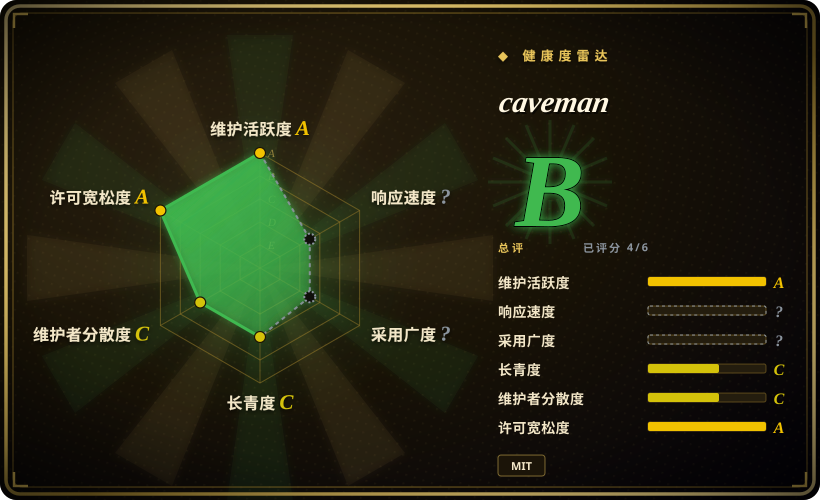

# caveman

一个 prompt 与安装器技能包，让多种 coding agent 用刻意简短的“caveman”风格回答，同时保留代码、命令和错误信息。

## 何时使用

你在使用 coding agent，痛点不是它不会写代码，而是它在可见回复里塞了太多铺垫、免责声明和长段解释；你仍然要求代码块、shell 命令、错误信息和技术判断保持原样。此时可以选 caveman：它把一套简短表达规则装进 Claude Code、Codex、Gemini、Cursor、Windsurf、Cline、Copilot 等多种 agent，并提供不同简短等级。

关键取舍是范围。caveman 改的是 agent 的“嘴”，不是推理循环、规划器、工具或记忆系统；如果你只想要低摩擦的简短表达覆盖层，而不是完整工程 harness，它更合适。

## 何时不用

- **你需要更强工程流程，而不是更短表达。** 用 [mattpocock/skills](mattpocock-skills.zh.md) 处理 TDD、bug 诊断、spec、review 和架构纪律；caveman 主要约束回复风格。
- **你需要在 agent 读取前压缩上下文。** 如果问题是记忆、检索、context degradation 或 prompt surface 设计，用 [Agent Skills for Context Engineering](../context-engineering/context-engineering-skills.zh.md) 这类 context-engineering 技能；caveman 的主场是输出简短。
- **你需要把降本当作合同指标。** README 自己说明 caveman 主要压缩输出 token，会增加输入 token 开销，已很简短的工作负载可能净负；把它用于成本承诺前，应在自己的 harness 上测量。
- **团队不接受运行日志里的玩笑人设。** 直接写本地简短回复规则或用常规 reviewer skill；caveman 的“原始人”语气在合规评审或客户可见 transcript 里可能分散注意力。
- **你要完整替换 coding agent。** 评估 Caveman Code（未收录）或其他 coding-agent harness；本仓库只是 skill/plugin 覆盖层。

## 横向对比

| 替代品 | 是否收录 | 我们的评价 | 取舍 |
|---|---|---|---|
| [mattpocock/skills](mattpocock-skills.zh.md) | ✅ | 如果失败模式是工程纪律不足，选 mattpocock/skills；只有主要收益是缩短 agent 输出时，才选 caveman。 | mattpocock/skills 改工作流质量门；caveman 更轻，但不提供 TDD 或 review 流程。 |
| [Agent Skills for Context Engineering](../context-engineering/context-engineering-skills.zh.md) | ✅ | 如果瓶颈是上下文设计、记忆或评测，选 context-engineering 包；如果只要回复风格覆盖层，选 caveman。 | context-engineering 覆盖更广也更重；caveman 安装快，但只处理啰嗦问题。 |
| 自写简短回复规则 | 未收录 | 如果团队需要中性语气或严格 house style，写本地规则；如果需要安装矩阵和预设命令，选 caveman。 | 本地规则更好治理，但没有 caveman 的命令、统计和多 agent 安装覆盖。 |
| Caveman Code | 未收录 | 如果你要完整的简短 coding agent，评估 Caveman Code；如果只想改变现有 agent 的输出风格，选本页项目。 | 完整 agent 替换会改变更多行为；caveman 是更小、更可逆的覆盖层。 |

## 健康度与可持续性

- **维护快照（2026-07-16）：** GitHub 返回 `archived=false`，`pushed_at=2026-07-03T11:10:42Z`；健康度评分器看到近期活动，maintenance 为 `A`。
- **采用快照：** GitHub API 在 2026-07 返回约 90,035 个 star，对年轻 skill-pack 来说异常高；这代表关注度强，不等于你的工作负载一定适配。
- **许可证快照：** 根目录 `LICENSE` 为 MIT，GitHub 元数据也返回 MIT。
- **Lindy / 治理：** health block 中仓库年龄只有约 3 个月，longevity 仍为 `C`；治理比许多单作者 skill-pack 稍好，因为评分器 12 个月窗口里的贡献者集中度较低。
- **风险信号：** README 的输出 token 节省是项目方基准；整场会话是否省 token 取决于你的 prompt 大小、输入 token 开销，以及 agent 原本有多简短。

## 存疑（未验证）

- [未验证] README 中的输出 token 节省和技术准确性示例未经 oss-atlas 独立基准验证；用于成本测算前请在自己的 session 上测试。
- [未验证] 宽泛安装矩阵未在本地逐项执行；团队采用前请验证自己的具体 agent 路径。
- [推断] 很高的 star 数代表关注度，但不能证明长期维护或适合合规沟通。
