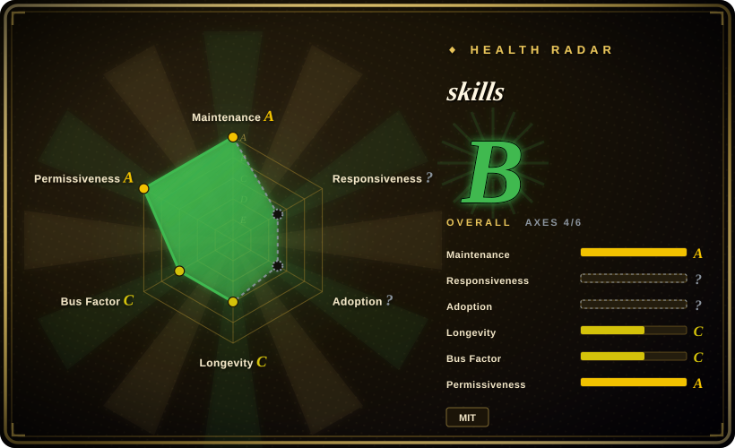

# mattpocock/skills

Matt Pocock's engineering skill pack for Claude Code and skills.sh: grilling, domain docs, TDD, bug diagnosis, architecture, review, tickets, and implementation flow.

## When to use

You're using Claude Code, Codex, or another Agent-Skills-compatible coding agent on a real application, and the failure mode is not model capability but weak process: unclear requirements, vague domain language, missing TDD loops, sloppy bug diagnosis, unreviewed diffs, or architecture drift. Pick mattpocock/skills when you want a compact engineering playbook that can be copied via skills.sh or installed as a Claude Code plugin, then configured per repo with `/setup-matt-pocock-skills`.

Choose it over a broad personal collection when you specifically want software-engineering rituals rather than content creation or persona prompts. It is opinionated around issue trackers, docs, tickets, and review flow, so it is strongest when your repo can absorb that process.

## When NOT to use

- **You only want web-quality audits.** Use [web-quality-skills](addyosmani-web-quality.md) for Lighthouse, Core Web Vitals, accessibility, SEO, and performance checklists; mattpocock/skills is broader engineering process.
- **You need a vendor's deployment playbook.** Use [Vercel Agent Skills](vercel-agent-skills.md) for React/Next.js/Vercel-specific deployment and docs audit work; mattpocock/skills is model- and platform-agnostic.
- **You cannot add process artifacts.** If your environment rejects tickets, domain docs, ADRs, or setup questions, use a smaller single skill such as [Waza](waza.md) or a local rule instead.
- **You want a full autonomous SDLC framework.** Evaluate BMAD, Spec Kit, or GSD-style systems (not indexed) if you deliberately want the process to own orchestration; this pack is explicitly positioned as smaller and composable.
- **You need neutral organization-owned policy.** Use an internal skill set when external personal conventions, newsletter links, or Matt Pocock's opinions are not acceptable in enterprise agent prompts.

## Comparison

| Alternative | In index | Our verdict | Tradeoff |
|---|---|---|---|
| [Waza](waza.md) | ✅ | When you want a small set of eight engineering habits, pick Waza; when you want a larger repo setup, issue/ticket flow, and TDD/review loop, pick mattpocock/skills. | Waza is lighter; mattpocock/skills gives more orchestration and setup surface. |
| [Agent Skills (addyosmani)](addyosmani-agent-skills.md) | ✅ | For production quality/security/performance/API/ship commands, pick addyosmani's pack; for requirement grilling, domain modeling, TDD, and code review workflow, pick mattpocock/skills. | addyosmani is broader production checklisting; mattpocock is more process-and-design oriented. |
| [Vercel Agent Skills](vercel-agent-skills.md) | ✅ | For Vercel/Next.js deployment guidance, pick Vercel's official pack; for model-agnostic engineering rituals across stacks, pick mattpocock/skills. | Vercel has first-party product fit; mattpocock travels better across stacks. |
| [Spec Kit](../../agent-dev-methodology/spec-kit.md) | ✅ | If you want a full spec-driven development workflow, evaluate Spec Kit; pick mattpocock/skills when you want smaller composable skills you can adapt. | Spec Kit provides stronger rails; mattpocock/skills is easier to override skill by skill. |
| BMAD / GSD | 未收录 | If you want a full SDLC framework to own the process, evaluate these; pick mattpocock/skills when you want lighter engineering rituals. | Frameworks can provide more orchestration but can be harder to debug or override. |

## Health & viability

- **Maintenance snapshot (2026-07-16):** GitHub reports `archived=false` and `pushed_at=2026-07-16T09:03:25Z`; the health scorer grades maintenance `A`.
- **Adoption snapshot:** GitHub API reports ~173,369 stars as of 2026-07, and the README also cites a large newsletter audience; treat this as strong social proof, not automatic fit.
- **License snapshot:** root `LICENSE` is MIT and GitHub metadata reports MIT.
- **Lindy / governance:** the repo is young, so longevity remains `C`; governance is `C` because the scorer sees a very concentrated contributor distribution.
- **Risk flags:** the pack is highly opinionated and personal; run `/setup-matt-pocock-skills` in a test repo before making it the default team workflow.

## Caveats (unverified)

- [未验证] oss-atlas did not execute the setup command or install the Claude Code plugin; verify behavior in your own harness.
- [未验证] The README's claims about effectiveness of these engineering practices are not independently measured here.
- [推断] The high star count and author reputation reduce discovery risk, but the repo is still young and contributor concentration remains a governance concern.
