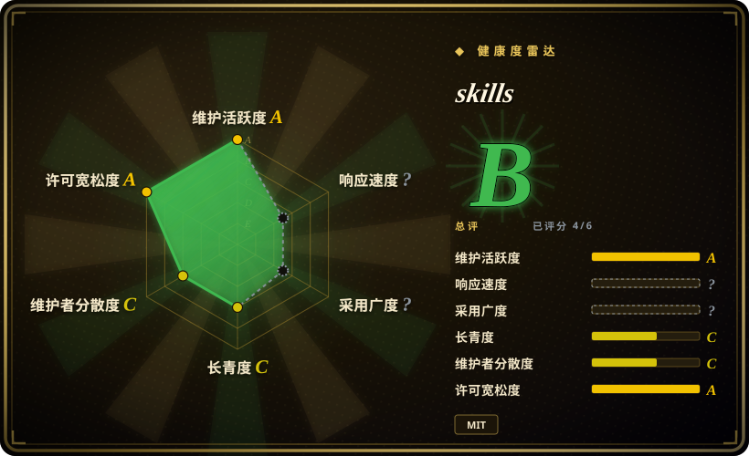

# mattpocock/skills

Matt Pocock 的工程 skill 包，面向 Claude Code 和 skills.sh，覆盖 grilling、domain docs、TDD、bug 诊断、架构、review、tickets 和实现流程。

## 何时使用

你在 Claude Code、Codex 或其他兼容 Agent Skills 的 coding agent 上开发真实应用，失败模式不是模型能力，而是流程薄弱：需求没问清、领域语言含糊、缺 TDD 循环、bug 诊断随意、diff 没审、架构持续劣化。此时可选 mattpocock/skills：它是一套紧凑工程 playbook，可通过 skills.sh 复制，也可作为 Claude Code plugin 安装，并通过 `/setup-matt-pocock-skills` 为每个 repo 配置。

如果你明确要的是软件工程仪式，而不是内容生产或人设 prompt，它比宽泛个人合集更合适。它对 issue tracker、文档、tickets 和 review flow 有明显主张，因此最适合能吸收这些流程的仓库。

## 何时不用

- **你只想做 Web 质量审计。** 用 [web-quality-skills](addyosmani-web-quality.zh.md) 处理 Lighthouse、Core Web Vitals、无障碍、SEO 和性能清单；mattpocock/skills 是更宽的工程流程。
- **你需要厂商部署 playbook。** React/Next.js/Vercel 特定部署和文档审计选 [Vercel Agent Skills](vercel-agent-skills.zh.md)；mattpocock/skills 是跨模型、跨平台的工程仪式。
- **你不能增加流程产物。** 如果环境拒绝 tickets、domain docs、ADR 或 setup 问题，用 [Waza](waza.zh.md) 这类更小的单组 skill 或本地规则。
- **你想要完整自治 SDLC 框架。** 如果刻意让流程接管编排，评估 BMAD、Spec Kit 或 GSD 类系统（未收录）；本包明确定位为更小、更可组合。
- **你需要中性的组织级政策。** 如果企业 prompt 里不能接受外部个人约定、newsletter 链接或 Matt Pocock 的个人观点，请使用内部 skill set。

## 横向对比

| 替代品 | 是否收录 | 我们的评价 | 取舍 |
|---|---|---|---|
| [Waza](waza.zh.md) | ✅ | 如果只要八个轻量工程习惯，选 Waza；如果要更大的 repo setup、issue/ticket flow 和 TDD/review 循环，选 mattpocock/skills。 | Waza 更轻；mattpocock/skills 给出更多编排和设置表面。 |
| [Agent Skills（addyosmani）](addyosmani-agent-skills.zh.md) | ✅ | 如果要生产质量、安全、性能、API、发布命令，选 addyosmani 包；如果要需求 grilling、domain modeling、TDD 和 code review 工作流，选 mattpocock/skills。 | addyosmani 更像生产 checklist；mattpocock 更偏流程与设计。 |
| [Vercel Agent Skills](vercel-agent-skills.zh.md) | ✅ | Vercel/Next.js 部署指导选 Vercel 官方包；跨技术栈工程仪式选 mattpocock/skills。 | Vercel 有一方产品适配；mattpocock 跨栈迁移性更好。 |
| [Spec Kit](../../agent-dev-methodology/spec-kit.zh.md) | ✅ | 如果你要完整的 spec-driven 开发工作流，评估 Spec Kit；如果要较小、可组合、可改的 skill，选 mattpocock/skills。 | Spec Kit 轨道更强；mattpocock/skills 更容易逐个 skill 覆盖。 |
| BMAD / GSD | 未收录 | 如果你要完整 SDLC 框架接管流程，评估这些；如果只要较轻的工程仪式，选 mattpocock/skills。 | 框架可提供更多编排，但更难调试或覆盖。 |

## 健康度与可持续性

- **维护快照（2026-07-16）：** GitHub 返回 `archived=false`，`pushed_at=2026-07-16T09:03:25Z`；健康度评分器给 maintenance `A`。
- **采用快照：** GitHub API 在 2026-07 返回约 173,369 个 star，README 也提到大规模 newsletter 受众；这代表强社会证明，不等于自动适配。
- **许可证快照：** 根目录 `LICENSE` 为 MIT，GitHub 元数据也返回 MIT。
- **Lindy / 治理：** 仓库仍年轻，longevity 为 `C`；评分器看到贡献者分布高度集中，因此 governance 为 `C`。
- **风险信号：** 该包强主张且个人化；把它设为团队默认工作流前，先在测试 repo 运行 `/setup-matt-pocock-skills`。

## 存疑（未验证）

- [未验证] oss-atlas 没有执行 setup 命令或安装 Claude Code plugin；请在自己的 harness 中验证行为。
- [未验证] README 对这些工程实践效果的描述未在本页独立测量。
- [推断] 高 star 和作者声誉降低发现风险，但仓库仍年轻，贡献者集中度仍是治理风险。
