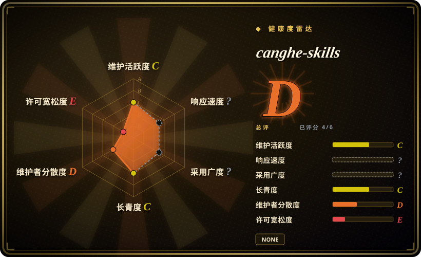

# canghe-skills

苍何个人 Claude Code skills marketplace：覆盖内容发布、图像/视频生成后端、商业情报、URL/X/微信提取、Obsidian 工具、Remotion 指南和文档解析。

## 何时使用

你是 Claude Code 重度用户，想要一个个人 marketplace 式的实用技能箱：小红书图文卡、信息图、封面图、slide deck、漫画、文章插图、X/微信公众号发布、图像/视频生成后端、天眼查风格 dashboard、URL/X/微信提取、Obsidian helper、Remotion 参考和 PaddleOCR 文档解析。需要广覆盖和可安装命令，而不是单一工程纪律时，可以选 canghe-skills。

关键取舍是便利性换治理成本。它是一个大型个人合集，含很多外部 API 表面，也有一些明确带风险的浏览器和网页技能；应把它当作工具菜单，只安装当前需要的 plugin group。

## 何时不用

- **许可证必须明确。** GitHub 元数据没有 SPDX license，验证时 `master/LICENSE` 返回 404；如果再分发或 vendoring 重要，选 [Khazix Skills](khazix-skills.zh.md) 或其他 MIT 已确认的合集。
- **你只需要工程纪律。** 改用 [mattpocock/skills](../../engineering/mattpocock-skills.zh.md)、[Waza](../../engineering/waza.zh.md) 或 [Agent Skills（addyosmani）](../../engineering/addyosmani-agent-skills.zh.md)；canghe-skills 是宽泛个人效率与内容工具箱。
- **你无法治理凭据或浏览器登录风险。** 多个 skill 提到 API keys、Chrome/CDP 登录流程、X cookies、微信凭据、Gemini Web cookies 或 provider tokens；如果 secrets 和账号不能治理，选更窄的本地-only skill。
- **你需要 vendor-neutral、组织拥有的政策。** 建内部 marketplace，或审完后只 fork 需要的 skills；本仓库是个人持续演进合集，表面很多且不相关。
- **你要确定性测试或 CI 工作流。** 使用标准工程/测试工具；canghe-skills 主要是操作者触发的内容、提取和工具自动化。

## 横向对比

| 替代品 | 是否收录 | 我们的评价 | 取舍 |
|---|---|---|---|
| [Khazix Skills](khazix-skills.zh.md) | ✅ | 如果要更小、边界更清楚的中文个人 skill set，选 Khazix Skills；如果需要更宽的内容、媒体和发布工具箱，选 canghe-skills。 | Khazix 更容易审计；canghe-skills 覆盖更多工作流和外部服务。 |
| [ljg-skills](ljg-skills.zh.md) | ✅ | 中文阅读、概念分析、改写和视觉卡片渲染选 ljg-skills；发布自动化、图像/视频后端和实用工具选 canghe-skills。 | ljg-skills 更聚焦知识工作；canghe-skills 更宽但运营风险更高。 |
| [dbskill](dbskill.zh.md) | ✅ | 商业模式诊断和中文内容策略 skill 选 dbskill；具体媒体生成与平台发布 helper 选 canghe-skills。 | dbskill 更偏建议；canghe-skills 含更多命令式自动化。 |
| 内部 skill marketplace | 未收录 | 企业场景涉及 secrets、账号和合规时，构建或 fork 内部 marketplace；把 canghe-skills 当作模式来源。 | 内部治理成本更高，但避免导入不相关的高风险表面。 |

## 健康度与可持续性

- **维护快照（2026-07-16）：** GitHub 返回 `archived=false`、默认分支 `master`、`pushed_at=2026-06-08T09:57:52Z`；健康度评分器给 maintenance `C`。
- **采用快照：** GitHub API 在 2026-07 返回约 407 个 star；足够纳入索引，但不能抵消许可证和治理不确定性。
- **许可证快照：** GitHub 元数据没有 SPDX license，`master/LICENSE` 返回 404；README 写 `MIT`，但因为没有确认 root license 文件，frontmatter 保持 `NOASSERTION`。
- **Lindy / 治理：** 仓库年轻，且评分器显示近似单人维护，因此 governance 为 `D`，longevity 只有 `C`。
- **风险信号：** 多个 skill 会触碰外部 API、浏览器 session、cookies、社交平台发布和媒体生成 provider；应把它当菜单，而不是默认全装基线。

## 存疑（未验证）

- [未验证] README 声明 `MIT`，但 `master/LICENSE` 没有可访问 root license 文件；再分发或 vendoring 前必须确认许可证。
- [未验证] oss-atlas 未安装或执行各个 skill 命令；API key、浏览器登录和 provider 行为需要本地验证。
- [推断] 它属于 personal-collections 而非 engineering，因为主要价值是某作者的宽工具箱，而不是代码质量纪律。
