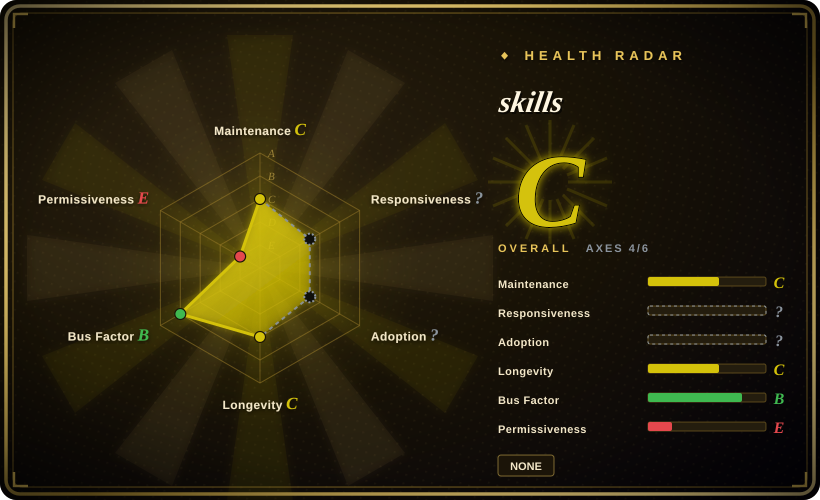

# skills

Sahil Lavingia's Claude Code skill pack translating The Minimalist Entrepreneur journey into 10 business-building commands.

## When to use

You're using Claude Code as a thinking partner for a tiny business or indie product, and you want a staged set of prompts for the Minimalist Entrepreneur journey: find a community, validate an idea, scope an MVP, processize manual delivery, find first customers, price, make a marketing plan, grow sustainably, define company values, and review decisions. Pick slavingia/skills when you specifically want Sahil Lavingia's book-derived entrepreneurial frame as invokable commands.

The decisive tradeoff is specificity. It is not a general engineering harness or startup operating system; it is a compact book-method skill pack, useful when that philosophy is the desired lens.

## When NOT to use

- **You need software-engineering process.** Use [mattpocock/skills](../../engineering/mattpocock-skills.md), [Waza](../../engineering/waza.md), or [Agent Skills (addyosmani)](../../engineering/addyosmani-agent-skills.md); slavingia/skills is about business judgment, not code delivery.
- **License or content rights are hard constraints.** GitHub metadata has no SPDX license and `main/LICENSE` returned 404; additionally, the README says the skills are based on a named commercial book, so verify code/content licensing before reuse.
- **You want broad business-model diagnosis in Chinese.** Use [dbskill](dbskill.md) if its Chinese business/content skills match your context better; slavingia/skills is narrower and book-specific.
- **You need market research with sources and data.** Use research tools, customer interviews, analytics, or a cited writing/research workflow; these commands are decision prompts, not a data pipeline.
- **You reject the Minimalist Entrepreneur philosophy.** Use a different startup framework or write custom prompts; the value here comes from that specific lens.

## Comparison

| Alternative | In index | Our verdict | Tradeoff |
|---|---|---|---|
| [dbskill](dbskill.md) | ✅ | For Chinese business-model and content-strategy diagnosis, choose dbskill; for the Minimalist Entrepreneur's staged founder journey, choose slavingia/skills. | dbskill is broader and localized; slavingia/skills is clearer when you want this specific book lens. |
| [shaping-skills](../engineering-workflows/shaping-skills.md) | ✅ | For shaping what to build before coding, choose shaping-skills; for validating and growing an indie business, choose slavingia/skills. | shaping-skills is product-scope focused; slavingia/skills covers community, customers, pricing, and growth. |
| Custom founder coach prompts | 未收录 | If you need your own market, language, or investor assumptions, write custom prompts; choose slavingia/skills when the book-derived defaults are exactly the desired frame. | Custom prompts fit local context better but lack a ready-made 10-step progression. |
| Lean Startup / other startup frameworks | 未收录 | If the organization already uses a different framework, encode that instead; choose slavingia/skills for minimalist, community-first indie-business decisions. | Alternative frameworks may fit venture or enterprise contexts better; this pack is intentionally small-business oriented. |

## Health & viability

- **Maintenance snapshot (2026-07-16):** GitHub reports `archived=false` and `pushed_at=2026-04-14T00:53:57Z`; the health scorer grades maintenance `C` because the default branch has been quiet for about three months.
- **Adoption snapshot:** GitHub API reports ~9,588 stars as of 2026-07, a strong attention signal for a small skill pack.
- **License snapshot:** GitHub metadata reports no SPDX license and root `LICENSE` returned 404, so frontmatter stays `NOASSERTION`.
- **Lindy / governance:** the repo is young, longevity is `C`, but governance is `B` in the health block because contributor concentration is not as extreme as many single-author packs.
- **Risk flags:** book-derived content creates content-rights uncertainty; treat it as a prompt implementation of a philosophy unless licensing is clarified.

## Caveats (unverified)

- [未验证] No root license file was reachable at `main/LICENSE`; do not redistribute or vendor without confirming license terms.
- [未验证] The relationship between the skill text and The Minimalist Entrepreneur's book content was not audited for content licensing.
- [推断] This belongs in personal-collections because it is a named author's book-derived skill pack, not an engineering workflow collection.
