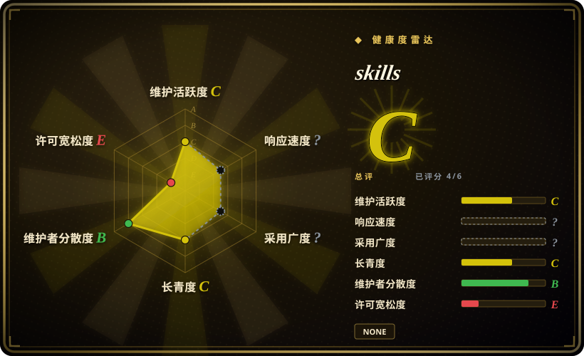

# skills

Sahil Lavingia 的 Claude Code skill 包，把《The Minimalist Entrepreneur》旅程变成 10 个商业构建命令。

## 何时使用

你把 Claude Code 当成小生意或独立产品的思考搭档，并想要一套按《The Minimalist Entrepreneur》推进的 prompt：找社区、验证想法、收敛 MVP、先手工交付再流程化、找到前 100 个客户、定价、制定营销计划、可持续增长、定义公司价值观、复盘决策。明确想用 Sahil Lavingia 的书中框架作为可调用命令时，可以选 slavingia/skills。

关键取舍是特定性。它不是通用工程 harness，也不是完整 startup operating system；它是一个紧凑的书籍方法 skill pack，适合当你就是想用这套哲学做判断。

## 何时不用

- **你需要软件工程流程。** 用 [mattpocock/skills](../../engineering/mattpocock-skills.zh.md)、[Waza](../../engineering/waza.zh.md) 或 [Agent Skills（addyosmani）](../../engineering/addyosmani-agent-skills.zh.md)；slavingia/skills 是商业判断，不是代码交付。
- **许可证或内容权利是硬约束。** GitHub 元数据没有 SPDX license，`main/LICENSE` 返回 404；README 又说明 skills 基于一本具名商业书，复用前必须确认代码和内容许可。
- **你要中文商业模式诊断。** 如果 [dbskill](dbskill.zh.md) 的中文商业/内容 skill 更贴近语境，优先用它；slavingia/skills 更窄，而且绑定书中框架。
- **你需要带来源和数据的市场研究。** 用调研工具、客户访谈、analytics 或带引用的研究/写作 workflow；这些命令是决策 prompts，不是数据管道。
- **你不接受 Minimalist Entrepreneur 哲学。** 改用其他创业框架或写自定义 prompts；本项目价值来自这个特定视角。

## 横向对比

| 替代品 | 是否收录 | 我们的评价 | 取舍 |
|---|---|---|---|
| [dbskill](dbskill.zh.md) | ✅ | 中文商业模式和内容策略诊断选 dbskill；Minimalist Entrepreneur 分阶段 founder journey 选 slavingia/skills。 | dbskill 更宽且中文本地化；slavingia/skills 在你需要这本书视角时更清晰。 |
| [shaping-skills](../engineering-workflows/shaping-skills.zh.md) | ✅ | 写代码前先 shape“做什么”选 shaping-skills；验证和增长独立小生意选 slavingia/skills。 | shaping-skills 聚焦产品范围；slavingia/skills 覆盖社区、客户、定价和增长。 |
| 自定义 founder coach prompts | 未收录 | 如果需要自己的市场、语言或投资人假设，写自定义 prompts；如果书中默认框架正是想要的镜头，选 slavingia/skills。 | 自定义更贴本地上下文，但缺少现成 10 步路径。 |
| Lean Startup / 其他创业框架 | 未收录 | 如果组织已使用其他框架，应编码那套框架；如果要 minimalist、community-first 的独立业务判断，选 slavingia/skills。 | 其他框架可能更适合融资型或企业场景；本包刻意偏小生意。 |

## 健康度与可持续性

- **维护快照（2026-07-16）：** GitHub 返回 `archived=false`，`pushed_at=2026-04-14T00:53:57Z`；默认分支约三个月安静，因此健康度评分器给 maintenance `C`。
- **采用快照：** GitHub API 在 2026-07 返回约 9,588 个 star，对小型 skill pack 来说是强关注信号。
- **许可证快照：** GitHub 元数据没有 SPDX license，root `LICENSE` 返回 404，因此 frontmatter 保持 `NOASSERTION`。
- **Lindy / 治理：** 仓库年轻，longevity 为 `C`；但 health block 中 governance 为 `B`，因为贡献者集中度没有许多单作者包那么极端。
- **风险信号：** 来源于书的方法论会带来内容权利不确定性；除非许可澄清，否则只把它当作某种哲学的 prompt 实现。

## 存疑（未验证）

- [未验证] `main/LICENSE` 没有可访问 root license 文件；确认许可前不要再分发或 vendor。
- [未验证] skill 文本与《The Minimalist Entrepreneur》书籍内容之间的版权关系未被本页审计。
- [推断] 它属于 personal-collections，因为这是具名作者的书籍方法 skill pack，而不是工程工作流合集。
