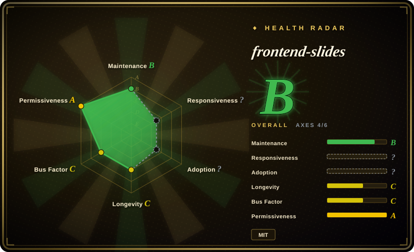

# frontend-slides

Create beautiful slides on the web using a coding agent's frontend skills

## When to use

You want a coding agent to create a **single-file web presentation** using frontend skills, or convert an existing PowerPoint into a browser-viewable slideshow. Choose frontend-slides when the user can pick visual directions from generated previews and the final artifact can be HTML rather than native PowerPoint.

It is packaged as a Claude Code plugin and also usable by other coding agents that can read `SKILL.md` and supporting files. The upstream README emphasizes zero-dependency single HTML output for new decks, visual style discovery, PPT content extraction, bold template previews, Vercel deployment, and PDF export via Playwright.

## When NOT to use

- **You need native editable `.pptx`.** Use [ppt-master](ppt-master.md); frontend-slides produces web slides and can convert PowerPoint content to web, but it is not a PowerPoint-native editor/export pipeline.
- **You need a large static template/runtime library.** [html-ppt-skill](html-ppt-skill.md) has many built-in themes, layouts, animations, and presenter mode.
- **You cannot use a local coding agent with filesystem and shell access.** The skill expects file creation and optional scripts for PPT extraction, deployment, and PDF export.
- **You need deterministic corporate templates only.** The style-discovery workflow is useful for exploration, but strict brand decks may need a locked template system.
- **You want a general visual artifact generator.** Use [HTML Anything](../../ai-design-generation/html-anything.md) or [huashu-design](../design/huashu-design.md) when slides are only one artifact type.

## Comparison

| Alternative | In index | Our verdict | Tradeoff |
|---|---|---|---|
| [ppt-master](ppt-master.md) | ✅ | Choose ppt-master when native editable PowerPoint output is mandatory. | ppt-master is heavier and Python/PPTX-oriented; frontend-slides is simpler for web decks. |
| [html-ppt-skill](html-ppt-skill.md) | ✅ | Choose html-ppt-skill for a richer static deck runtime with many built-in templates and presenter mode. | html-ppt-skill is more template/runtime heavy; frontend-slides focuses on visual discovery and single HTML output. |
| [Guizang PPT Skill](guizang-ppt.md) | ✅ | Choose Guizang PPT for opinionated article-to-HTML swipe decks. | Guizang is more constrained; frontend-slides is more general for web presentation creation and PPT conversion. |
| Slidev / Marp | 未收录 | Choose these for Markdown-first developer decks with established ecosystems. | Mature and deterministic, but less agent-guided and less visual-preview driven. |

## Health & viability

- **Maintenance snapshot (2026-07-16):** GitHub reports `archived=false` and `pushed_at=2026-06-23T20:08:19Z`; health scores maintenance as B.
- **Adoption snapshot:** ~25,713 GitHub stars as of 2026-07, which is strong attention for a young skill but not a substitute for local output review.
- **License snapshot:** MIT verified from upstream README and root `LICENSE` in the read-only upstream check.
- **Lindy / governance:** young repo with health longevity C and governance C; useful, but not a long-lived deck standard yet.
- **Risk flags:** output quality depends on the model, selected visual preview, local browser behavior, and whether HTML output is acceptable for the audience.

## Caveats (unverified)

- [未验证] PPT conversion quality and visual-preservation claims were not tested with real `.pptx` files in this pass.
- [未验证] Vercel deploy and PDF export scripts were read from upstream docs but not executed locally.
- [推断] Best fit is web-first presentation creation, not native PowerPoint production.
