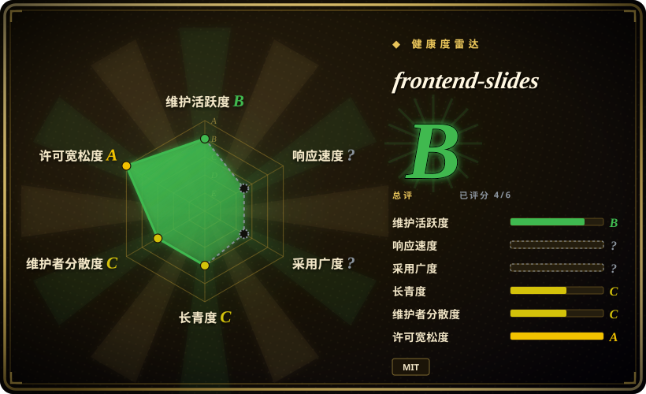

# frontend-slides

Create beautiful slides on the web using a coding agent's frontend skills

## 何时使用

你想让 coding agent 用前端能力创建**单文件网页演示文稿**，或把已有 PowerPoint 转成浏览器可看的 slideshow。用户可以从生成的视觉预览里选方向，最终产物可以是 HTML 而不是原生 PowerPoint 时，选 frontend-slides。

它打包为 Claude Code plugin，也可被其他能读取 `SKILL.md` 和支持文件的 coding agent 使用。上游 README 强调新 deck 的零依赖单 HTML 输出、视觉风格发现、PPT 内容提取、bold template 预览、Vercel 部署和 Playwright PDF 导出。

## 何时不用

- **你需要原生可编辑 `.pptx`。** 用 [ppt-master](ppt-master.zh.md)；frontend-slides 生成网页 slides，也能把 PowerPoint 内容转成网页，但不是 PowerPoint-native 编辑 / 导出管线。
- **你需要大型静态模板 / runtime 库。** [html-ppt-skill](html-ppt-skill.zh.md) 内置更多主题、布局、动画和 presenter mode。
- **你不能使用有文件系统和 shell 权限的本地 coding agent。** 该 skill 需要创建文件，并可选运行 PPT 提取、部署和 PDF 导出脚本。
- **你只接受确定的企业模板。** 风格发现适合探索，但严格品牌 deck 可能需要锁定模板系统。
- **你想要通用视觉产物生成器。** slides 只是多种 artifact 之一时，看 [HTML Anything](../../ai-design-generation/html-anything.zh.md) 或 [huashu-design](../design/huashu-design.zh.md)。

## 横向对比

| 替代品 | 是否收录 | 我们的评价 | 取舍 |
|---|---|---|---|
| [ppt-master](ppt-master.zh.md) | ✅ | 必须产出原生可编辑 PowerPoint 时选 ppt-master。 | ppt-master 更重，偏 Python / PPTX；frontend-slides 更适合网页 deck。 |
| [html-ppt-skill](html-ppt-skill.zh.md) | ✅ | 需要更丰富的静态 deck runtime、大量内建模板和 presenter mode 时选它。 | html-ppt-skill 更模板 / runtime 重；frontend-slides 聚焦视觉发现和单 HTML 输出。 |
| [Guizang PPT Skill](guizang-ppt.zh.md) | ✅ | 有主张的文章转 HTML 翻页 deck 选 Guizang。 | Guizang 更受约束；frontend-slides 更通用，覆盖 web presentation creation 和 PPT conversion。 |
| Slidev / Marp | 未收录 | 需要 Markdown-first developer decks 和成熟生态时选它们。 | 成熟且确定，但 agent-guided 和视觉预览驱动较弱。 |

## 健康度与可持续性

- **维护快照（2026-07-16）：** GitHub 返回 `archived=false`，`pushed_at=2026-06-23T20:08:19Z`；health 将维护评为 B。
- **采用快照：** 2026-07 约 25,713 个 GitHub stars；这对年轻 skill 是强关注，但不能替代本地输出验收。
- **许可证快照：** 只读上游核验确认 README 和根目录 `LICENSE` 均为 MIT。
- **Lindy / 治理：** 项目年轻，health 中 longevity 为 C、governance 为 C；有用，但还不是长期 deck 标准。
- **风险信号：** 输出质量取决于模型、选定视觉预览、本地浏览器行为，以及受众是否接受 HTML 输出。

## 存疑（未验证）

- [未验证] PPT conversion 质量和视觉保真没有用真实 `.pptx` 本地测试。
- [未验证] Vercel deploy 和 PDF export 脚本读自上游文档，本次没有执行。
- [推断] 它最适合 web-first presentation creation，不是原生 PowerPoint 生产。
