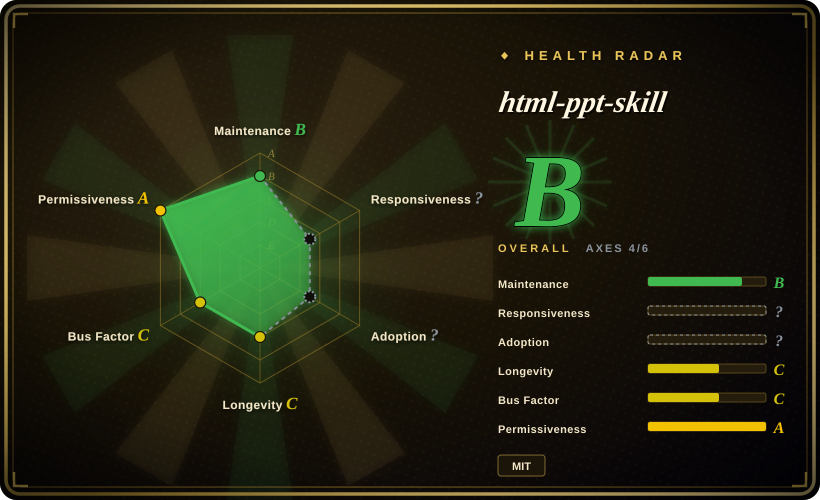

# html-ppt-skill

HTML PPT Studio — AgentSkill with 36 themes, 15 full-deck templates, 31 layouts, 47 animations, and presenter mode for building professional static HTML presentations.

## When to use

You want an agent skill that gives a coding agent a ready-made HTML presentation studio: themes, layouts, animations, full-deck templates, presenter mode, and static HTML/CSS/JS runtime. Choose html-ppt-skill when the output can be an HTML deck and the main need is rich slide-building primitives rather than native `.pptx` editability.

It is strong for presentation authors who want a large palette: 36 CSS-token themes, 15 full-deck templates, 31 single-page layouts, 27 CSS animations, 20 canvas FX modules, and presenter mode with current/next-slide previews, speaker script, and timer.

## When NOT to use

- **You need editable PowerPoint output.** Use [ppt-master](ppt-master.md); html-ppt-skill is a static HTML deck system.
- **You want a minimal one-off web deck.** [frontend-slides](frontend-slides.md) may be lighter if you do not need a large built-in template/runtime catalog.
- **You need a locked article-to-swipe-deck editorial workflow.** [Guizang PPT Skill](guizang-ppt.md) is more constrained and opinionated.
- **You cannot accept CDN/webfont/JavaScript presentation behavior.** The project is static HTML/CSS/JS and may use optional webfonts/highlight.js/chart.js style dependencies.
- **Your team standardizes on Markdown deck frameworks.** Slidev/Marp may be easier to version and review in developer workflows.

## Comparison

| Alternative | In index | Our verdict | Tradeoff |
|---|---|---|---|
| [frontend-slides](frontend-slides.md) | ✅ | Choose frontend-slides for visual-preview-driven web deck generation and PPT-to-web conversion. | frontend-slides is lighter and more guided; html-ppt-skill has the larger built-in deck runtime/catalog. |
| [ppt-master](ppt-master.md) | ✅ | Choose ppt-master when the deliverable must be a native editable `.pptx`. | ppt-master is PowerPoint-native; html-ppt-skill is HTML-native. |
| [Guizang PPT Skill](guizang-ppt.md) | ✅ | Choose Guizang PPT for tightly constrained article-to-HTML swipe decks. | Guizang has a stronger editorial funnel; html-ppt-skill is a broader template studio. |
| Slidev / Marp | 未收录 | Choose these when Markdown source and mature developer tooling matter most. | They are mature frameworks, but not packaged as an AgentSkill with this many built-in visual primitives. |

## Health & viability

- **Maintenance snapshot (2026-07-16):** GitHub reports `archived=false` and `pushed_at=2026-04-26T07:13:39Z`; health scores maintenance as B.
- **Adoption snapshot:** ~7,185 GitHub stars as of 2026-07; relevant, but still a young skill with limited longevity evidence.
- **License snapshot:** MIT verified from upstream README and root `LICENSE` in the read-only upstream check.
- **Lindy / governance:** health longevity is C and governance is C; not abandoned, but not old enough to be a stable presentation standard.
- **Risk flags:** the large catalog is an advantage, but also increases the chance of visual inconsistency unless the agent selects and applies templates carefully.

## Caveats (unverified)

- [未验证] Presenter mode and animation behavior were read from docs but not executed in a browser in this pass.
- [未验证] The exact theme/template counts come from upstream README and may drift as the repo evolves.
- [推断] Best fit is HTML-native deck production when a rich built-in visual catalog matters more than PowerPoint editability.
