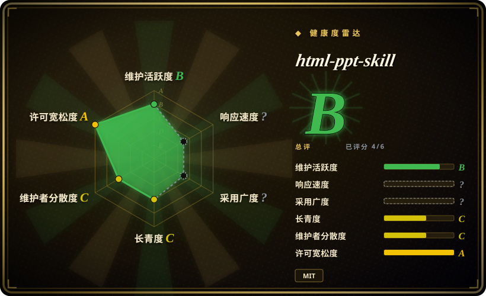

# html-ppt-skill

HTML PPT Studio——AgentSkill，内置 36 个主题、15 个 full-deck templates、31 个布局、47 个动画和 presenter mode，用于构建专业静态 HTML 演示文稿。

## 何时使用

你想给 coding agent 一个现成的 HTML presentation studio：主题、布局、动画、full-deck templates、presenter mode 和静态 HTML / CSS / JS runtime。最终产物可以是 HTML deck，核心需求是丰富 slide-building primitives，而不是原生 `.pptx` 可编辑性时，选 html-ppt-skill。

它适合需要大视觉素材库的 presentation author：36 个 CSS-token themes、15 个 full-deck templates、31 个 single-page layouts、27 个 CSS animations、20 个 canvas FX modules，以及带当前页 / 下一页预览、speaker script 和 timer 的 presenter mode。

## 何时不用

- **你需要可编辑 PowerPoint 输出。** 用 [ppt-master](ppt-master.zh.md)；html-ppt-skill 是静态 HTML deck 系统。
- **你只要一个极简一次性网页 deck。** 如果不需要大型内建 template / runtime catalog，[frontend-slides](frontend-slides.zh.md) 可能更轻。
- **你需要锁定的文章转翻页 deck 编辑流程。** [Guizang PPT Skill](guizang-ppt.zh.md) 更受约束，也更有主张。
- **你不能接受 CDN / webfont / JavaScript presentation 行为。** 项目是静态 HTML / CSS / JS，并可能使用可选 webfonts、highlight.js、chart.js 等依赖。
- **团队标准是 Markdown deck framework。** Slidev / Marp 在开发者流程里更容易版本化和 review。

## 横向对比

| 替代品 | 是否收录 | 我们的评价 | 取舍 |
|---|---|---|---|
| [frontend-slides](frontend-slides.zh.md) | ✅ | 需要视觉预览驱动的 web deck generation 和 PPT-to-web conversion 时选 frontend-slides。 | frontend-slides 更轻、更引导式；html-ppt-skill 内建 deck runtime / catalog 更大。 |
| [ppt-master](ppt-master.zh.md) | ✅ | 交付物必须是原生可编辑 `.pptx` 时选 ppt-master。 | ppt-master 是 PowerPoint-native；html-ppt-skill 是 HTML-native。 |
| [Guizang PPT Skill](guizang-ppt.zh.md) | ✅ | 需要强约束的文章转 HTML 翻页 deck 时选 Guizang。 | Guizang 编辑漏斗更强；html-ppt-skill 是更宽的 template studio。 |
| Slidev / Marp | 未收录 | Markdown source 和成熟开发者工具最重要时选它们。 | 它们是成熟框架，但不是内置大量视觉 primitives 的 AgentSkill。 |

## 健康度与可持续性

- **维护快照（2026-07-16）：** GitHub 返回 `archived=false`，`pushed_at=2026-04-26T07:13:39Z`；health 将维护评为 B。
- **采用快照：** 2026-07 约 7,185 个 GitHub stars；相关但仍是年轻 skill，长期证据有限。
- **许可证快照：** 只读上游核验确认 README 和根目录 `LICENSE` 均为 MIT。
- **Lindy / 治理：** health 中 longevity 为 C、governance 为 C；没有废弃，但还不足以视为长期 presentation 标准。
- **风险信号：** 大 catalog 是优势，也会增加视觉不一致风险，除非 agent 小心选择和应用模板。

## 存疑（未验证）

- [未验证] Presenter mode 和 animation behavior 读自文档，本次没有在浏览器里执行。
- [未验证] 主题 / 模板数量来自上游 README，可能随仓库演进而变化。
- [推断] 当丰富内建视觉 catalog 比 PowerPoint 可编辑性更重要时，它最适合 HTML-native deck production。
