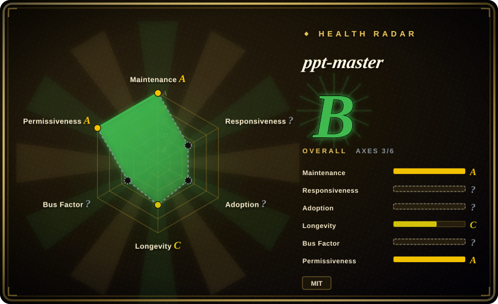

# ppt-master

AI generates a real, editable PowerPoint from any document — native shapes & animations, editable charts & tables you can change the data on, speaker notes voiced as audio narration, and the option to follow your own .pptx template, not slide images · by Hugo He

## When to use

You need an agent workflow that turns documents, notes, web pages, references, or an existing `.pptx` into a **real editable PowerPoint file**, not a web deck or one-image-per-slide export. Choose ppt-master when the output must open in PowerPoint with editable text boxes, shapes, charts/tables, transitions, optional animations, speaker notes, and optional audio narration.

It fits AI IDE workflows where an agent can read/write files and run commands locally: Claude Code, Cursor, VS Code + Copilot, Codex-style CLIs, and similar agents. The upstream README is explicit that PPT Master owns the workflow, not the model quality ceiling; good results depend on a capable model, local Python setup, source materials, and human polish after export.

## When NOT to use

- **You only need a web presentation.** Use [frontend-slides](frontend-slides.md), [html-ppt-skill](html-ppt-skill.md), or [Guizang PPT Skill](guizang-ppt.md); ppt-master's core promise is native editable PPTX.
- **You expect a perfect deck without review.** Upstream warns it is a tool, not a wishing well; the deck is editable because polishing remains part of the workflow.
- **Your environment cannot run Python or allow an agent to write files and execute scripts.** The documented setup requires Python 3.10+, `pip install -r requirements.txt`, source files, and local exports.
- **You cannot send source content to an AI model.** Most processing is local, but the agent/model still sees the material needed to design the deck.
- **You need a fixed developer deck framework.** Slidev/Marp-style frameworks are better when developers want versioned Markdown source and deterministic build output.

## Comparison

| Alternative | In index | Our verdict | Tradeoff |
|---|---|---|---|
| [frontend-slides](frontend-slides.md) | ✅ | Choose frontend-slides for single-file HTML decks and PPT-to-web conversion. | frontend-slides optimizes web presentations; ppt-master optimizes native editable `.pptx`. |
| [html-ppt-skill](html-ppt-skill.md) | ✅ | Choose html-ppt-skill for static HTML/CSS/JS decks with many themes, layouts, animations, and presenter mode. | html-ppt-skill is a deck runtime/template studio; ppt-master is a document-to-editable-PowerPoint workflow. |
| [Guizang PPT Skill](guizang-ppt.md) | ✅ | Choose Guizang PPT for an article-to-single-file HTML swipe deck with strong art direction. | Guizang is narrower and more editorial; ppt-master is heavier but creates editable PowerPoint. |
| Slidev / Marp | 未收录 | Choose these when Markdown-as-source and deterministic developer builds matter most. | More mature deck frameworks, but less agent-native and not focused on editable PPTX output. |

## Health & viability

- **Maintenance snapshot (2026-07-16):** GitHub reports `archived=false` and `pushed_at=2026-07-16T03:51:31Z`; health scores maintenance as A.
- **Adoption snapshot:** ~39,357 GitHub stars as of 2026-07, but the project is young and attention is not the same as long-term deck quality.
- **License snapshot:** MIT verified from upstream README and root `LICENSE` in the read-only upstream check.
- **Lindy / governance:** health longevity is C; governance is unknown in the recomputed health block (`empty_or_gated`) despite visible sponsor/community interest.
- **Risk flags:** quality depends heavily on model capability, local setup, source-material quality, and post-generation human editing.

## Caveats (unverified)

- [未验证] Example decks and model recommendations were read from upstream docs but not reproduced locally.
- [未验证] Native chart/table export behavior was not tested in PowerPoint in this pass.
- [推断] It is the strongest fit in this leaf when `.pptx` editability is mandatory, but overkill for web-only slide decks.
