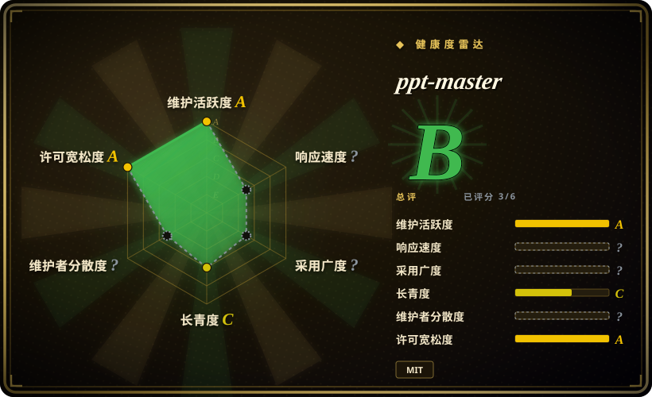

# ppt-master

AI generates a real, editable PowerPoint from any document — native shapes & animations, editable charts & tables you can change the data on, speaker notes voiced as audio narration, and the option to follow your own .pptx template, not slide images · by Hugo He

## 何时使用

你需要 agent workflow 把文档、笔记、网页、参考资料或已有 `.pptx` 变成**真正可编辑的 PowerPoint 文件**，而不是网页 deck 或每页一张图。输出必须能在 PowerPoint 里编辑文本框、形状、图表 / 表格、转场、可选动画、speaker notes，甚至可选音频旁白时，选 ppt-master。

它适合能本地读写文件、执行命令的 AI IDE 工作流：Claude Code、Cursor、VS Code + Copilot、Codex 类 CLI 等。上游 README 明确说 PPT Master 只负责 workflow，模型决定质量上限；好结果依赖强模型、本地 Python 环境、源材料，以及导出后的人工润色。

## 何时不用

- **你只需要网页演示文稿。** 用 [frontend-slides](frontend-slides.zh.md)、[html-ppt-skill](html-ppt-skill.zh.md) 或 [Guizang PPT Skill](guizang-ppt.zh.md)；ppt-master 的核心承诺是原生可编辑 PPTX。
- **你期待一键完美成稿。** 上游明确提醒它是工具，不是许愿池；deck 可编辑，正是因为后续润色仍是流程的一部分。
- **环境不能运行 Python，或 agent 不能写文件 / 执行脚本。** 文档 setup 需要 Python 3.10+、`pip install -r requirements.txt`、源文件和本地导出。
- **你不能把源材料交给 AI 模型。** 处理大多在本地，但 agent / model 仍会看到用于设计 deck 的材料。
- **你要固定的开发者 deck 框架。** 当开发者想要版本化 Markdown source 和确定性 build output 时，Slidev / Marp 更合适。

## 横向对比

| 替代品 | 是否收录 | 我们的评价 | 取舍 |
|---|---|---|---|
| [frontend-slides](frontend-slides.zh.md) | ✅ | 需要单文件 HTML deck 或 PowerPoint 转网页时选 frontend-slides。 | frontend-slides 优化网页演示；ppt-master 优化原生可编辑 `.pptx`。 |
| [html-ppt-skill](html-ppt-skill.zh.md) | ✅ | 需要静态 HTML / CSS / JS deck，并且想要大量主题、布局、动画和 presenter mode 时选它。 | html-ppt-skill 是 deck runtime / template studio；ppt-master 是 document-to-editable-PowerPoint workflow。 |
| [Guizang PPT Skill](guizang-ppt.zh.md) | ✅ | 文章转单文件 HTML 翻页 deck，且能接受强 art direction 时选 Guizang。 | Guizang 更窄、更编辑化；ppt-master 更重，但生成可编辑 PowerPoint。 |
| Slidev / Marp | 未收录 | Markdown-as-source 和确定性开发者 build 最重要时选它们。 | 更成熟的 deck 框架，但不够 agent-native，也不聚焦可编辑 PPTX。 |

## 健康度与可持续性

- **维护快照（2026-07-16）：** GitHub 返回 `archived=false`，`pushed_at=2026-07-16T03:51:31Z`；health 将维护评为 A。
- **采用快照：** 2026-07 约 39,357 个 GitHub stars，但项目很年轻，关注度不等于长期 deck 质量。
- **许可证快照：** 只读上游核验确认 README 和根目录 `LICENSE` 均为 MIT。
- **Lindy / 治理：** health 中 longevity 为 C；重算后的 governance 为未知（`empty_or_gated`），尽管 README 可见 sponsor / 社区关注。
- **风险信号：** 质量强依赖模型能力、本地环境、源材料质量和生成后的人工编辑。

## 存疑（未验证）

- [未验证] 示例 deck 和模型推荐读自上游文档，本次没有本地复现。
- [未验证] Native chart / table export 没有在 PowerPoint 中实测。
- [推断] 当 `.pptx` 可编辑性是硬约束时，它是本叶子里最贴合的选择；只做网页 deck 时可能过重。
