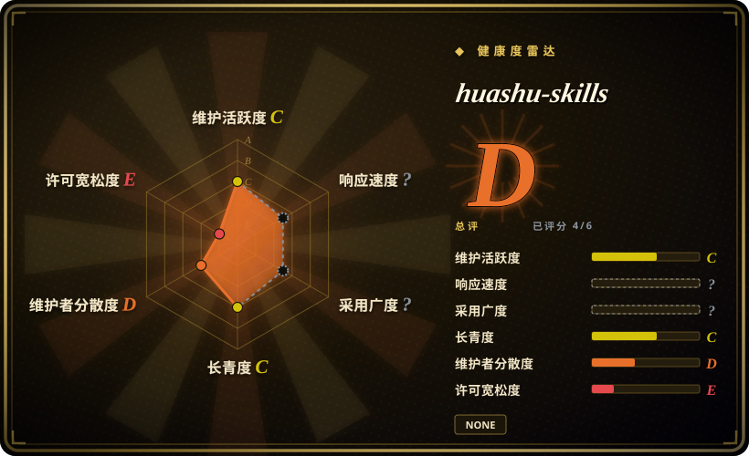

# huashu-skills

花叔的内容创作 Skills 合集 - AI审校、选题生成、视频大纲、素材搜索等 11 个实用技能

## 何时使用

你需要面向中文创作者的 Claude Code skill collection，覆盖文章编辑、选题生成、调研、视频大纲、脚本、长文转社媒、配图、PDF 导出、演讲教练和 prompt 保存。目标是宽内容创作工具箱，而不是单一写作生产线时，选 huashu-skills。

上游 README 描述了 21 个实战 skill，包括 slides、数据报告、抖音脚本、设计建议等端到端工作流，也包括写作审校、素材搜索、文章编辑、选题生成、视频检查、配图生成 / 上传、Markdown 转 PDF。安装方式是按单个 skill 路径运行 `/install-skill https://github.com/alchaincyf/huashu-skills/tree/master/{skill名}`。

## 何时不用

- **许可证必须清晰。** 本次 README 没看到 license 段，`LICENSE` 返回 404；复用时应保守处理。
- **你需要一条严格端到端文章生产线。** [writing-agent](writing-agent.zh.md) 更流程化，也有 evidence gate。
- **你需要英文 SaaS marketing 或 growth execution。** [marketingskills](marketingskills.zh.md) 更专门覆盖 CRO、SEO、analytics 和 sales enablement。
- **你不能按子 skill 安装。** README 的安装模型是 per skill path，不是清晰版本化 package contract。
- **你需要审计过的输出质量声明。** AI 检测率降低、图片管线或报告质量等声明仍需本地验证。

## 横向对比

| 替代品 | 是否收录 | 我们的评价 | 取舍 |
|---|---|---|---|
| [writing-agent](writing-agent.zh.md) | ✅ | 单篇文章必须走严格 staged production 和 fact-check workflow 时选 writing-agent。 | writing-agent 更深更重；huashu-skills 更宽、更模块化。 |
| [Baoyu Skills](baoyu-skills.zh.md) | ✅ | 需要翻译、排版、抓取和媒体等宽 coding-agent 工具时选 Baoyu Skills。 | Baoyu 更偏通用工具；huashu-skills 面向中文创作者流程。 |
| [marketingskills](marketingskills.zh.md) | ✅ | SaaS / growth marketing 选 marketingskills。 | marketingskills 更营销专门；huashu-skills 更 creator-content。 |
| 自写 creator toolkit | 未收录 | 内容渠道、图床和编辑风格固定时自写。 | 更贴本地，但每个 skill 都要自己维护。 |

## 健康度与可持续性

- **维护快照（2026-07-16）：** GitHub 返回 `archived=false`，`pushed_at=2026-04-21T05:28:31Z`；health 将维护评为 C。
- **采用快照：** 2026-07 约 1,205 个 GitHub stars；对 creator toolkit 是有用关注信号，但不证明每个子 skill 的质量。
- **许可证快照：** `NOASSERTION`；本次根目录 `LICENSE` 返回 404，health 也把 repo 标为 source-available / no-license。
- **Lindy / 治理：** 项目年轻，health 中 longevity 为 C；维护者集中，governance 为 D。
- **风险信号：** surface area 很宽、许可证不清、per-skill install path，以及图床或模型 API 等渠道相关依赖。

## 存疑（未验证）

- [未验证] 本次没有找到根目录 `LICENSE` 文件；不要假定可宽松复用。
- [未验证] 没有本地执行各子 skill 行为和外部依赖。
- [推断] 最适合中文内容创作者工作流辅助，不是单一审计过的写作 pipeline。
