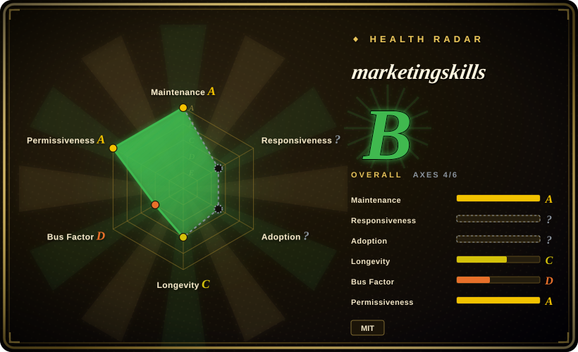

# marketingskills

Marketing skills for Claude Code and AI agents. CRO, copywriting, SEO, analytics, and growth engineering.

## When to use

You want a coding agent to help with product marketing, CRO, copywriting, SEO, analytics, lifecycle email, paid ads, growth loops, sales enablement, launch strategy, and related marketing execution. Choose marketingskills when the agent needs a broad marketing operating system rather than one narrow writing prompt.

The upstream pack is organized around `product-marketing` as shared context, with many specialized skills referencing it first. It supports `npx skills add coreyhaines31/marketingskills`, Claude Code plugin installation, clone/copy installs, and SkillKit multi-agent installation.

## When NOT to use

- **You only need prose style or de-AI cleanup.** Use [humanizer](../de-ai-writing/humanizer.md), [shuorenhua](../de-ai-writing/shuorenhua.md), or a voice guide; marketingskills is a marketing strategy/execution pack.
- **You need long-form editorial production for articles.** [writing-agent](writing-agent.md) or [Webnovel Writer](webnovel-writer.md) are more writing-pipeline oriented.
- **You do not have product positioning context.** Many skills depend on `product-marketing`; without product, audience, and positioning inputs, outputs become generic.
- **You need deterministic analytics implementation only.** Treat analytics skills as guidance; still verify event names, consent, privacy, and production instrumentation in code.
- **You want a small local prompt.** This is a large multi-skill marketing pack with cross-skill dependencies and upgrade/migration concerns.

## Comparison

| Alternative | In index | Our verdict | Tradeoff |
|---|---|---|---|
| [Baoyu Skills](baoyu-skills.md) | ✅ | Choose Baoyu Skills for broader writing, formatting, media, and utility workflows. | Baoyu is general-purpose; marketingskills is much deeper on marketing categories. |
| [writing-agent](writing-agent.md) | ✅ | Choose writing-agent for Chinese long-form article production with staged evidence, review, and publishing outputs. | writing-agent is a content production line; marketingskills is marketing strategy/execution support. |
| [huashu-skills](huashu-skills.md) | ✅ | Choose huashu-skills for Chinese creator workflows across articles, video outlines, images, and research. | huashu-skills is creator-content oriented; marketingskills is SaaS/growth marketing oriented. |
| Custom marketing playbook | 未收录 | Choose a private playbook when company-specific positioning, channels, and metrics are non-negotiable. | Better fit to one business; less reusable than the public skill pack. |

## Health & viability

- **Maintenance snapshot (2026-07-16):** GitHub reports `archived=false` and `pushed_at=2026-07-16T05:42:22Z`; health scores maintenance as A.
- **Adoption snapshot:** ~39,977 GitHub stars as of 2026-07, a strong attention signal for a young pack but not proof that every marketing tactic fits every business.
- **License snapshot:** MIT verified from upstream README and root `LICENSE` in the read-only upstream check.
- **Lindy / governance:** health longevity is C and governance is D because activity is still concentrated despite visible contributors.
- **Risk flags:** marketing advice depends on product context, data quality, channel constraints, and legal/privacy review for tracking or outreach.

## Caveats (unverified)

- [未验证] Individual skill quality across the full catalog was not audited one by one.
- [未验证] Analytics, ads, SEO, and outreach workflows still need business/legal review before production use.
- [推断] Best fit is technical marketers and founders using coding agents, especially SaaS/software contexts.
