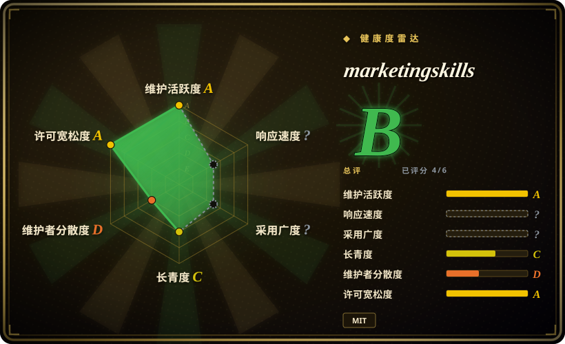

# marketingskills

Marketing skills for Claude Code and AI agents. CRO, copywriting, SEO, analytics, and growth engineering.

## 何时使用

你希望 coding agent 处理 product marketing、CRO、copywriting、SEO、analytics、lifecycle email、paid ads、growth loops、sales enablement、launch strategy 等营销执行任务。需要的是一套宽 marketing operating system，而不是一个窄写作 prompt 时，选 marketingskills。

上游围绕 `product-marketing` 作为共享上下文组织，很多专门 skill 会先读它。支持 `npx skills add coreyhaines31/marketingskills`、Claude Code plugin 安装、clone/copy 安装，以及 SkillKit 多 agent 安装。

## 何时不用

- **你只需要 prose style 或去 AI 味清理。** 用 [humanizer](../de-ai-writing/humanizer.zh.md)、[shuorenhua](../de-ai-writing/shuorenhua.zh.md) 或 voice guide；marketingskills 是营销策略 / 执行包。
- **你需要长文编辑生产线。** [writing-agent](writing-agent.zh.md) 或 [Webnovel Writer](webnovel-writer.zh.md) 更偏写作流程。
- **你没有 product positioning context。** 很多技能依赖 `product-marketing`；没有产品、受众和定位输入，输出会变泛。
- **你只要确定性的 analytics 实装。** analytics skills 只能做指导；事件名、同意机制、隐私和生产埋点仍要在代码里验证。
- **你想要一个小本地 prompt。** 这是大型多 skill marketing pack，有 cross-skill dependencies 和升级迁移成本。

## 横向对比

| 替代品 | 是否收录 | 我们的评价 | 取舍 |
|---|---|---|---|
| [Baoyu Skills](baoyu-skills.zh.md) | ✅ | 需要更宽的写作、排版、媒体和工具流程时选 Baoyu Skills。 | Baoyu 更通用；marketingskills 在营销类别上更深。 |
| [writing-agent](writing-agent.zh.md) | ✅ | 中文长文生产、证据、审稿和发布输出选 writing-agent。 | writing-agent 是内容生产线；marketingskills 是营销策略 / 执行支持。 |
| [huashu-skills](huashu-skills.zh.md) | ✅ | 中文创作者需要文章、视频大纲、配图、调研等工具时选 huashu-skills。 | huashu-skills 偏 creator-content；marketingskills 偏 SaaS / growth marketing。 |
| 私有 marketing playbook | 未收录 | 公司定位、渠道和指标有硬约束时自写。 | 更贴一个业务，但不如公共 skill pack 可复用。 |

## 健康度与可持续性

- **维护快照（2026-07-16）：** GitHub 返回 `archived=false`，`pushed_at=2026-07-16T05:42:22Z`；health 将维护评为 A。
- **采用快照：** 2026-07 约 39,977 个 GitHub stars；对年轻 pack 是强关注信号，但不证明每个营销 tactic 都适合每个业务。
- **许可证快照：** 只读上游核验确认 README 和根目录 `LICENSE` 均为 MIT。
- **Lindy / 治理：** health 中 longevity 为 C；虽然有可见贡献者，活动仍集中，governance 为 D。
- **风险信号：** 营销建议依赖产品上下文、数据质量、渠道约束，以及 tracking / outreach 的法律和隐私审查。

## 存疑（未验证）

- [未验证] 没有逐个审计完整 catalog 中每个 skill 的质量。
- [未验证] Analytics、ads、SEO 和 outreach workflow 在生产使用前仍需业务 / 法务审查。
- [推断] 最适合使用 coding agent 的 technical marketers 和 founders，尤其是 SaaS / software 场景。
