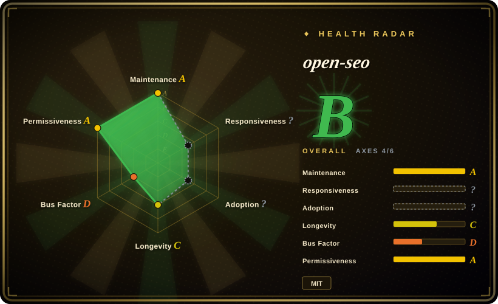

# open-seo

Open source alternative to Semrush and Ahrefs

## When to use

You want a self-hostable SEO application that gives humans and AI agents one place to run keyword research, rank tracking, competitor insights, backlinks, site audits, AI visibility work, and SEO coaching. Choose OpenSEO when Semrush/Ahrefs are too expensive or too closed, and you are willing to bring a DataForSEO API key and pay usage-based API costs.

It also exposes an OpenSEO MCP server plus prebuilt Agent Skills (`seo-project-setup`, `seo-coach`, `keyword-research`, `keyword-clustering`, `competitive-landscape`, `competitor-analysis`, `link-prospecting`) so Claude Code, OpenClaw, Hermes, or another MCP-capable agent can operate on your SEO data.

## When NOT to use

- **You need subscription-free usage with no external API spend.** OpenSEO itself is free, but core SEO data comes from paid DataForSEO APIs.
- **You need a mature Semrush/Ahrefs replacement today.** OpenSEO is young and focused; established commercial suites still have broader datasets, dashboards, and support.
- **You cannot self-host or manage secrets.** Docker/Cloudflare deployments, DataForSEO credentials, optional Google OAuth, and optional OpenRouter keys are operational responsibilities.
- **You only need marketing copy skills.** Use [marketingskills](marketingskills.md) for copy, CRO, lifecycle, and broader marketing execution.
- **You want design/UI taste guidance.** OpenSEO was moved out of `agent-skills/design`; use [Hallmark](../design/hallmark.md) or [Taste-Skill](../design/taste-skill.md) for design work.

## Comparison

| Alternative | In index | Our verdict | Tradeoff |
|---|---|---|---|
| [marketingskills](marketingskills.md) | ✅ | Choose marketingskills for agent-guided SEO, copy, CRO, and marketing workflows without running an SEO app. | marketingskills is a skill pack; OpenSEO is an app plus MCP/skills backed by paid SEO data APIs. |
| Semrush / Ahrefs | not indexed | Choose commercial suites when mature datasets, hosted UX, and vendor support matter more than control. | More expensive and closed, but much more established. |
| Custom DataForSEO scripts | not indexed | Choose scripts for a narrow one-off SEO data pull. | Cheaper to maintain for one task; lacks OpenSEO UI, MCP, and agent workflows. |
| Google Search Console alone | not indexed | Choose GSC for owned-site search performance only. | Free and official, but not a full competitor/keyword/backlink suite. |

## Tech stack

- **Core app:** TypeScript web application with self-hosting paths documented for Docker and Cloudflare.
- **Agent layer:** MCP server plus OpenSEO Agent Skills for SEO workflows.
- **SEO data:** DataForSEO APIs for paid SEO data; optional Google Search Console integration with a user-owned OAuth client.
- **AI features:** optional OpenRouter key for in-app SEO agent features.

## Dependencies

- **Required for useful SEO data:** DataForSEO account/API key.
- **Required for self-hosting:** Docker for local Docker path, or Cloudflare account for internet-facing/serverless deployment.
- **Optional:** Google OAuth client for Search Console, OpenRouter API key for AI features, agent runtime for MCP/skills usage.

## Ops difficulty

**Medium.** Local Docker self-hosting is the easier path, but it is intended for local single-user use and ships without authentication by default. Internet-facing use should prefer the documented Cloudflare path and requires secret management, API spend monitoring, OAuth setup if using Search Console, and regular updates.

## Health & viability

- **Maintenance snapshot (2026-07-16):** GitHub reports `archived=false` and `pushed_at=2026-07-15T17:12:05Z`; health scores maintenance as A.
- **Adoption snapshot:** ~4,337 GitHub stars as of 2026-07; useful attention signal but not proof of commercial-suite parity.
- **License snapshot:** MIT verified from root `LICENSE` in the read-only upstream check.
- **Lindy / governance:** health longevity is D and governance is D because the app is young and contribution is concentrated.
- **Risk flags:** DataForSEO spend, unauthenticated local Docker defaults, self-hosting exposure, OAuth secrets, and SEO-data freshness all need operational review.

## Caveats (unverified)

- [未验证] Self-hosting docs and skills setup were read from README links but not executed locally.
- [未验证] DataForSEO prices and minimum top-up figures are upstream README claims as of its stated date; verify before budgeting.
- [推断] Best fit is controlled, self-hosted SEO workflows with agent integration, not generic design or copywriting.
