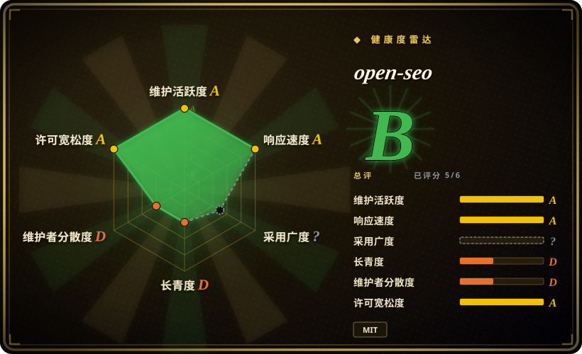

# open-seo

Open source alternative to Semrush and Ahrefs

## 何时使用

你想要一个可自托管的 SEO 应用，让人和 AI agent 在同一处做关键词研究、排名跟踪、竞品洞察、反向链接、站点审计、AI visibility 和 SEO coach。Semrush / Ahrefs 太贵或太封闭，而你愿意自带 DataForSEO API key 并按使用量付 API 成本时，选 OpenSEO。

它还提供 OpenSEO MCP server 和预置 Agent Skills（`seo-project-setup`、`seo-coach`、`keyword-research`、`keyword-clustering`、`competitive-landscape`、`competitor-analysis`、`link-prospecting`），让 Claude Code、OpenClaw、Hermes 或其他 MCP-capable agent 直接操作你的 SEO 数据。

## 何时不用

- **你要求无订阅且无外部 API 成本。** OpenSEO 本身免费，但核心 SEO 数据来自付费 DataForSEO APIs。
- **你今天就需要成熟 Semrush / Ahrefs 替代品。** OpenSEO 很年轻且更聚焦；成熟商业套件仍有更宽的数据集、dashboard 和支持。
- **你不能自托管或管理 secrets。** Docker / Cloudflare 部署、DataForSEO credentials、可选 Google OAuth 和可选 OpenRouter key 都是运维责任。
- **你只需要 marketing copy skills。** 文案、CRO、lifecycle 和更宽 marketing execution 用 [marketingskills](marketingskills.zh.md)。
- **你要设计 / UI 品味指导。** OpenSEO 已从 `agent-skills/design` 移出；设计任务用 [Hallmark](../design/hallmark.zh.md) 或 [Taste-Skill](../design/taste-skill.zh.md)。

## 横向对比

| 替代品 | 是否收录 | 我们的评价 | 取舍 |
|---|---|---|---|
| [marketingskills](marketingskills.zh.md) | ✅ | 不想运行 SEO app，只需要 agent-guided SEO、copy、CRO 和营销流程时选 marketingskills。 | marketingskills 是 skill pack；OpenSEO 是 app 加 MCP / skills，并依赖付费 SEO data APIs。 |
| Semrush / Ahrefs | 未收录 | 成熟数据集、托管 UX 和 vendor support 比控制权更重要时选商业套件。 | 更贵且更封闭，但成熟很多。 |
| 自写 DataForSEO scripts | 未收录 | 只做窄的一次性 SEO data pull 时自写脚本。 | 单任务维护更便宜，但没有 OpenSEO UI、MCP 和 agent workflows。 |
| Google Search Console alone | 未收录 | 只看自有站搜索表现时用 GSC。 | 免费且官方，但不是完整竞品 / 关键词 / 反链套件。 |

## 技术栈

- **核心应用：** TypeScript web application，文档化支持 Docker 和 Cloudflare 自托管路径。
- **Agent 层：** MCP server，加 OpenSEO Agent Skills 做 SEO workflows。
- **SEO 数据：** DataForSEO APIs 提供付费 SEO 数据；可选 Google Search Console 集成，使用用户自有 OAuth client。
- **AI 功能：** 可选 OpenRouter key 开启 in-app SEO agent 功能。

## 依赖

- **有效 SEO 数据必需：** DataForSEO account / API key。
- **自托管必需：** 本地 Docker 路径需要 Docker；面向公网 / serverless 部署需要 Cloudflare account。
- **可选：** Search Console 需要 Google OAuth client；AI 功能需要 OpenRouter API key；MCP / skills 使用需要 agent runtime。

## 运维难度

**中等。** 本地 Docker 自托管更容易，但默认面向 local single-user，且没有认证。面向公网使用应优先走文档化 Cloudflare 路径，并需要 secrets 管理、API 成本监控、使用 Search Console 时的 OAuth 设置，以及定期更新。

## 健康度与可持续性

- **维护快照（2026-07-16）：** GitHub 返回 `archived=false`，`pushed_at=2026-07-15T17:12:05Z`；health 将维护评为 A。
- **采用快照：** 2026-07 约 4,337 个 GitHub stars；这是有用关注信号，但不证明已达到商业套件能力。
- **许可证快照：** 只读上游核验确认根目录 `LICENSE` 为 MIT。
- **Lindy / 治理：** health 中 longevity 为 D；应用年轻且贡献集中，governance 为 D。
- **风险信号：** DataForSEO 成本、默认无认证的本地 Docker、暴露自托管、OAuth secrets 和 SEO 数据新鲜度都需要运维复核。

## 存疑（未验证）

- [未验证] 自托管文档和 skills setup 读自 README 链接，本次没有本地执行。
- [未验证] DataForSEO 价格和最低充值金额是上游 README 按其日期给出的说法，预算前要重新核验。
- [推断] 最适合可控自托管 SEO workflow 加 agent integration，不是通用设计或文案写作。
