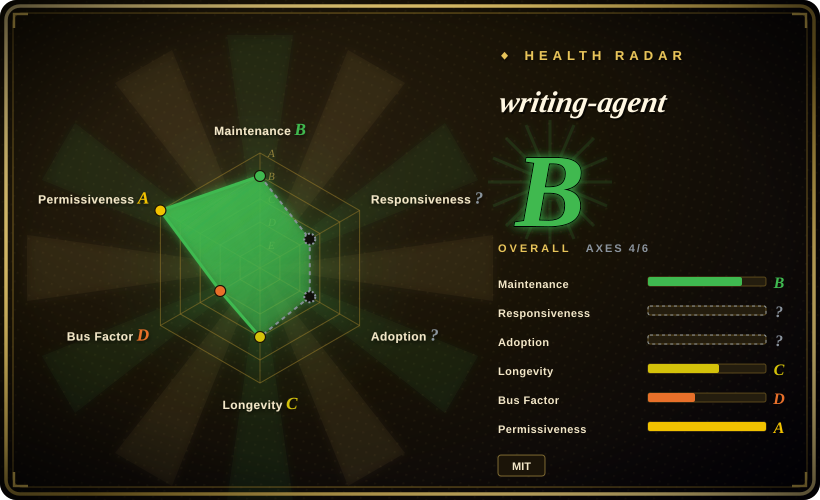

# writing-agent

🚀 一个基于 Claude Code (Skills + Subagents) 的“去AI味”全栈写作系统。不仅防套路，更通过专属规则强制注入人类观点与细节，搭配读者测试评估与自动图文排版。全面支持 DeepSeek / 智谱GLM / MiniMax 等国产低成本大模型，提供从选题、风格建模到审稿发布的高维全自动写作工作流。

## When to use

You write Chinese long-form opinion pieces, WeChat posts, or content-marketing essays and want a staged production line instead of “generate the full article in one prompt”. Choose writing-agent when you need topic/positioning, evidence ledger, scar-tissue material mining, outline, opening tournament, drafting, editorial review, reader simulation, de-AI pass, fact-check gate, and final `_clean.txt` output.

It fits users willing to run a full Claude Code project workflow, inspect intermediate artifacts, and use compatible model endpoints such as DeepSeek, GLM, or MiniMax. The repo also includes a Windows desktop preview, but the documented full workflow depends on project files, `.claude/`, workflows, agents, and scripts.

## When NOT to use

- **You want a short, one-shot draft.** This project is intentionally heavy; a simple prompt or smaller writing skill is cheaper.
- **You cannot keep intermediate files or evidence ledgers.** The value comes from artifacts such as theme files, evidence ledger, drafts, reviews, fact-check reports, and final clean output.
- **You do not use Claude Code or a compatible project workflow.** The full path depends on project runtime structure, agents, workflows, and scripts.
- **You need English marketing/copy workflows.** [marketingskills](marketingskills.md) is broader for SaaS marketing, CRO, SEO, and lifecycle execution.
- **You are unwilling to provide real material.** Upstream emphasizes true experiences/evidence and blocks unsupported facts; generic inputs weaken the pipeline.

## Comparison

| Alternative | In index | Our verdict | Tradeoff |
|---|---|---|---|
| [huashu-skills](huashu-skills.md) | ✅ | Choose huashu-skills for a broader Chinese creator toolkit: topics, research, editing, video outlines, and images. | huashu-skills is a toolkit collection; writing-agent is a stricter end-to-end writing production line. |
| [Baoyu Skills](baoyu-skills.md) | ✅ | Choose Baoyu Skills for general translation, formatting, transcript, webpage capture, and media utilities. | Broader utilities, less opinionated long-form writing pipeline. |
| [marketingskills](marketingskills.md) | ✅ | Choose marketingskills for marketing/CRO/SEO/growth tasks. | Marketing execution versus Chinese long-form article production. |
| Custom editorial workflow | 未收录 | Choose custom when your publication has fixed stages, reviewers, or compliance rules. | More exact to one org, but more maintenance work. |

## Health & viability

- **Maintenance snapshot (2026-07-16):** GitHub reports `archived=false` and `pushed_at=2026-07-05T06:13:28Z`; health scores maintenance as B.
- **Adoption snapshot:** ~319 GitHub stars as of 2026-07; niche but relevant for Chinese writing workflows.
- **License snapshot:** MIT verified from upstream README badge and root `LICENSE` in the read-only upstream check.
- **Lindy / governance:** health longevity is C and governance is D because the repo is young and single-maintainer concentrated.
- **Risk flags:** pipeline complexity, model/provider setup, and user-supplied evidence quality decide whether outputs are actually publishable.

## Caveats (unverified)

- [未验证] Demo quality and desktop preview were read from upstream docs but not executed locally.
- [未验证] Model recommendations and pricing notes can change; verify current provider docs before adopting.
- [推断] Best fit is disciplined Chinese long-form writing, not lightweight copyediting.
