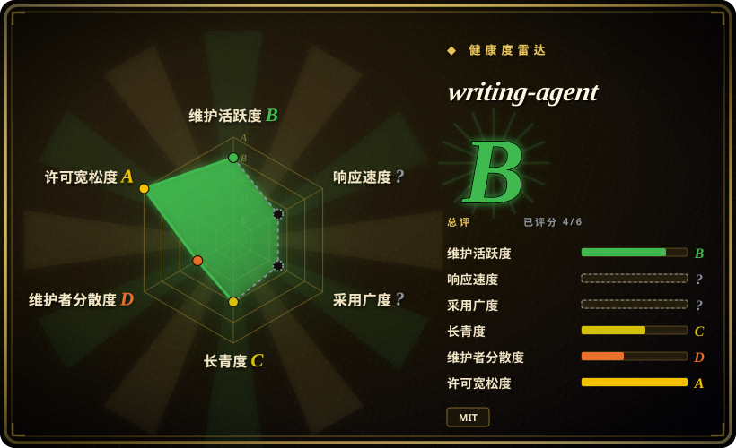

# writing-agent

🚀 一个基于 Claude Code (Skills + Subagents) 的“去AI味”全栈写作系统。不仅防套路，更通过专属规则强制注入人类观点与细节，搭配读者测试评估与自动图文排版。全面支持 DeepSeek / 智谱GLM / MiniMax 等国产低成本大模型，提供从选题、风格建模到审稿发布的高维全自动写作工作流。

## 何时使用

你写中文长文观点文、公众号文章或内容营销文章，想要分阶段生产线，而不是“一条 prompt 生成全文”。需要选题 / 立场、证据账本、伤疤素材、提纲、开头赛马、起草、主编审稿、读者模拟、去 AI 味、事实核查闸门和最终 `_clean.txt` 输出时，选 writing-agent。

它适合愿意跑完整 Claude Code 项目工作流、检查中间产物，并使用 DeepSeek、GLM、MiniMax 等兼容模型端点的用户。仓库也提供 Windows desktop preview，但完整流程依赖项目文件、`.claude/`、workflows、agents 和 scripts。

## 何时不用

- **你只要一篇短文的一次性草稿。** 这个项目刻意偏重；简单 prompt 或小型写作 skill 更便宜。
- **你不能保留中间文件或证据账本。** 价值来自 theme、evidence ledger、drafts、reviews、fact-check reports 和 final clean output 等 artifacts。
- **你不用 Claude Code 或兼容项目工作流。** 完整路径依赖项目 runtime structure、agents、workflows 和 scripts。
- **你需要英文营销 / copy workflow。** [marketingskills](marketingskills.zh.md) 对 SaaS marketing、CRO、SEO 和 lifecycle execution 更宽。
- **你不愿意提供真实素材。** 上游强调真实经历 / 证据，并拦截无依据事实；泛泛输入会削弱管线。

## 横向对比

| 替代品 | 是否收录 | 我们的评价 | 取舍 |
|---|---|---|---|
| [huashu-skills](huashu-skills.zh.md) | ✅ | 需要更宽的中文创作者工具箱：选题、调研、编辑、视频大纲、配图时选 huashu-skills。 | huashu-skills 是 toolkit collection；writing-agent 是更严格的端到端写作生产线。 |
| [Baoyu Skills](baoyu-skills.zh.md) | ✅ | 需要翻译、排版、字幕、网页抓取和媒体工具时选 Baoyu Skills。 | 工具更宽，长文写作 pipeline 没有 writing-agent 这么有主张。 |
| [marketingskills](marketingskills.zh.md) | ✅ | Marketing / CRO / SEO / growth 任务选 marketingskills。 | 营销执行 vs 中文长文生产。 |
| 自写编辑流程 | 未收录 | 刊物已有固定阶段、reviewer 或合规规则时自写。 | 更贴一个组织，但维护成本更高。 |

## 健康度与可持续性

- **维护快照（2026-07-16）：** GitHub 返回 `archived=false`，`pushed_at=2026-07-05T06:13:28Z`；health 将维护评为 B。
- **采用快照：** 2026-07 约 319 个 GitHub stars；中文写作工作流里小众但相关。
- **许可证快照：** 只读上游核验确认 README badge 和根目录 `LICENSE` 均为 MIT。
- **Lindy / 治理：** 项目年轻，health 中 longevity 为 C；单维护者集中，governance 为 D。
- **风险信号：** pipeline 复杂度、模型 / provider setup 和用户提供的证据质量，决定最终是否真能发布。

## 存疑（未验证）

- [未验证] Demo 质量和 desktop preview 读自上游文档，本次没有本地执行。
- [未验证] 模型推荐和价格信息会变，采用前要重新核验 provider 文档。
- [推断] 最适合有纪律的中文长文生产，不适合轻量 copyediting。
