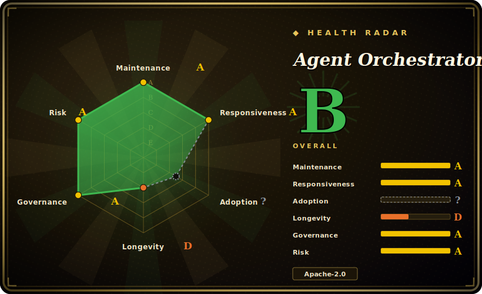

# Agent Orchestrator

An "Agentic IDE" — a long-running Go daemon plus an Electron/React desktop app that supervises multiple parallel AI coding agents in isolated git worktrees, with automatic feedback loops routing CI failures, PR review comments, and merge conflicts back to the owning agent.

## When to use

You're a senior engineer who runs several coding agents at once — a Claude Code session on one feature, Codex on a refactor, Aider on a bug — and you've outgrown the "many terminal tabs" stage. The agents trip over each other on the same working tree, you lose track of which one is mid-task, and when CI fails or a reviewer leaves comments on the PR, you're the one manually copy-pasting the failure back into the right agent's prompt. You want a control plane that keeps each agent in its own lane and closes those loops without you babysitting.

So you install Agent Orchestrator as a desktop app. It runs a local Go daemon that spawns each agent inside its own git worktree (via tmux on macOS/Linux, conpty on Windows), so parallel work never collides on the same checkout. You plan tasks in the GUI, assign them to agents, and watch live state stream in over SSE (SQLite with change-data-capture under the hood). When a task's CI run fails, a reviewer comments on the PR, or a merge conflict appears, the orchestrator routes that signal straight back to the agent that owns the branch — the feedback loop runs itself. Because it speaks to 23+ CLI agents through adapters ("if it runs in a terminal, it runs on Agent Orchestrator"), you can mix vendors instead of betting the workflow on one. You reach for it when supervising N parallel agents on real branches — not running one agent in one repo.

## When NOT to use

- **Too young for a verdict.** Created 2026-02 — roughly 4.5 months old (as of 2026-06). Lindy gives it no credit yet; high stars on a months-old repo are an attention signal, not a track record. Don't bet a critical workflow on its stability. [推断]
- **Pre-1.0 churn / nightly cadence.** It ships nightly prereleases and tagged its first 0.10.x days before this writing — APIs, schema, and the desktop UI can shift release-to-release. Pin a version if you need stability.
- **Single-User-owned, no foundation.** The repo's `owner.type` is **User**, not an Organization or foundation; one person (AgentWrapper) plus a top contributor concentrate the bus factor. Roadmap and continuity rest on a small group, not institutional backing.
- **You want a headless / CI-first tool.** This is a GUI desktop app (Electron) with a local daemon — it's built to sit on a developer's machine, not to run unattended in a pipeline or on a server. If you want a scriptable, headless orchestrator, this isn't it.
- **The daemon's security posture is a dealbreaker.** The control daemon is "Loopback-Only … HTTP control over 127.0.0.1 with **no auth, CORS, or TLS by design**" — fine for a single trusted machine, but it means any local process can drive it; do not expose the port or run it on a shared/multi-user host.
- **Worktree-hostile repos.** Parallel isolation leans on git worktrees; repos with heavy submodules, large generated artifacts, or per-checkout env that doesn't survive a worktree will fight the model.
- **Telemetry-sensitive environments.** Telemetry exists (local by default, remote transmission opt-in via env vars) — verify the toggle and your policy before deploying in a restricted setting.
- **You only run one agent.** A single agent in a single repo gets nothing from a parallel-supervision control plane; the daemon + desktop app is pure overhead at N=1.

## Comparison

| Alternative | In index | Tradeoff |
|---|---|---|
| [CCPM](ccpm.md) | ✅ | Spec-driven: PRD → GitHub Issues → parallel git-worktree agents, driven from your existing harness as a skill-pack. CCPM is process + GitHub-native with no GUI; Agent Orchestrator is a desktop app + daemon that supervises live agents and auto-routes CI/review/conflict feedback. Different layers — you could plan with CCPM and run with this. |
| [OpenSandbox](opensandbox.md) | ✅ | A sandbox *runtime* for safely executing untrusted agent code at K8s scale (isolation, egress, vault). Orthogonal: OpenSandbox isolates *execution*; Agent Orchestrator orchestrates *agents* across worktrees. You might run agents under a sandbox and supervise them here. |
| [Planning with Files](planning-with-files.md) | ✅ | Lightweight file-based planning pattern (plans live as markdown the agent reads/writes); no parallel supervision, no GUI, no feedback-loop routing. The minimal baseline this replaces for state-keeping. |
| Conductor / Crystal / Claude Squad | 未收录 | Other "run parallel Claude Code agents in git worktrees" tools (desktop or TUI). Directly comparable on the core idea; differ in agent breadth (Agent Orchestrator targets 23+ adapters), feedback-loop automation, and maturity — shortlist and compare if you've narrowed to this niche. |
| Vibe Kanban | 未收录 | Kanban-style board for orchestrating multiple coding agents; overlapping "supervise many agents" goal with a board-first UX rather than a worktree-daemon + feedback-loop emphasis. |
| Plain tmux + `git worktree` scripts | 未收录 | Zero-dependency and fully scriptable, but you hand-roll the worktree lifecycle, agent adapters, live state UI, and CI/review/conflict routing — exactly the glue Agent Orchestrator packages. |

## Tech stack

- **Backend:** a long-running Go HTTP daemon (Go is the primary language, ~2.6MB of source) with inbound/outbound port contracts; control plane is loopback-only.
- **Frontend:** an Electron + React desktop app (~900KB TypeScript) using TanStack Router/Query and shadcn/ui.
- **Terminal runtimes:** tmux on Darwin/Linux, conpty on Windows, to host each agent's session.
- **Isolation:** git worktrees, one per agent/task, with dedicated runtimes.
- **Storage / streaming:** SQLite with change-data-capture (CDC) broadcast to the UI over SSE.
- **Agent surface:** adapters for 23+ CLI coding agents (Claude Code, Codex, Cursor, OpenCode, Aider, Amp, Goose, Copilot, Grok, Qwen Code, Kimi Code, Cline, Continue, Kiro, and more); docs (MDX) make up the rest of the repo.

## Dependencies

- **The desktop app + daemon themselves** — distributed as Windows `Setup.exe`, macOS DMG, and Linux AppImage; the Go daemon runs locally on 127.0.0.1.
- **Build-from-source toolchain:** Go 1.25+, Node.js 20+, pnpm, and Git (per the README's minimum requirements).
- **tmux** on Darwin/Linux (conpty is built in on Windows) to back the terminal sessions.
- **The coding agents you orchestrate** — you supply and authenticate each CLI agent (Claude Code, Codex, etc.) yourself; the orchestrator drives them, it doesn't bundle them.
- **GitHub CLI (`gh`)** for authenticated GitHub API calls (PR/review feedback loop).

## Ops difficulty

**Low-to-medium for an individual; not built for fleet ops.** As a desktop app it installs from a packaged binary and runs on one developer's machine — that path is easy. The complexity is operational rather than deploy-time: you're running a local daemon that spawns multiple agent processes across git worktrees, so disk and process pressure scale with parallelism, and a worktree-hostile repo (submodules, generated artifacts) makes setup fiddly. The loopback-no-auth daemon is fine on a trusted single-user machine but is **not** something to run on a shared/multi-user host or expose. There is no documented multi-user/server deployment story — this is a personal control plane, not infrastructure you operate for a team. [推断]

## Health & viability

- **Maintenance (2026-06).** Last pushed 2026-06-29 with frequent nightly prereleases and a v0.10.1 tagged 2026-06-28 — **very active** development. Not archived. The flip side: ~588 open issues against a large fork count signals a fast-moving, still-stabilizing project. [推断]
- **Governance / bus factor.** `owner.type` is **User**, not an Organization or foundation. ~36 contributors, but contributions concentrate in the top few (harshitsinghbhandari, suraj-markup, and the owner AgentWrapper); a Discord-driven community with a "daily contributor sync" suggests energy, but the roadmap rests on a small, individually-owned group — real bus-factor risk. [推断]
- **Age × Lindy (2026-06).** Created 2026-02 — about 4.5 months old. This is a **very young project**; Lindy gives it no credit. Treat API/schema/UI stability as unproven and the longevity unknown.
- **Adoption & ecosystem.** ~7.7k stars and ~1.1k forks in ~4.5 months is unusually high for a User-owned vendor repo of this age; that *could* reflect genuine pull or hype/inflation — the data can't distinguish them, so don't read it as a track record. Broad agent-adapter coverage (23+) is the strongest ecosystem signal. [推断]
- **Risk flags.** Youth + pre-1.0 churn (nightly cadence), single-User ownership with no foundation, the loopback-no-auth daemon posture, GUI-desktop-only (not headless), and opt-in remote telemetry. Apache-2.0 with no relicense history found. [未验证]

## Caveats (unverified)

- [未验证] ~7.7k stars, ~1.1k forks, ~588 open issues, latest v0.10.1, ~36 contributors — all as of 2026-06-29; these numbers are date-sensitive and volatile (nightly cadence), treat as indicative only.
- [推断] "Unusually high stars for a User-owned repo this young" is flagged as a possible hype/inflation signal per the read-repo methodology — this is **not** an assertion that the numbers are inflated, only that age + ownership + magnitude warrant caution; the data can't confirm or deny it.
- [未验证] The "Loopback-Only … no auth, CORS, or TLS by design" posture, telemetry (local default / remote opt-in via env), the 23+ adapter list, tmux/conpty runtimes, and SQLite-CDC-over-SSE architecture are taken from the README/docs, not independently inspected in source.
- [推断] Classified as `type: app` (over `tool`) because the primary artifact is a packaged Electron **desktop application** backed by a local daemon, not a headless CLI/library — the GUI is the product surface.
- [未验证] The automatic feedback-loop routing (CI failures, PR review comments, merge conflicts back to the owning agent) is the project's headline claim; actual reliability across the 23+ agents was not verified, and LLM/agent behavior is never guaranteed.
- [未验证] Bus-factor reading (concentration in top contributors, "daily contributor sync" Discord cadence) is inferred from the contributor list and community signals, not from a governance document; no GOVERNANCE/CODEOWNERS was confirmed.
- [未验证] Comparisons to Conductor / Crystal / Claude Squad / Vibe Kanban reflect general positioning in the same niche, not a measured feature-by-feature benchmark.
