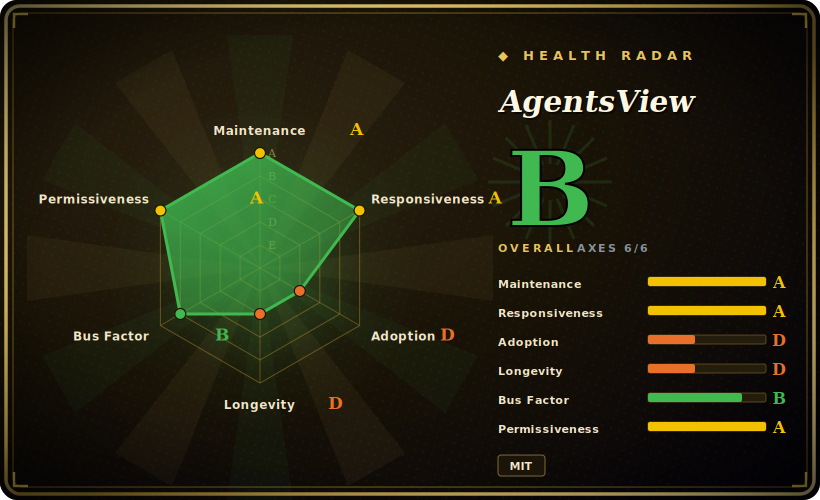

# AgentsView

A local-first desktop/CLI app that discovers, searches, and analyzes your coding-agent sessions across 40+ agents (Claude Code, Codex, Cursor, Gemini, and more) — full-text search, token-usage analytics, and cost tracking, all on your machine without an account.

## When to use

You're a developer (or a small team lead) running several coding agents day to day — Claude Code in one repo, Codex in another, maybe Cursor and Gemini too — and you've lost the thread: which session solved that bug last week, how many tokens (and dollars) you're actually burning across agents, what prompts you keep repeating. The per-tool histories are scattered in different local directories and none of them give you a cross-agent view. You install AgentsView (a `curl | sh` CLI, a Homebrew/desktop app, or Docker), point it at your machine, and it indexes the local session logs into SQLite, exposes a Svelte web UI bound to `127.0.0.1`, and lets you full-text search every conversation, see token/cost breakdowns per agent and per session, and browse analytics — without sending your transcripts to anyone's cloud.

You reach for it specifically when you want **observability over your own agent usage** (cost control, "where did I do X", usage patterns) and you care that the session data stays local. The optional Postgres/DuckDB backends let a team share a view if you opt into that.

## When NOT to use

- **You want a managed/hosted team dashboard out of the box.** It's local-first and binds to loopback by default; team sharing means *you* stand up Postgres/DuckDB and networking. If you want a SaaS, this isn't it.
- **You need a mature, battle-tested tool.** It's months old with a very high star count — that combination is a hype/maturity *risk flag*, not proof of stability; expect churn, breaking changes, and rough edges. [未验证]
- **Your agent isn't supported or has no central session directory.** It covers 40+ agents but coverage is per-agent; some (e.g. Aider) are opt-in because they have no central session store. Verify your agent is handled. [未验证]
- **You're on a locked-down build environment.** SQLite FTS5 needs CGO; the desktop app is a Tauri wrapper and frontend dev needs Node — fine for prebuilt binaries, but building from source has real toolchain prerequisites.
- **You object to any telemetry.** Anonymous PostHog telemetry is present (disableable via env var); if zero phone-home is a hard requirement, configure it off and verify. [未验证]

## Comparison

| Alternative | In index | Tradeoff |
|---|---|---|
| Per-agent built-in history (Claude Code `/resume`, etc.) | 未收录 | Native and zero-install, but single-agent and no cross-tool search/cost rollup — the gap AgentsView fills. |
| ccusage / token-cost CLIs | 未收录 | Focused Claude Code/agent token-cost reporters; narrower scope (cost, often one agent) vs. AgentsView's search + analytics + multi-agent. |
| Langfuse / Helicone / observability SaaS | 未收录 | Production LLM observability platforms (tracing, evals); built for app pipelines and usually hosted/instrumented, not local-first browsing of *your own* coding-agent sessions. |
| grep over `~/.claude` / session dirs | 未收录 | Zero-dependency and fully local, but no UI, no token/cost math, no cross-agent normalization. |

## Tech stack

- **Backend:** Go (1.26+), with **SQLite** (FTS5 full-text search, CGO-required) as the primary store; optional **PostgreSQL** and **DuckDB** backends.
- **Frontend:** Svelte 5 SPA (Vite + TypeScript).
- **Desktop:** Tauri wrapper for the macOS/Windows desktop app.
- **Distribution:** CLI install script (shell/PowerShell), Homebrew, GitHub Releases, and Docker images.

## Dependencies

- **Runtime:** the prebuilt binary/app is self-contained; it reads your **local agent session directories** as its data source and stores its index in SQLite. Server binds to `127.0.0.1` by default.
- **Optional infra:** PostgreSQL or DuckDB if you want team sharing / an alternate backend.
- **Build-from-source:** Go 1.26+, CGO (for SQLite FTS5), and Node 22+ for the frontend.
- **Network:** core features work offline; optional anonymous PostHog telemetry unless disabled.

## Ops difficulty

**Low-to-medium.** For a single user the happy path is a one-line install or a desktop app, pointed at your own machine — nothing to operate, data stays local, loopback-bound. Difficulty rises if you (a) build from source (CGO + Go + Node toolchain), or (b) run it for a team on Postgres/DuckDB with real networking, where you now own a database and an exposed service. Because the project is young and fast-moving, expect upgrade churn and occasional breakage between versions — operational risk is more "moving target" than "complex to run."

## Health & viability

- **Maintenance (2026-06).** Extremely active — created 2026-02, last push 2026-06, shipping rapid point releases (v0.34.x). Clearly in heavy development, not coasting. Not archived. [推断]
- **Governance / bus factor.** Owner is the `kenn-io` **Organization**, but the project is **only ~4 months old** with a top contributor (wesm) dominating commits — early-stage, likely small core team; treat bus factor as unproven. [推断]
- **Age & Lindy — RISK.** Created 2026-02 yet already ~3.4k stars. **Young + high stars is a hype/maturity risk flag, not a Lindy signal**: there is no track record yet, APIs and storage formats may still churn, and longevity is unproven. Bet on it as a *new* tool, not a settled one. [未验证]
- **Adoption.** Fast star growth and broad agent coverage suggest real early interest; whether it sustains and stabilizes is the open question. [未验证]
- **Risk flags.** Youth/hype mismatch (above); CGO/Tauri/Node build complexity; optional telemetry (disableable); pre-1.0 versioning implies no stability guarantee. [推断]

## Caveats (unverified)

- [未验证] ~3.4k GitHub stars as of 2026-06 on a repo created 2026-02; star counts are date-sensitive and the young-repo/high-star combination is treated as a risk signal, not validation.
- [未验证] "40+ agents" and the specific supported list (Claude Code, Codex, Cursor, Gemini, etc., with Aider opt-in) come from the README and shift release-to-release; verify your agent.
- [未验证] Tech-stack specifics (Go 1.26+, SQLite FTS5/CGO, Svelte 5, Tauri, optional Postgres/DuckDB, Node 22+) are from the README and not independently built/tested here.
- [未验证] Local-first / loopback-bind / "data stays on your machine" and disableable PostHog telemetry are README claims; not verified against the running binary.
- [推断] Pre-1.0 versioning (v0.34.x) is read as "no stability guarantee / expect breaking changes," an inference from the version scheme.
