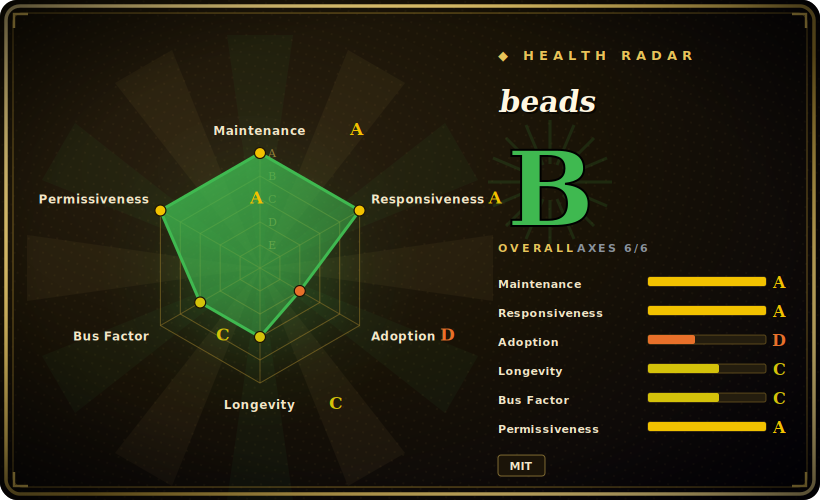

# beads

A dependency-aware, version-controlled task/issue graph that gives AI coding agents persistent structured memory — backed by Dolt (versioned SQL), shipped as a single Go binary (`bd`). Started by Steve Yegge; repo moved from `steveyegge/beads` to the `gastownhall` org.

## When to use

You're a solo developer babysitting a coding agent through a multi-day refactor of a single repo. Every time the session compacts or you start a fresh one, the agent forgets half of what it was doing: the bug it spotted in the auth layer two hours ago is gone, the "do this after the migration lands" note never made it anywhere durable, and it quietly reorders work to whatever fits the token budget rather than what's actually unblocked. You've been patching over this with a hand-rolled `MEMORY.md`, but it has no notion of which tasks block which, and the moment you let the agent work on two branches it scribbles conflicting IDs all over it.

So you `bd init` in the repo and hand the agent the `bd` binary. Now its task state lives in a version-controlled, dependency-aware graph that commits and merges right alongside the code — hash IDs keep parallel branches and agents from colliding, `bd ready` surfaces exactly the work that isn't blocked, and `bd remember`/`bd prime` replace that ad-hoc scratch file with memory the agent can actually carry across sessions. It's offline-first and git-style branchable, which is the point: you wanted a task graph that travels with the repo, not a hosted tracker you have to log into.

## When NOT to use

- **Stability / maturity signal** — despite a v1.x release line, the author's launch post described it as "alpha" software and the FAQ admits "command flags and data formats can evolve" (whether maintainers still consider 1.x alpha as of 2026-06 is unconfirmed). It explicitly says *not* for "mission-critical production systems without a tested backup/restore plan" or "large enterprise deployments that need formal compatibility guarantees."
- **Human-team trackers** — no web UI, cross-repo dashboards, notifications, or non-engineer access. By design (it trades those for agent-native APIs).
- **Cross-project work** — each database is isolated; issues cannot reference issues in another project. A monorepo-of-services or portfolio view needs multiple DBs + custom glue.
- **Multi-writer at scale** — embedded mode is single-writer (file lock); concurrent agents require an external Dolt server plus a "claim work" convention (a user-defined "who's working on what" protocol so two agents don't race the same task) — real ops overhead.
- **Very large backlogs** — the project's own FAQ reportedly suggests filtering exports or splitting into multiple databases past ~100k issues (its guidance, not independently benchmarked).
- **Migration / lock-in** — export appears to be JSONL-only with no built-in importers from GitHub Issues/Jira/Linear found, so migrating *out* would need custom scripting; either way you inherit Dolt as the storage format.
- **Backend churn** — documented SQLite→Dolt and 0.x→1.0 migrations with schema-repair steps; upgrades are not always painless.
- **DB fragility** — `[未验证]` per the project's own docs/warnings, agents have at times run destructive operations on the DB (e.g. `DROP TABLE`); treat it as not "set and forget" and keep backups.
- **Bus-factor** — `[未验证]` young, reportedly largely AI-built ("a tool that AI has built for itself"), under an org renamed from `steveyegge` to `gastownhall`; treat single-maintainer / abandonment risk as non-trivial, especially for mission-critical agent workflows you can't afford to re-tool.

## Comparison

| Alternative | In index | Our verdict | Tradeoff |
|---|---|---|---|
| Plain markdown `MEMORY.md` / `TODO.md` | 未收录 | Use this page for its stated niche; choose Plain markdown MEMORY.md / TODO.md when you need zero deps and human-readable, but no dependency graph, no ready-detection, no merge-safe IDs. | Zero deps and human-readable, but no dependency graph, no ready-detection, no merge-safe IDs — exactly the unstructured approach beads replaces. |
| GitHub Issues (+ `gh` CLI) | 未收录 | Use this page for its stated niche; choose GitHub Issues (+ gh CLI) when you need mature hosted tracker with web UI/notifications/cross-repo views, but online-first, not branch-scope. | Mature hosted tracker with web UI/notifications/cross-repo views, but online-first, not branch-scoped/version-controlled, no native dependency-graph + auto-ready for agents. |
| Taskwarrior | 未收录 | Use this page for its stated niche; choose Taskwarrior when you need battle-tested offline CLI task manager with rich filtering, but no SQL/version-control backend, weak. | Battle-tested offline CLI task manager with rich filtering, but no SQL/version-control backend, weaker multi-agent merge story, not built around agent JSON workflows. |
| Linear / Jira | 未收录 | Use this page for its stated niche; choose Linear / Jira when you need best-in-class for human teams (workflows, dashboards, guarantees), but heavyweight, online-only, not. | Best-in-class for human teams (workflows, dashboards, guarantees), but heavyweight, online-only, not version-controlled with the code, not agent-native. |
| Dolt directly (raw versioned SQL) | 未收录 | Use this page for its stated niche; choose Dolt directly (raw versioned SQL) when you need same versioned-SQL superpowers without an opinionated schema, but you build the issue schema, depend. | Same versioned-SQL superpowers without an opinionated schema, but you build the issue schema, dependency logic, ready-detection and agent ergonomics yourself — beads is that opinionated layer. |

## Tech stack

- Go (~95%)
- Dolt — version-controlled SQL backend, embedded in-process via CGO
- JSONL — export / migration format
- CLI binary `bd`
- Distribution via Homebrew / npm (`@beads/bd`) / shell install script

## Dependencies

- **Dolt backend** — embedded in-process in the default prebuilt binary (no separate Dolt install for embedded mode). A `CGO_ENABLED=0` build is server-mode-only and needs an external `dolt sql-server`.
- **Server (multi-writer) mode** — an external Dolt SQL server process plus host/port/credential config.
- **Optional** — a git remote to sync the `.beads` database alongside the repo (`bd dolt push/pull`).

## Ops difficulty

**Medium.** Single-binary embedded mode is genuinely low-friction (`bd init` and go; Dolt runs in-process; data in `.beads/embeddeddolt/`). Difficulty rises because: embedded mode is single-writer (file lock), so any real multi-agent/multi-writer setup means standing up and operating an external Dolt SQL server with credentials; the Dolt database must be backed up and synced deliberately (no managed service); there is documented schema-migration churn (SQLite-era and v0.63→v1.0 upgrades needing repair steps); and the author warns agents have historically been destructive toward the DB, so backup/restore hygiene is on you.

## Health & viability

- **Maintenance** — last push 2026-06 (as of 2026-06) on a v1.x release line: actively developed. But the author still self-describes it as "alpha" and the FAQ warns flags/data-formats can evolve, so treat it as active-but-volatile, not stabilized. [推断]
- **Governance / bus factor** — `[未验证]` started by Steve Yegge; repo moved from `steveyegge/beads` to the `gastownhall` org. An org wrapper reduces the literal single-person bus factor on paper, but it's reportedly largely AI-built ("a tool AI built for itself") and the org appears purpose-made — treat real bus-factor / abandonment risk as non-trivial for anything you can't re-tool.
- **Age & Lindy** — created 2025-10, so under a year old as of 2026-06: too young for a Lindy verdict. High star velocity (~24k) is hype-driven attention, not a longevity track record — don't read the stars as durability. [推断]
- **Risk flags** — `[未验证]` MIT (no relicense history). Real flags are operational: the author warns agents have run destructive DB ops (`DROP TABLE`), Dolt is the locked-in storage format with JSONL-only export, and there's documented SQLite→Dolt / 0.x→1.0 migration churn. Keep backups; this is not "set and forget."

## Caveats (unverified)

- **Stars** — repo page surfaced ~24.8k while a third-party article cited 18.7k; not reconciled. `[未验证]`
- **Release dates** — WebFetch returned 1.0.x releases dated to 2024, which conflicts with active development in 2026; the years are almost certainly misread. Treat specific release dates and the "bi-weekly cadence" claim as `[未验证]`.
- **Distribution** — whether Dolt is bundled in *every* installer (brew/npm/script) vs only the CGO-enabled prebuilt binary is inferred, not confirmed. `[未验证]`
- **"Alpha" label** — comes from the author's launch blog post; whether maintainers still consider 1.0.x alpha as of 2026-06 is unconfirmed. `[未验证]`
- **Performance / scale claims** — sub-100ms for thousands of issues and 100k+ guidance are the project's own FAQ claims, not independently benchmarked. `[未验证]`
- **Migration / backend specifics** — JSONL-only export, the absence of built-in GitHub/Jira/Linear importers, and the documented SQLite→Dolt and 0.x→1.0 migration/repair steps are from the project's own docs, not independently verified. `[未验证]`
- An independent third-party critique (starlog.is) could not be fetched (HTTP 403), so the tradeoffs above lean on the project's own README/FAQ/blog plus secondary summaries. `[未验证]`
