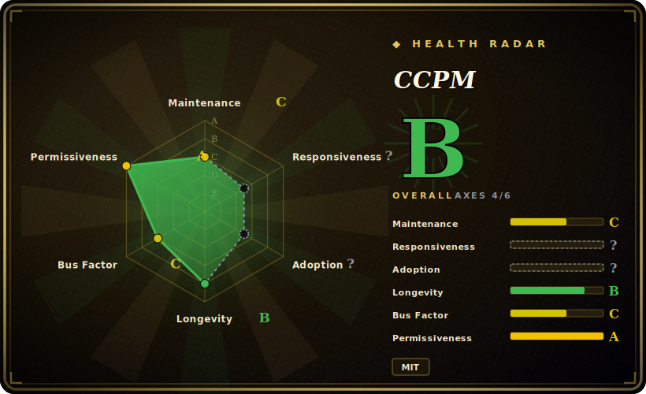

# CCPM

A spec-driven project-management skill (bash scripts + skill prompts) that turns a PRD into GitHub Issues and runs multiple coding agents in parallel across git worktrees — keeping project state in markdown files, not chat history.

## When to use

You're leading a feature that's too big for one agent session — a multi-file subsystem you've roughly scoped but not specified. You've been "vibe-coding" it: you describe what you want, the agent guesses, you correct it three messages later, and by the time the context window compacts the *why* behind half the decisions is gone. When you try to parallelize by opening a second agent on another branch, the two of them step on each other and you spend more time reconciling than building. You want the discipline of writing things down first, plus a way to fan work out without the merge chaos.

So you point your harness at CCPM's skill and say "let's plan the payments feature." It walks you through a brainstorm into a PRD under `.claude/prds/`, parses that into a technical epic, decomposes the epic into tasks tagged with `depends_on` / `parallel` / `conflicts_with`, then syncs those tasks up as GitHub Issues — which become the shared source of truth a whole team (human or agent) reads. From there you say "start working on issue 1234" and it spins up a git worktree so an agent can grind on that stream in isolation while another works a non-conflicting one. Deterministic queries ("standup", "what's blocked") run as plain bash scripts, so status is a script call, not a hallucination. Every commit traces back to a written spec, which is the whole point: you wanted documented intent and merge-safe parallelism, not a faster way to lose context.

## When NOT to use

- **Small / single-stream work.** A one-file fix or a task that fits in a single agent session doesn't need PRD → epic → issue ceremony; CCPM's 5-phase discipline is pure overhead below a certain size.
- **No GitHub, or GitHub Issues is off the table.** Issues are the required source of truth — `gh` auth and a GitHub repo are mandatory. No GitLab/Gitea/Jira backend; if your org tracks work elsewhere, this doesn't fit.
- **You want a human-team tracker.** This is agent-and-engineer workflow tooling, not a PM dashboard — no boards, sprints, notifications, or non-engineer UI beyond what GitHub Issues itself provides.
- **Large epics.** The workflow caps at roughly ≤10 tasks per epic by default; very large efforts need manual splitting into multiple epics.
- **You distrust the headline numbers.** Marketing claims ("89% less context-switching", "75% fewer bugs", "up to 3× faster", a 4/4-vs-0/4 internal eval) are self-reported and not independently reproduced — adopt for the *workflow*, not the percentages. [未验证]
- **Maturity / churn risk.** No tagged releases and a recent v1→v2 ("Agent Skills") restructure mean the skill surface and file layout can still shift release-to-release; pin a commit if you need stability.
- **Worktree-hostile setups.** Parallel execution leans on git worktrees; repos with heavy submodules, generated artifacts, or env that doesn't survive a worktree checkout will fight the parallel model.

## Comparison

| Alternative | In index | Our verdict | Tradeoff |
|---|---|---|---|
| [beads](beads.md) | ✅ | Use this page for its stated niche; choose beads when you need a versioned-SQL task **graph** giving agents persistent memory. | A versioned-SQL task **graph** giving agents persistent memory; richer dependency/ready-detection backend, but no PRD→epic→GitHub-Issues spec pipeline and no worktree-based parallel orchestration. CCPM is process+GitHub-native; beads is a storage-native task engine. |
| [Planning with Files](planning-with-files.md) | ✅ | Use this page for its stated niche; choose Planning with Files when you need lighter file-based planning pattern (plans live as markdown the agent reads/writes). | Lighter file-based planning pattern (plans live as markdown the agent reads/writes); overlaps on "state in files, not chat", but no GitHub-Issues sync, no enforced PRD/epic phases, no parallel-worktree fan-out. |
| [Entire](entire-cli.md) | ✅ | Use this page for its stated niche; choose Entire when you need another agent work-tracking approach in this category. | Another agent work-tracking approach in this category; different mechanism — compare directly if you've shortlisted both. |
| GitHub Projects / Issues + `gh` by hand | 未收录 | Use this page for its stated niche; choose GitHub Projects / Issues + gh by hand when you need the same backend CCPM drives, without the opinionated PRD→epic→task decomposition, worktree setup, o. | The same backend CCPM drives, without the opinionated PRD→epic→task decomposition, worktree setup, or bash status scripts — you'd hand-roll the spec discipline and parallel conventions yourself. |
| Taskmaster (claude-task-master) | 未收录 | Use this page for its stated niche; choose Taskmaster (claude-task-master) when you need popular PRD-to-tasks agent workflow. | Popular PRD-to-tasks agent workflow; parses a spec into tasks too, but is its own task store/CLI rather than syncing to GitHub Issues + git worktrees as the shared truth. |
| Plain `MEMORY.md` / `TODO.md` | 未收录 | Use this page for its stated niche; choose Plain MEMORY.md / TODO.md when you need zero-dependency and human-readable, but no dependency metadata, no GitHub sync, no parallel-stream i. | Zero-dependency and human-readable, but no dependency metadata, no GitHub sync, no parallel-stream isolation — the unstructured baseline CCPM replaces. |

## Health & viability

- **Maintenance** — last push 2026-03 (as of 2026-06), so ~3 months since the last commit and no tagged releases; the recent v1→v2 ("Agent Skills") restructure shows real upkeep, but a multi-month gap means it's coasting rather than rapidly iterating. Only ~4 open issues — low backlog, but read alongside the modest ~8k stars. [推断]
- **Governance / bus factor** — `Organization`-owned (`automazeio`), which softens single-maintainer risk somewhat, but it's still a small vendor-led skill repo, not a foundation project; the roadmap is whoever runs automaze. No formal governance to point to. [推断]
- **Age & Lindy** — created 2025-08, so under a year old as of 2026-06 and already through one breaking restructure (v1→v2): too young for a Lindy verdict, and the surface is still settling — pin a commit if you need stability.
- **Risk flags** — `[未验证]` MIT, no relicense history. Hard dependency on GitHub Issues + `gh` is a lock-in surface (no GitLab/Jira backend), and the headline metrics ("89% less context-switching", "75% fewer bugs", "3× faster") are self-reported, not independently reproduced — adopt for the workflow, not the percentages.

## Caveats (unverified)

- [未验证] Quantitative claims — "89% less context-switching time", "75% reduction in bug rates", "up to 3× faster delivery", "5–8 parallel tasks vs 1", and the 4/4-vs-0/4 / 4/4-vs-2/4 eval scores — are the project's own README figures, not independently reproduced.
- [未验证] Star count ~8.2k (and ~833 forks) as of 2026-06; GitHub stars are unreliable and date-sensitive — treat as indicative only.
- [推断] Classified as `skill-pack` because the repo ships bash scripts plus skill/prompt markdown distributed via the agentskills.io standard, not a deployable service/library — so Tech stack / Dependencies / Ops sections are intentionally omitted.
- [未验证] "Harness-agnostic" / compatibility with Claude Code, Codex, OpenCode, Factory, Amp, Cursor, Droid is the README's claim; actual behavior on each non-Claude harness is not independently verified, and LLM/agent behavior is never guaranteed.
- [未验证] The "14 deterministic bash scripts", the ≤10-tasks-per-epic default cap, the `gh-sub-issue` optional fallback, and the v1-on-separate-branch detail come from the README/docs, not independently inspected here.
- [未验证] No tagged GitHub releases were found (`latestRelease: null`); "v2" refers to the Agent Skills restructure, not a SemVer tag — versioning is informal and the file layout may drift.
- [推断] CCPM stores PRDs/epics under a `.claude/` directory path, which suggests a Claude-Code-origin convention even though it's marketed as harness-agnostic; verify the path layout for your harness before relying on it.
